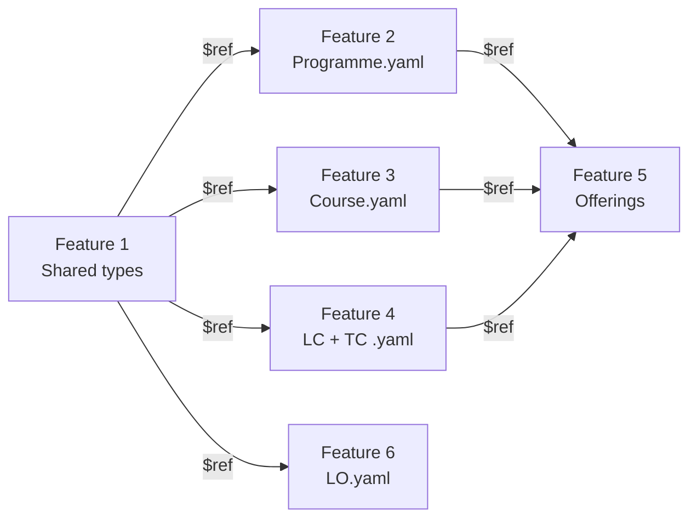

# Feature 1 — OKx enumerations and shared types

## NL → UK English mapping

All OKx consumer extension attributes, enum values and shared schema names follow UK English naming, consistent with the OEAPI standard. Below is the complete mapping from the Dutch source documentation.

### Shared schema names

| NL (bron) | EN (YAML) |
|-----------|-----------|
| OnderwijsSpecificatie | EducationSpecification |
| WaardeDocument | CredentialDocument |
| KwalificatieRef | QualificationReference |
| Tijdsbesteding | TimeAllocation |
| DeelnameVereiste | ParticipationRequirement |
| ExpertiseProfiel | ExpertiseProfile |
| LeermiddelGroep | LearningResourceGroup |
| CompetentNlRef | CompetentNlReference |

### Attribute names

| NL (bron) | EN (YAML) | Entiteit |
|-----------|-----------|----------|
| onderwijsSpecificatie | educationSpecification | Programme, Course, LC, TC |
| waardeDocument | credentialDocument | Programme, Course, LC |
| kwalificatieRef | qualificationReference | Programme, Course, TC, LO |
| leervorm | deliveryForm | EducationSpecification |
| ruimteType | roomType | EducationSpecification |
| ruimteEisen | roomRequirements | EducationSpecification |
| tijdsbesteding | timeAllocation | EducationSpecification |
| spreidingspatroon | distributionPattern | TimeAllocation |
| expertiseProfielen | expertiseProfiles | EducationSpecification |
| leermiddelGroepen | learningResourceGroups | EducationSpecification |
| curriculumType | curriculumType | Programme |
| keuzegateType | choiceGateType | Programme |
| leerrouteType | learningRouteType | Programme |
| leeruitkomstDekking | learningOutcomeCoverage | Programme |
| hierarchieNiveau (LC) | hierarchyLevel | LearningComponent |
| hierarchieNiveau (LO) | hierarchyLevel | LearningOutcome |
| componentStudyLoad | componentStudyLoad | LearningComponent |
| deelnameVereisten | participationRequirements | Course, LC |
| toetsNiveau | assessmentLevel | TestComponent |
| standaardisatieStatus | standardisationStatus | LearningOutcome |
| sectorReferentie | sectorReference | LearningOutcome |
| competentNlRefs | competentNlRefs | LearningOutcome |
| competentNlRelatieType | competentNlRelationType | LearningOutcome |
| keuzeMogelijk | choiceAvailable | Course |
| cohortGrootte | cohortSize | ProgrammeOffering |
| doorlooptijdWeken | durationWeeks | ProgrammeOffering |
| minimaalAantalDeelnemers | minimumParticipants | CourseOffering |
| parallelGroepen | parallelGroups | CourseOffering |
| instroomEisen | admissionCriteria | Programme (fase 2) |
| uitstroomProfiel | graduateProfile | Programme (fase 2) |
| instroomMomenten | admissionMoments | ProgrammeOffering (fase 2) |
| beschikbarePlaatsen | availablePlaces | ProgrammeOffering (fase 2) |
| regioAanbod | regionOffering | ProgrammeOffering (fase 2) |
| beschikbaarheidsType | availabilityType | CourseOffering (fase 2) |
| budgetIndicatie | budgetIndication | CourseOffering (fase 2) |
| bot | supervisedHours | TimeAllocation |
| oot | unsupervisedHours | TimeAllocation |
| eenheid | unit | TimeAllocation |
| profiel | profile | ExpertiseProfile |
| groep | group | LearningResourceGroup |
| specificatie | specification | LearningResourceGroup |
| dossier | dossier | QualificationReference |
| kwalificatie | qualification | QualificationReference |
| kerntaak | coreTask | QualificationReference |
| werkproces | workProcess | QualificationReference |
| referentieId | referenceId | ParticipationRequirement |
| bedrag | amount | budgetIndication |
| valuta | currency | budgetIndication |
| strategie | strategy | EducationSpecification |

### Enum values

| NL (bron) | EN (YAML) | Enum |
|-----------|-----------|------|
| simulatie | simulation | deliveryForm |
| klassikaal | classroom | deliveryForm |
| werkplekleren | work_based_learning | deliveryForm |
| projectonderwijs | project_based_education | deliveryForm |
| zelfstudie_begeleid | guided_self_study | deliveryForm |
| stage | internship | deliveryForm |
| onderzoek | research | deliveryForm |
| co_teaching | co_teaching | deliveryForm |
| blended | blended | deliveryForm |
| praktijkruimte_simulatie | simulation_practice_room | roomType |
| collegezaal | lecture_hall | roomType |
| werkplaats | workshop | roomType |
| lab | laboratory | roomType |
| online | online | roomType |
| externe_werkplek | external_workplace | roomType |
| examenzaal | examination_room | roomType |
| hybride | hybrid | roomType |
| nominaal | nominal | curriculumType, choiceGateType |
| flexibel | flexible | curriculumType |
| hybride | hybrid | curriculumType |
| maatwerk | custom | choiceGateType |
| continu | continuous | choiceGateType |
| regulier | regular | learningRouteType |
| versneld | accelerated | learningRouteType |
| temporiserend | decelerated | learningRouteType |
| personalisatie_intra | personalisation_intra | learningRouteType |
| personalisatie_sector | personalisation_sector | learningRouteType |
| personalisatie_cross_sector | personalisation_cross_sector | learningRouteType |
| vrije_keuze | free_choice | learningRouteType |
| bundelen | bundling | learningRouteType |
| stapelen | stacking | learningRouteType |
| leeractiviteit | learning_activity | hierarchyLevel (LC) |
| lesopdracht | lesson_assignment | hierarchyLevel (LC) |
| leeruitkomst | learning_outcome | hierarchyLevel (LO) |
| lesuitkomst | lesson_outcome | hierarchyLevel (LO) |
| diploma | diploma | credentialDocument.type |
| certificaat | certificate | credentialDocument.type |
| mbo_certificaat | mbo_certificate | credentialDocument.type |
| deelkwalificatie | partial_qualification | credentialDocument.type |
| microcredential | micro_credential | credentialDocument.type |
| badge | badge | credentialDocument.type |
| formatief | formative | assessmentLevel |
| summatief | summative | assessmentLevel |
| concept | concept | standardisationStatus |
| afgestemd | agreed | standardisationStatus |
| vastgesteld | established | standardisationStatus |
| verouderd | deprecated | standardisationStatus |
| afgerond | completed | participationRequirement.type |
| gelijktijdig | concurrent | participationRequirement.type |
| vooropleiding | prior_education | admissionCriteria.type |
| werkervaring | work_experience | admissionCriteria.type |
| taaleis | language_requirement | admissionCriteria.type |
| leeftijd | age | admissionCriteria.type |
| doorlopend | continuous | availabilityType |
| periodiek | periodic | availabilityType |
| eenmalig | one_time | availabilityType |
| collegegeld | tuition_fee | budgetIndication.type |
| cursusgeld | course_fee | budgetIndication.type |
| materiaalkosten | material_costs | budgetIndication.type |
| primair | primary | competentNlRelationType |
| ondersteunend | supporting | competentNlRelationType |
| vaardigheid_algemeen | skill_general | CompetentNlReference.type |
| vaardigheid_generiek | skill_generic | CompetentNlReference.type |
| vaardigheid_specifiek | skill_specific | CompetentNlReference.type |
| kennisgebied | knowledge_area | CompetentNlReference.type |

---

## 1. Probleem en doel

Het OKx consumer profiel (`consumerKey: "okx"`) moet 6+ OEAPI-entiteiten verrijken met educationSpecification-attributen. Zonder een gedeeld vocabulaire van enumeraties en herbruikbare subschema's ontstaat **duplicatie**, **inconsistentie** en **onmogelijkheid tot cross-feature referentie**.

**Succescriterium:** Na afronding kan elke entiteit-feature (2-6) verwijzen naar gedeelde enumeraties en subschema's via `$ref`, zonder eigen type-definities te hoeven maken.

## 2. Scope

| Binnen scope | Buiten scope |
|-------------|-------------|
| Alle enumeratietypen uit het featureplan (11 enums) | Koppeling aan specifieke OEAPI-entiteiten (feature 2-6) |
| 8 gedeelde subschema's | Enum-waarden voor fase 2/3-specifieke attributen (feature 8-10) |
| Naamgevingsconventies (UK English) en extensibiliteitsregels | Wijzigingen aan OEAPI-kernschema's of -enumeraties |
| Directory-structuur `source/consumers/OKx/V1/` | Voorbeeldbestanden (die horen bij feature 2-6) |

## 3. Referenties

| Bron | Pad | Relevantie |
|------|-----|-----------|
| Featureplan | `meta/architecture/agent-artifacts/feature-plans/20260414_1800_okx-oeapi-consumer-profiel.md` | Feature 1 scope en afhankelijkheden |
| Projectaanvraag §6 | `meta/architecture/agent-artifacts/project-requests/20260414_1500_okx-oeapi-consumer-profiel.md` | Attributen en enum-waarden per entiteit |
| ADR 0004 | `meta/architecture/dr/0004-leeruitkomsten-sbu-ec-logistieke-containergrootte.md` | SBU/EC als logistieke maatstaf → `TimeAllocation` |
| ADR 0007 | `meta/architecture/dr/0007-keuzecriteria-trechters-onderwijscatalogus.md` | Trechterparameters → enum-waarden voor query |
| ADR 0011 | `meta/architecture/dr/0011-keuzeniveau-leeractiviteit-leervormen-als-aanbodkenmerk.md` | Leervorm als aanbodkenmerk → `deliveryForm` |
| ADR 0012 | `meta/architecture/dr/0012-leerroute-onafhankelijk-keuzegate-nominaal-maatwerk.md` | Keuzegate → `choiceGateType`, `learningRouteType` |
| Principes | `meta/architecture/docs/principes.md` | OEAPI als voorkeur; machine-interpreteerbaar |
| OEAPI `modeOfDelivery` | `source/enumerations/modeOfDelivery.yaml` | Overlap met `deliveryForm` |
| OEAPI `studyloadUnit` | `source/enumerations/studyloadUnit.yaml` | Eenheid voor `TimeAllocation` |
| RIO Programme | `source/consumers/RIO/V1/Programme.yaml` | Referentiepatroon consumer-extensie |
| Consumer-schema | `source/schemas/Consumer.yaml` | `additionalProperties: true` |

## 4. Data en validatie

### Nieuwe schema-bestanden

```
source/consumers/OKx/V1/
├── shared/
│   ├── EducationSpecification.yaml
│   ├── CredentialDocument.yaml
│   ├── QualificationReference.yaml
│   ├── TimeAllocation.yaml
│   ├── ParticipationRequirement.yaml
│   ├── CompetentNlReference.yaml
│   ├── ExpertiseProfile.yaml
│   └── LearningResourceGroup.yaml
```

Enumeraties worden **inline** gedefinieerd in de subschema's (conform RIO/EduXchange-patroon).

### Validatie-invarianten

- Alle enum-waarden in `snake_case` UK English.
- Subschema's zijn zelfstandig valideerbaar als JSON Schema.
- Geen `required`-declaraties op gedeelde subschema's — de entiteit-extensie (feature 2-6) bepaalt welke velden verplicht zijn.

## 5. Happy-path narratief



## 6. Feature-specifieke diepte

### 6.1 Ontwerpbeslissing: directory-structuur

**Beslissing:** OKx introduceert een `shared/`-subdirectory voor `$ref`'s. `$ref: './shared/EducationSpecification.yaml'` is valide JSON Schema.

**Alternatief afgewogen:** Alles plat in `V1/` — verworpen: 8 subschema's × 6 entiteiten is onwerkbaar.

### 6.2 Cross-feature contracten

#### Contract: `EducationSpecification`

- **Eigenaar:** Feature 1
- **Afnemers:** Feature 2 (Programme), Feature 3 (Course), Feature 4 (LearningComponent, TestComponent)

```yaml
# source/consumers/OKx/V1/shared/EducationSpecification.yaml
type: object
description: |
  Specification of the pedagogical framework at each level of the hierarchy.
  At higher levels (Programme, Course) it describes an overarching framework;
  at lower levels (LearningComponent) the concrete specification per lesson/activity.
properties:
  deliveryForm:
    type: string
    description: |
      Didactic delivery form of the education. Determines which type of
      facilities, expertise and learning resources are needed.

      | Value | Definition | OEAPI modeOfDelivery equivalent |
      |-------|-----------|--------------------------------|
      | simulation | Simulated practice situation in controlled environment | — |
      | classroom | Teacher-led education in physical group setting | presential |
      | work_based_learning | Learning at an external workplace (WBL, internship) | work_based |
      | project_based_education | Learning through a long-running, self-directed project | project_based |
      | guided_self_study | Self-directed study with periodic supervision | — |
      | internship | Formal work placement at external training company | work_based |
      | research | Learning through research activities (lab, fieldwork) | research_lab_based |
      | co_teaching | Joint teaching by lecturers from multiple institutions | coil |
      | blended | Structured combination of online and physical | blended |

      ADR 0011: delivery form is an offer characteristic, not a separate choice moment.
    enum:
      - simulation
      - classroom
      - work_based_learning
      - project_based_education
      - guided_self_study
      - internship
      - research
      - co_teaching
      - blended
  strategy:
    type:
      - string
      - "null"
    description: |
      Overarching didactic strategy (optional).
      E.g.: "4CID", "problem-based", "competency-based".
  timeAllocation:
    $ref: "./TimeAllocation.yaml"
  roomType:
    type: string
    description: |
      Type of educational room required for this component.

      | Value | Definition |
      |-------|-----------|
      | simulation_practice_room | Room arranged as simulated work environment |
      | lecture_hall | Large hall for lectures |
      | workshop | Room with tools/machines for practical lessons |
      | laboratory | Laboratory for research or experiments |
      | online | No physical room; fully digital |
      | external_workplace | Location at a training company or practice institution |
      | examination_room | Controlled assessment environment |
      | hybrid | Room arranged for both physical and online participation |
    enum:
      - simulation_practice_room
      - lecture_hall
      - workshop
      - laboratory
      - online
      - external_workplace
      - examination_room
      - hybrid
  roomRequirements:
    type:
      - string
      - "null"
    description: |
      Free specification of additional room requirements.
      Example: "counter, waiting area, cash register system".
  expertiseProfiles:
    type:
      - array
      - "null"
    items:
      $ref: "./ExpertiseProfile.yaml"
  learningResourceGroups:
    type:
      - array
      - "null"
    items:
      $ref: "./LearningResourceGroup.yaml"
```

#### Contract: `TimeAllocation`

- **Eigenaar:** Feature 1
- **Afnemers:** Feature 2-4 (via `EducationSpecification`), Feature 4 (`componentStudyLoad`)

```yaml
# source/consumers/OKx/V1/shared/TimeAllocation.yaml
type: object
description: |
  Breakdown of study load into supervised (BOT) and unsupervised (OOT)
  education time. ADR 0004: SBU (mbo) and EC (hbo) as logistic measure.
properties:
  supervisedHours:
    type: number
    description: Supervised education time — contact hours with teacher/supervisor.
  unsupervisedHours:
    type: number
    description: Unsupervised education time — self-study.
  unit:
    type: string
    description: |
      Unit of the time allocation.
      - sbu: Study load hour (mbo)
      - ects: European Credit Transfer System (hbo/wo)
      - hour: Clock hours (for fine-grained planning)
    enum:
      - sbu
      - ects
      - hour
  distributionPattern:
    type:
      - string
      - "null"
    description: |
      Indication of distribution over time. Free string.
      Example: "2x per week, 8 weeks" or "continuous".
```

#### Contract: `CredentialDocument`

- **Eigenaar:** Feature 1
- **Afnemers:** Feature 2-4, Feature 6

```yaml
# source/consumers/OKx/V1/shared/CredentialDocument.yaml
type: object
description: |
  Credential the student receives upon completion of this component.
  Makes the credentialing cascade explicit: badge → micro_credential →
  certificate → diploma.
required:
  - type
properties:
  type:
    type: string
    description: |
      | Value | Definition | Level |
      |-------|-----------|-------|
      | diploma | Full qualification recognised by DUO | Programme (root) |
      | certificate | Proof of completion of course unit | Course |
      | mbo_certificate | MBO certificate per qualification structure | Course / Programme |
      | partial_qualification | Proof of partial qualification | Programme (child) |
      | micro_credential | Proof of completed learning activity or short course | Course / LC |
      | badge | Proof of completed lesson (assignment) | LC (child) |
    enum:
      - diploma
      - certificate
      - mbo_certificate
      - partial_qualification
      - micro_credential
      - badge
  register:
    type:
      - string
      - "null"
    description: |
      Register where the credential is recorded.
      Example: "DUO", "edubadges.nl", "institution-internal".
```

#### Contract: `QualificationReference`

- **Eigenaar:** Feature 1
- **Afnemers:** Feature 2-4, Feature 6

```yaml
# source/consumers/OKx/V1/shared/QualificationReference.yaml
type: object
description: |
  Reference to the SBB qualification dossier (mbo). For hbo: qualification
  can refer to CROHO via the crohoCode field. ADR 0004.
properties:
  dossier:
    type:
      - string
      - "null"
    description: SBB qualification dossier number. Example "25391".
  qualification:
    type:
      - string
      - "null"
    description: SBB qualification number. Example "25396".
  coreTask:
    type:
      - string
      - "null"
    description: Core task code within the dossier. Example "B1-K1".
  workProcess:
    type:
      - string
      - "null"
    description: Work process code within the core task. Example "B1-K1-W1".
  crohoCode:
    type:
      - string
      - "null"
    description: |
      CROHO code for hbo/wo programmes. Example "34401".
      Use this field as alternative for dossier/qualification in hbo.
```

#### Contract: `ParticipationRequirement`

- **Eigenaar:** Feature 1
- **Afnemers:** Feature 3 (Course), Feature 4 (LearningComponent)

```yaml
# source/consumers/OKx/V1/shared/ParticipationRequirement.yaml
type: object
description: |
  Prerequisite relationship to another component. Signal: OEAPI has
  no prerequisite mechanism in the core (project request §9, signal 3).
required:
  - referenceId
  - type
properties:
  referenceId:
    type: string
    format: uuid
    description: |
      UUID of the component that must be completed or followed
      concurrently. Can be a courseId or learningComponentId.
  type:
    type: string
    description: |
      - completed: the component must have been successfully completed
      - concurrent: the component must be followed in parallel
    enum:
      - completed
      - concurrent
```

#### Contract: `CompetentNlReference`

- **Eigenaar:** Feature 1
- **Afnemers:** Feature 6 (LearningOutcome)

```yaml
# source/consumers/OKx/V1/shared/CompetentNlReference.yaml
type: object
description: |
  Reference to a CompetentNL skill or knowledge area.
  CompetentNL is the national standard for skills (SBB/UWV/TNO/CBS).
  Available as Linked Open Data via SPARQL endpoint and API.
required:
  - uri
  - type
properties:
  uri:
    type: string
    format: uri
    description: |
      CompetentNL Linked Data URI.
      Example: "https://competentnl.nl/skill/specifiek/mondelinge-communicatie"
  type:
    type: string
    description: |
      Position in the CompetentNL taxonomy.
      - skill_general: Layer 1 (6 concepts)
      - skill_generic: Layer 2 (19 concepts)
      - skill_specific: Layer 3 (112 concepts)
      - knowledge_area: Knowledge area taxonomy (ISCED-F based, 4 layers)
    enum:
      - skill_general
      - skill_generic
      - skill_specific
      - knowledge_area
  label:
    type: string
    description: |
      Human-readable name of the CompetentNL concept. For display purposes.
      Example: "Oral communication"
```

#### Contract: `ExpertiseProfile`

```yaml
# source/consumers/OKx/V1/shared/ExpertiseProfile.yaml
type: object
description: Competence designation of the required teacher/supervisor.
required:
  - profile
properties:
  profile:
    type: string
    description: |
      Competence profile designation. Free string.
      Example: "roleplay_training", "pharmaceutical", "examiner_pharmaceutical".
```

#### Contract: `LearningResourceGroup`

```yaml
# source/consumers/OKx/V1/shared/LearningResourceGroup.yaml
type: object
description: Group of learning resources required for this component.
required:
  - group
properties:
  group:
    type: string
    description: |
      Learning resource group designation.
      Example: "digital_workstation", "professional_literature", "simulation_material".
  specification:
    type:
      - string
      - "null"
    description: |
      Further specification (optional).
      Example: "Chromebook + MS Word licence".
```

### 6.3 Enumeratiewaarden — volledige semantiek

#### `curriculumType` (Programme)

| Value | Definition | ADR |
|-------|-----------|-----|
| `nominal` | Fixed curriculum with little freedom of choice; student follows pre-designed route | 0012 |
| `flexible` | Student composes own learning route from loose modules | 0012 |
| `hybrid` | Combination: fixed core with flexible shell (elective parts, minors) | 0012 |

#### `choiceGateType` (Programme)

| Value | Definition | ADR |
|-------|-----------|-----|
| `nominal` | Student selects a fixed route at enrolment; switching possible but not standard | 0012 |
| `custom` | Student composes own learning route at intake | 0012 |
| `continuous` | No fixed choice moment; student can switch at any time (continuous change of state) | 0012 |

#### `learningRouteType` (Programme)

| Value | Definition | Npuls route | ADR |
|-------|-----------|-------------|-----|
| `regular` | Standard full-time/part-time route | 1 | 0012 |
| `accelerated` | Shortened trajectory (exemptions, RPL) | 3 | 0012 |
| `decelerated` | Extended trajectory (extra support, spread) | 2 | 0012 |
| `personalisation_intra` | Personalised within one institution | 4 | 0012 |
| `personalisation_sector` | Personalised across institutions within same sector | 5 | 0012 |
| `personalisation_cross_sector` | Personalised across sectors (mbo + hbo) | 6 | 0012 |
| `free_choice` | Loose modules without diploma goal | 7 | 0012 |
| `bundling` | Thematically bundled modules from multiple sources | 8 | 0012 |
| `stacking` | Stacking modules towards qualification (retroactive diploma) | 9 | 0012 |

#### `hierarchyLevel` (LearningComponent)

| Value | Definition | ADR |
|-------|-----------|-----|
| `learning_activity` | Collection of lesson assignments + lesson outcomes; student choice level (ADR 0011) | 0011 |
| `lesson_assignment` | Individual lesson or assignment; LMS domain | 0011 |

#### `hierarchyLevel` (LearningOutcome)

| Value | Definition | ADR |
|-------|-----------|-----|
| `learning_outcome` | Summative outcome; linked to qualification dossier | 0003, 0004 |
| `lesson_outcome` | Formative outcome; linked to individual lesson/activity | 0003 |

#### `assessmentLevel` (TestComponent)

| Value | Definition |
|-------|-----------|
| `formative` | Interim; not counting towards diploma. Provides feedback. |
| `summative` | Counting towards diploma/certificate. Linked to qualification requirement. |

#### `standardisationStatus` (LearningOutcome)

| Value | Definition |
|-------|-----------|
| `concept` | Initial draft; not yet aligned with stakeholders |
| `agreed` | Discussed and validated with core team / working group |
| `established` | Formally established as sector standard |
| `deprecated` | No longer active; replaced by newer version |

## 7. Faalpad

**Scenario:** Feature 2 (Programme extension) references `$ref: './shared/EducationSpecification.yaml'`, but the OEAPI toolchain does not follow `$ref`'s outside the standard `source/schemas/` directory.

**Impact:** Consumer extension does not validate; build fails.

**Mitigatie:** Test before feature 2 implementation. Fallback: inline definitions with `# DUPLICATED FROM shared/EducationSpecification` comment.

## 8. Ontwerpkeuzes

| # | Keuze | Motivatie | Afgewogen alternatief |
|---|-------|-----------|----------------------|
| 1 | **Inline enums in subschema's** i.p.v. aparte enum-YAML's | Consistent met RIO/EduXchange-patroon. | Aparte `enumerations/`-directory — verworpen. |
| 2 | **`shared/`-subdirectory** | 8 subschema's × 6 entiteiten = onwerkbare duplicatie. | Alles plat in `V1/` — verworpen. |
| 3 | **`deliveryForm` als eigen OKx-enum**, niet als extensie op `modeOfDelivery` | `modeOfDelivery` mist OKx-vormen (simulation, guided_self_study). Mapping-tabel maakt relatie expliciet (ADR 0011). | `x-`-prefix waarden op `modeOfDelivery` — verworpen: niet 1:1 mapping. |
| 4 | **`crohoCode` in `QualificationReference`** voor hbo | Gecombineerd mbo+hbo in één schema. | Apart schema voor hbo — verworpen. |
| 5 | **UK English voor alle attributen en enum-waarden** | OEAPI-standaard is UK English. Consistentie met kern voorkomt taalmenging. | Nederlands — verworpen: inconsistent met OEAPI. |

## 9. Signaleringen

| # | Probleem | Workaround | Aanbeveling |
|---|---------|-----------|-------------|
| 1 | `modeOfDelivery` te grof voor OKx | `educationSpecification.deliveryForm` met mapping-tabel | Uitbreiden `x-ooapi-extensible-enum` |
| 2 | Geen prerequisite in OEAPI-kern | `ParticipationRequirement` als extensie | OEAPI change request |
| 3 | Geen credential/document-veld op component-niveau | `CredentialDocument` als extensie | Evalueer OEAPI-uitbreiding |

## 10. Verificatie

- [ ] Elk subschema in `shared/` is zelfstandig valideerbaar als JSON Schema draft-07+
- [ ] Alle enum-waarden in `snake_case` UK English
- [ ] Elk enum-waarde heeft een Engelse definitie
- [ ] Mapping-tabel `deliveryForm` ↔ `modeOfDelivery` is volledig
- [ ] `$ref`-paden werken vanuit `Programme.yaml` naar `./shared/EducationSpecification.yaml`
- [ ] Geen overlap met RIO/EduXchange consumer-attributen
- [ ] `QualificationReference` ondersteunt mbo (SBB) en hbo (CROHO)
- [ ] `TimeAllocation` ondersteunt sbu, ects en hour
- [ ] NL → EN mapping-tabel is volledig en consistent
