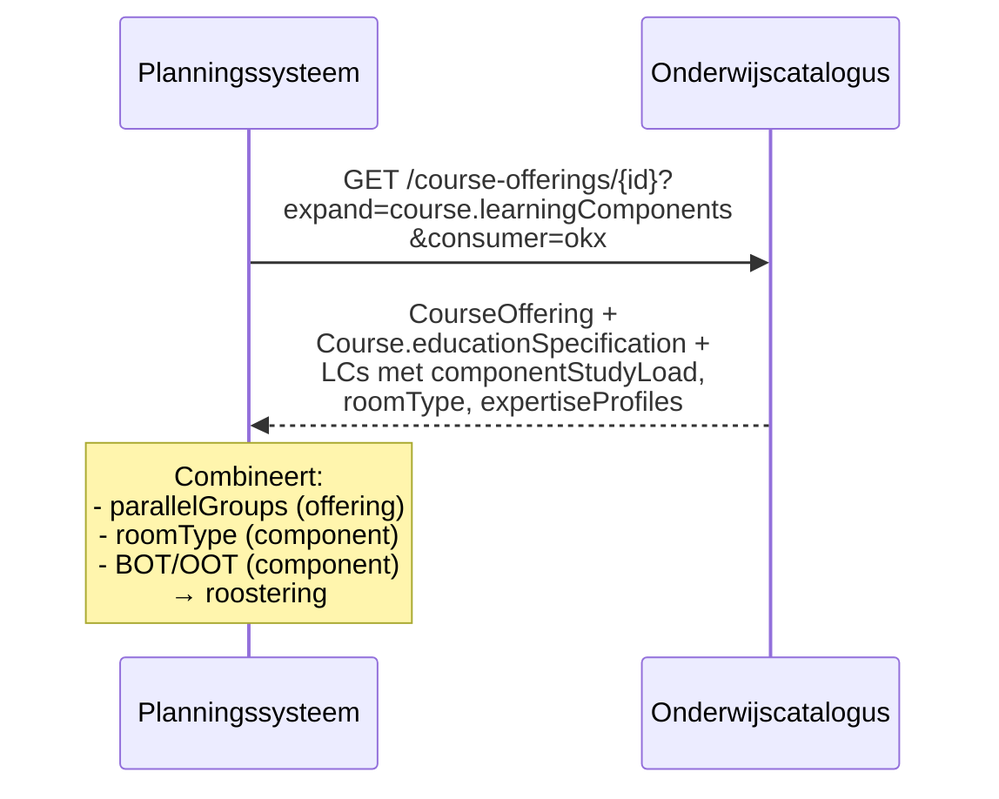

## NL → UK English mapping

| NL (oud) | EN (nieuw) |
|----------|-----------|
| `onderwijsSpecificatie` | `educationSpecification` |
| `leervorm` | `deliveryForm` |
| `cohortGrootte` | `cohortSize` |
| `doorlooptijdWeken` | `durationWeeks` |
| `minimaalAantalDeelnemers` | `minimumParticipants` |
| `parallelGroepen` | `parallelGroups` |
| `ruimteType` | `roomType` |
| `expertiseProfielen` | `expertiseProfiles` |
| `bot` | `supervisedHours` |
| `oot` | `unsupervisedHours` |

# Feature 10 — Fase 3 planningsattributen op offerings

## 1. Probleem en doel

Het planningssysteem heeft bovenop de `educationSpecification` (feature 2-4) en de basis offering-extensies (feature 5) aanvullende capaciteits- en doorlooptijdattributen nodig. Feature 10 voegt de laatste planningslaag toe op basis van de ArchiMate-flow "Opleidingseenheid specifieke planning".

**Succescriterium:** Offerings bevatten voldoende informatie voor het planningssysteem om roostering en capaciteitsbepaling te doen, zonder terug te hoeven naar de catalogusbeschrijving.

## 2. Scope

| Binnen scope | Buiten scope |
|-------------|-------------|
| Aanvullen/verfijnen offering-attributen uit feature 5 | Fijnmazige roostering (recurrence — signalering) |
| Mapping ArchiMate-flow → OEAPI-attributen | |

## 3. Referenties

Feature 5 en 7 ontwerpen. ArchiMate-model: flow "Opleidingseenheid specifieke planning".

## 4. Data en validatie

Feature 5 definieerde `cohortSize` en `durationWeeks` op ProgrammeOffering, en `planningHorizon`, `minimumParticipants`, `parallelGroups` op CourseOffering. Feature 10 controleert of deze volledig zijn en voegt eventueel **geen** extra attributen toe als feature 5 + 7 validatie bevestigt dat ze voldoen.

**Bevinding na review feature 5 en 7:** De fase-1 offering-attributen dekken de planningsbehoefte voor MVP. Fase 3 concentreert zich op **documentatie van de mapping** tussen ArchiMate-flows en OEAPI-attributen.

### Mapping ArchiMate → OEAPI

| ArchiMate informatieobject | OEAPI-attribuut(en) | Bron |
|---------------------------|---------------------|------|
| Opleidingseenheid specifieke planning | `CourseOffering` + `Course.educationSpecification` | F3 + F5 |
| Grofmazig ontwerp | `Programme` + `Programme.educationSpecification` | F2 |
| Leervraag in LO, domein, leervorm | `LearningOutcome` (query) + `modeOfDelivery` + `educationSpecification.deliveryForm` | F6 + F4 |
| Passend aanbod | `Programme` + `Course` + `LearningComponent` (full expand) | F2-F4 |

### Aanvullende attributen (indien nodig na feature 7 validatie)

**Voorlopig: geen.** Als feature 7 scenario-validatie uitwijst dat planningssystemen meer nodig hebben, worden attributen hier toegevoegd. Tot dat moment is dit document een mapping-referentie.

## 5. Happy-path narratief

## 6. Feature-specifieke diepte

Dit document levert primair de **mapping-tabel** (§4) als referentie. Geen nieuwe schema-wijzigingen.

## 7. Faalpad

**Scenario:** Planningssysteem kan `educationSpecification` niet lezen omdat het alleen kern-OEAPI verwacht en geen `consumer=okx` meestuurt.

**Mitigatie:** Het planningssysteem moet expliciet `consumer=okx` gebruiken in de query. OKx-attributen zijn alleen zichtbaar voor consumenten die het profiel kennen.

## 8. Ontwerpkeuzes

| # | Keuze | Motivatie | Alternatief |
|---|-------|-----------|-------------|
| 1 | Geen nieuwe attributen in fase 3 (voorlopig) | Feature 5 biedt voldoende planningsdata; feature 7 bevestigt dit. | Proactief roostering-attributen toevoegen — verworpen: recurrence is een OEAPI-signalering, geen extensie. |

## 9. Signaleringen

| # | Probleem | Workaround | Aanbeveling |
|---|---------|-----------|-------------|
| 1 | Geen recurrence-model in OEAPI | Meerdere LCOfferings per week | OEAPI change request (signalering 6) |

## 10. Verificatie

- [ ] Mapping-tabel is volledig (alle ArchiMate-flows gedekt)
- [ ] Geen onnodige nieuwe attributen toegevoegd
- [ ] Feature 5 attributen zijn voldoende voor MVP-planning
