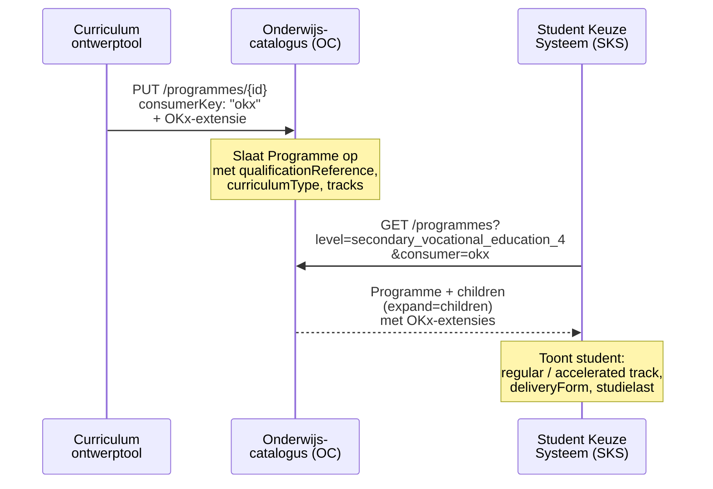
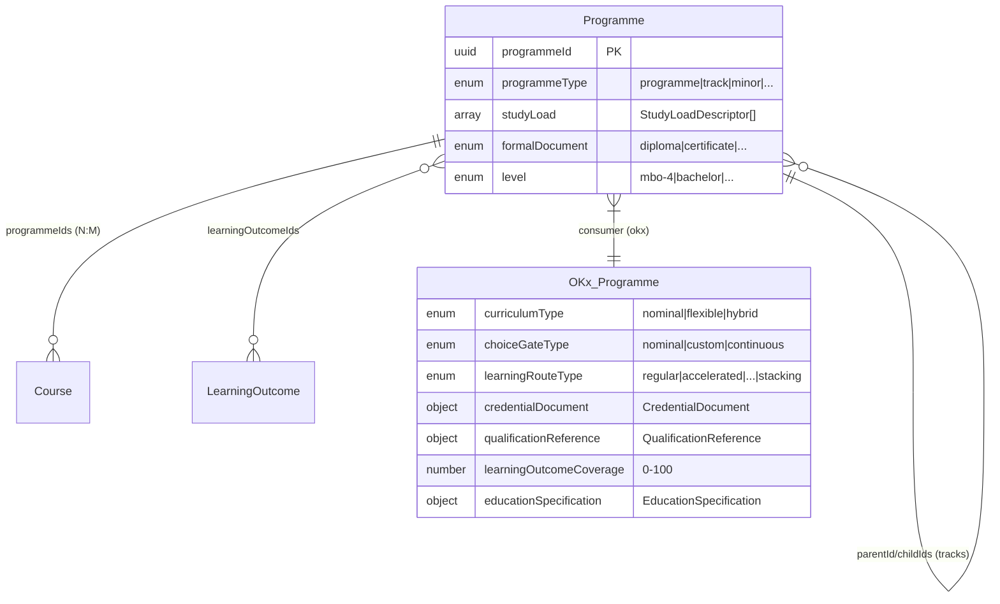

## NL → UK English mapping

| NL (oud) | EN (nieuw) | Type |
|----------|-----------|------|
| `onderwijsSpecificatie` | `educationSpecification` | attribuut |
| `waardeDocument` | `credentialDocument` | attribuut |
| `kwalificatieRef` | `qualificationReference` | attribuut |
| `keuzegateType` | `choiceGateType` | attribuut |
| `leerrouteType` | `learningRouteType` | attribuut |
| `leeruitkomstDekking` | `learningOutcomeCoverage` | attribuut |
| `leervorm` | `deliveryForm` | attribuut |
| `tijdsbesteding` | `timeAllocation` | attribuut |
| `bot` | `supervisedHours` | attribuut |
| `oot` | `unsupervisedHours` | attribuut |
| `eenheid` | `unit` | attribuut |
| `spreidingspatroon` | `distributionPattern` | attribuut |
| `ruimteType` | `roomType` | attribuut |
| `expertiseProfielen` | `expertiseProfiles` | attribuut |
| `leermiddelGroepen` | `learningResourceGroups` | attribuut |
| `kerntaak` | `coreTask` | attribuut |
| `werkproces` | `workProcess` | attribuut |
| `OnderwijsSpecificatie` | `EducationSpecification` | subschema |
| `WaardeDocument` | `CredentialDocument` | subschema |
| `KwalificatieRef` | `QualificationReference` | subschema |
| `nominaal` | `nominal` | enum |
| `flexibel` | `flexible` | enum |
| `hybride` | `hybrid` | enum |
| `maatwerk` | `custom` | enum |
| `continu` | `continuous` | enum |
| `regulier` | `regular` | enum |
| `versneld` | `accelerated` | enum |
| `temporiserend` | `decelerated` | enum |
| `vrije_keuze` | `free_choice` | enum |
| `bundelen` | `bundling` | enum |
| `stapelen` | `stacking` | enum |
| `certificaat` | `certificate` | enum |
| `microcredential` | `micro_credential` | enum |
| `mbo_certificaat` | `mbo_certificate` | enum |
| `deelkwalificatie` | `partial_qualification` | enum |

# Feature 2 — Programme-extensie (curriculum- en kwalificatielaag)

## 1. Probleem en doel

`Programme` is de zwaarste entiteit in de OKx-keten: het vertegenwoordigt de kwalificatie (mbo) of opleiding (hbo), de leerroute, en het curriculumtype. De OEAPI-kern biedt `programmeType`, `studyLoad`, `formalDocument` en `level`, maar mist concepten als **keuzegate**, **leerroutetype**, **curriculumtype**, en een **gestructureerde onderwijsspecificatie** die planners vertelt *hoe* onderwijs wordt aangeboden.

**Succescriterium:** Een implementeur kan `source/consumers/OKx/V1/Programme.yaml` schrijven en een volledig Apothekersassistent-voorbeeld (root + tracks) laten valideren, inclusief verwijzingen naar de gedeelde typen uit feature 1.

## 2. Scope

| Binnen scope | Buiten scope |
|-------------|-------------|
| OKx consumer-extensie op `Programme` | Fase 2 attributen: `instroomEisen`, `uitstroomProfiel`, `regioAanbod` (feature 8) |
| Attributen: `curriculumType`, `choiceGateType`, `learningRouteType`, `credentialDocument`, `qualificationReference`, `learningOutcomeCoverage`, `educationSpecification` | Offering-extensies (feature 5) |
| Voorbeeld-YAML (Apothekersassistent met tracks) | Course-, LearningComponent-, LearningOutcome-extensies |
| Mapping OEAPI-kernvelden ↔ OKx-extensies | Wijzigingen aan OEAPI-kernschema's |

## 3. Referenties

| Bron | Pad |
|------|-----|
| Feature 1 ontwerp | `meta/architecture/agent-artifacts/design-docs/20260414_1900_feature-1-enumeraties-en-gedeelde-typen.md` |
| Featureplan | `meta/architecture/agent-artifacts/feature-plans/20260414_1800_okx-oeapi-consumer-profiel.md` |
| Projectaanvraag §4.2, §4.3 | `meta/architecture/agent-artifacts/project-requests/20260414_1500_okx-oeapi-consumer-profiel.md` |
| ADR 0004 | SBU/EC als logistieke maatstaf |
| ADR 0012 | Leerroute onafhankelijk; keuzegate nominaal/maatwerk |
| OEAPI `ProgrammeProperties.yaml` | `source/schemas/ProgrammeProperties.yaml` |
| OEAPI `programmeType` enum | `source/enumerations/programmeType.yaml` |
| RIO Programme | `source/consumers/RIO/V1/Programme.yaml` |

## 4. Data en validatie

### Bestaande OEAPI-kernvelden die OKx hergebruikt

| OEAPI-veld | OKx-gebruik |
|-----------|------------|
| `programmeType` (extensible: programme, track, minor, specialisation, specification, honours) | Root = `programme`; leerroute = `track` of `specialisation`; keuzedeel = `minor` |
| `studyLoad` (array StudyLoadDescriptor: `{ studyLoadUnit, value }`) | Studielast in SBU/ECTS. Aggregatie-invariant: `SOM(children) = parent` |
| `formalDocument` (extensible: diploma, certificate, micro_credential_certificate, ...) | Gebruikt voor OEAPI-kernrapportage. OKx `credentialDocument` voegt granulariteit toe (badge, partial_qualification) |
| `level` / `levelOfQualification` | mbo-1 t/m mbo-4, associate_degree, bachelor, master |
| `parentId` / `childIds` | Recursie: root Programme → track Programmes |
| `learningOutcomeIds` | Verwijzing naar LearningOutcomes |
| `admissionRequirements` | Vrije tekst (fase 2 voegt gestructureerd toe) |

### Nieuwe OKx consumer-extensie attributen

| Attribuut | Type | Required | Beschrijving | ADR |
|-----------|------|----------|-------------|-----|
| `curriculumType` | enum | ja | `nominal` / `flexible` / `hybrid` | 0012 |
| `choiceGateType` | enum | ja | `nominal` / `custom` / `continuous` | 0012 |
| `learningRouteType` | enum | nee (null voor root) | `regular` / `accelerated` / ... / `stacking` (9 waarden) | 0012 |
| `credentialDocument` | object | ja | `$ref: './shared/CredentialDocument.yaml'` — type + register | — |
| `qualificationReference` | object | nee | `$ref: './shared/QualificationReference.yaml'` — SBB dossier of CROHO | 0004 |
| `learningOutcomeCoverage` | number | nee | Percentage (0-100) van kwalificatie-LO's dat dit programme afdekt. 100 = volledige kwalificatie. | — |
| `educationSpecification` | object | nee | `$ref: './shared/EducationSpecification.yaml'` — overkoepelend kader | 0011 |

### Validatie-invarianten

1. `SOM(children.studyLoad[unit=X].value) = parent.studyLoad[unit=X].value` voor elke studyLoadUnit (ADR 0004).
2. Als `credentialDocument.type = diploma` dan moet `qualificationReference` niet-null zijn (kwalificatie moet traceerbaar zijn).
3. Als `programmeType = programme` (root) dan is `learningRouteType` null; als `programmeType = track` dan is `learningRouteType` verplicht.
4. `learningOutcomeCoverage` op root = 100; op track ≤ 100 (track kan subset zijn).

## 5. Happy-path narratief



**Primaire flow:** De onderwijsontwerper publiceert een Programme met tracks via de curriculum ontwerptool. De OC slaat het op met alle OKx-extensies. Het SKS queriet de OC en ontvangt de volledige hiërarchie inclusief keuzegate-informatie en leerroutetypes.

## 6. Feature-specifieke diepte

### 6.1 Consumer YAML-structuur

```yaml
# source/consumers/OKx/V1/Programme.yaml
type: object
required:
  - curriculumType
  - choiceGateType
  - credentialDocument
properties:
  curriculumType:
    type: string
    description: "Type curriculum: hoe rigide is de leerroute?"
    enum:
      - nominal
      - flexible
      - hybrid
  choiceGateType:
    type: string
    description: "Type keuzemoment bij intake: nominal pad, custom, of continuous switchen."
    enum:
      - nominal
      - custom
      - continuous
  learningRouteType:
    type:
      - string
      - "null"
    description: |
      Type leerroute. Null voor root-programmes; verplicht voor tracks.
      Npuls leerroutes 1-9.
    enum:
      - regular
      - accelerated
      - decelerated
      - personalisatie_intra
      - personalisatie_sector
      - personalisatie_cross_sector
      - free_choice
      - bundling
      - stacking
  credentialDocument:
    $ref: "./shared/CredentialDocument.yaml"
  qualificationReference:
    oneOf:
      - $ref: "./shared/QualificationReference.yaml"
      - type: "null"
  learningOutcomeCoverage:
    type:
      - number
      - "null"
    description: |
      Percentage (0-100) van de kwalificatie-LO's dat door dit programme
      wordt afgedekt. Root = 100; track kan subset zijn.
    minimum: 0
    maximum: 100
  educationSpecification:
    oneOf:
      - $ref: "./shared/EducationSpecification.yaml"
      - type: "null"
```

### 6.2 Entiteitsdiagram



### 6.3 Voorbeeld-YAML

```yaml
# source/consumers/OKx/V1/examples/Programme.yaml

# --- Root Programme: Apothekersassistent ---
- consumerKey: okx
  curriculumType: hybrid
  choiceGateType: continuous
  learningRouteType: null
  credentialDocument:
    type: diploma
    register: DUO
  qualificationReference:
    dossier: "25391"
    kwalificatie: "25396"
    coreTask: null
    workProcess: null
    crohoCode: null
  learningOutcomeCoverage: 100
  educationSpecification:
    deliveryForm: blended
    timeAllocation:
      supervisedHours: 3200
      unsupervisedHours: 1600
      unit: sbu
      distributionPattern: "4 jaar voltijd"
    roomType: null
    expertiseProfiles: null
    learningResourceGroups: null

# --- Track: Regulier voltijd ---
- consumerKey: okx
  curriculumType: nominal
  choiceGateType: nominal
  learningRouteType: regular
  credentialDocument:
    type: diploma
    register: DUO
  qualificationReference:
    dossier: "25391"
    kwalificatie: "25396"
    coreTask: null
    workProcess: null
    crohoCode: null
  learningOutcomeCoverage: 100
  educationSpecification:
    deliveryForm: blended
    timeAllocation:
      supervisedHours: 3200
      unsupervisedHours: 1600
      unit: sbu
      distributionPattern: "40 weken/jaar, 4 jaar"
    roomType: null
    expertiseProfiles: null
    learningResourceGroups: null

# --- Track: Versneld ---
- consumerKey: okx
  curriculumType: hybrid
  choiceGateType: custom
  learningRouteType: accelerated
  credentialDocument:
    type: diploma
    register: DUO
  qualificationReference:
    dossier: "25391"
    kwalificatie: "25396"
    coreTask: null
    workProcess: null
    crohoCode: null
  learningOutcomeCoverage: 100
  educationSpecification:
    deliveryForm: blended
    timeAllocation:
      supervisedHours: 2400
      unsupervisedHours: 1200
      unit: sbu
      distributionPattern: "40 weken/jaar, 3 jaar (EVC-vrijstellingen)"
    roomType: null
    expertiseProfiles: null
    learningResourceGroups: null
```

### 6.4 Mapping OEAPI formalDocument ↔ OKx credentialDocument

| OEAPI `formalDocument` | OKx `credentialDocument.type` | Wanneer |
|------------------------|-------------------------------|---------|
| `diploma` | `diploma` | Root programme, volledige kwalificatie |
| `certificate` | `certificate` | Opleidingsonderdeel (op Course-niveau) |
| `micro_credential_certificate` | `micro_credential` | Kleinere eenheid |
| — | `mbo_certificate` | Geen direct OEAPI-equivalent |
| — | `partial_qualification` | Geen direct OEAPI-equivalent |
| — | `badge` | Geen direct OEAPI-equivalent |

## 7. Faalpad

**Scenario:** Instelling publiceert een root Programme met `studyLoad: 4800 SBU` maar de som van de child-tracks verschilt (track A = 4800, track B = 3600 via vrijstellingen). De OC accepteert beide.

**Impact:** Downstream systemen (SKS, planner) vertrouwen op aggregatie-consistentie. Als track B claimt 3600 SBU te zijn maar de courses eronder tellen op tot 4800, ontstaat een mismatch.

**Mitigatie:** De aggregatie-invariant geldt **per track**: track B heeft een lagere `studyLoad` omdat bepaalde courses via EVC zijn weggelaten (niet opgenomen in `programmeIds`). De invariant `SOM(courses.studyLoad) = track.studyLoad` moet per track kloppen. Feature 7 (validatie) formaliseert dit als testbare regel.

## 8. Ontwerpkeuzes

| # | Keuze | Motivatie | Afgewogen alternatief |
|---|-------|-----------|----------------------|
| 1 | `curriculumType` en `choiceGateType` als aparte attributen | Ze beschrijven orthogonale concepten: hoe het curriculum is ontworpen vs. hoe de student kiest. Combinatie leidt tot 3×3=9 geldige toestanden die elk iets anders betekenen. | Eén gecombineerd enum — verworpen: verlies van expressiviteit. |
| 2 | `learningRouteType` nullable op root | Een root Programme is geen leerroute maar een kwalificatie. `learningRouteType` is alleen zinvol op tracks. | Verplicht op alle niveaus — verworpen: semantisch incorrect voor root. |
| 3 | `credentialDocument` als eigen OKx-object naast OEAPI `formalDocument` | `formalDocument` mist `badge`, `partial_qualification`, `mbo_certificate`. Bovendien mist het een `register`-veld. | Extensie op `formalDocument` via `x-`-prefix — verworpen: geen ruimte voor `register`-veld. Signalering §9. |
| 4 | `educationSpecification` optioneel op Programme | Op root/track-niveau is de spec vaak overkoepelend en weinig informatief. De echte waarde zit op Course/LC-niveau. Optioneel voorkomt lege objecten. | Verplicht — verworpen: zou lege specs forceren. |

## 9. Signaleringen

| # | Probleem | Impact | Workaround | Aanbeveling |
|---|---------|--------|-----------|-------------|
| 1 | `formalDocument` mist OKx-waarden (badge, partial_qualification) | Credential-cascade niet volledig uitdrukbaar in kern | `credentialDocument` als consumer-extensie | Uitbreiden `formalDocument` extensible-enum |
| 2 | Geen gestructureerde `admissionRequirements` in kern | Trechterparameters (ADR 0007) niet querybaar | Feature 8: `instroomEisen` als consumer-extensie | OEAPI change request: structured admission requirements |

## 10. Verificatie

- [ ] `Programme.yaml` valideert als JSON Schema
- [ ] Alle `$ref`'s naar `./shared/` resolven correct
- [ ] Voorbeeld-YAML past op schema (root + 2 tracks)
- [ ] `curriculumType` en `choiceGateType` zijn onafhankelijk combineerbaar (3×3 matrix)
- [ ] `learningRouteType` is null op root, niet-null op track
- [ ] `credentialDocument.type = diploma` impliceert `qualificationReference ≠ null` (validatieregel)
- [ ] Aggregatie: `studyLoad` root = SOM tracks (of per track: SOM courses)
- [ ] Geen overlap met RIO/EduXchange `Programme` consumer-attributen
- [ ] Mapping-tabel `formalDocument` ↔ `credentialDocument` is volledig
