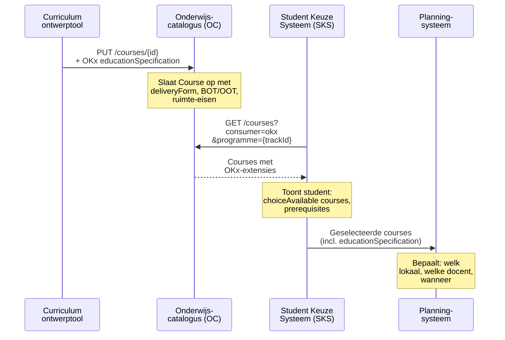
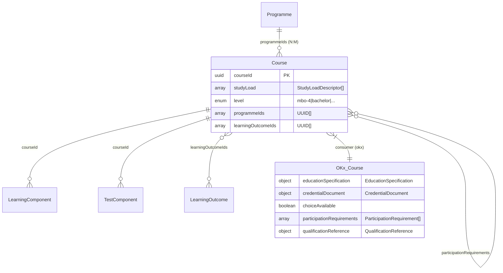

## NL → UK English mapping

| NL (oud) | EN (nieuw) | Type |
|----------|-----------|------|
| `onderwijsSpecificatie` | `educationSpecification` | attribuut |
| `waardeDocument` | `credentialDocument` | attribuut |
| `keuzeMogelijk` | `choiceAvailable` | attribuut |
| `deelnameVereisten` | `participationRequirements` | attribuut |
| `kwalificatieRef` | `qualificationReference` | attribuut |
| `leervorm` | `deliveryForm` | attribuut |
| `tijdsbesteding` | `timeAllocation` | attribuut |
| `bot` | `supervisedHours` | attribuut |
| `oot` | `unsupervisedHours` | attribuut |
| `eenheid` | `unit` | attribuut |
| `spreidingspatroon` | `distributionPattern` | attribuut |
| `ruimteType` | `roomType` | attribuut |
| `ruimteEisen` | `roomRequirements` | attribuut |
| `expertiseProfielen` | `expertiseProfiles` | attribuut |
| `profiel` | `profile` | attribuut |
| `leermiddelGroepen` | `learningResourceGroups` | attribuut |
| `groep` | `group` | attribuut |
| `specificatie` | `specification` | attribuut |
| `kerntaak` | `coreTask` | attribuut |
| `werkproces` | `workProcess` | attribuut |
| `referentieId` | `referenceId` | attribuut |
| `OnderwijsSpecificatie` | `EducationSpecification` | subschema |
| `WaardeDocument` | `CredentialDocument` | subschema |
| `DeelnameVereiste` | `ParticipationRequirement` | subschema |
| `KwalificatieRef` | `QualificationReference` | subschema |
| `simulatie` | `simulation` | enum |
| `werkplekleren` | `work_based_learning` | enum |
| `praktijkruimte_simulatie` | `simulation_practice_room` | enum |
| `externe_werkplek` | `external_workplace` | enum |
| `hybride` | `hybrid` | enum |
| `microcredential` | `micro_credential` | enum |
| `certificaat` | `certificate` | enum |
| `mbo_certificaat` | `mbo_certificate` | enum |
| `afgerond` | `completed` | enum |

# Feature 3 — Course-extensie (opleidingsonderdeel / leertaak)

## 1. Probleem en doel

`Course` vertegenwoordigt het **opleidingsonderdeel** of de **leertaak**: het niveau waarop studenten certificaten of microcredentials verdienen, waarop volgordelijkheid wordt afgedwongen, en waarop de onderwijsspecificatie concreet wordt. De OEAPI-kern biedt `studyLoad`, `level` en `learningOutcomeIds`, maar mist **prerequisite-relaties**, **waardeDocumenten** en de **gestructureerde onderwijsspecificatie** die de planner nodig heeft.

**Succescriterium:** Een implementeur kan `source/consumers/OKx/V1/Course.yaml` schrijven met voorbeelden die prerequisite-ketens en onderwijsspecificaties demonstreren, refererend aan feature 1 gedeelde typen.

## 2. Scope

| Binnen scope | Buiten scope |
|-------------|-------------|
| OKx consumer-extensie op `Course` | LearningComponent/TestComponent extensies (feature 4) |
| Attributen: `educationSpecification`, `credentialDocument`, `choiceAvailable`, `participationRequirements`, `qualificationReference` | Offering-extensies (feature 5) |
| Voorbeeld-YAML (Baliegesprekken, BPV) | Fase 2 CourseOffering-attributen (feature 9) |

## 3. Referenties

| Bron | Pad |
|------|-----|
| Feature 1 ontwerp | `meta/architecture/agent-artifacts/design-docs/20260414_1900_feature-1-enumeraties-en-gedeelde-typen.md` |
| Feature 2 ontwerp | `meta/architecture/agent-artifacts/design-docs/20260414_1930_feature-2-programme-extensie.md` |
| Projectaanvraag §4.3 | `meta/architecture/agent-artifacts/project-requests/20260414_1500_okx-oeapi-consumer-profiel.md` |
| ADR 0004 | SBU/EC als logistieke maatstaf |
| ADR 0011 | Keuzeniveau leeractiviteit |
| OEAPI `CourseProperties.yaml` | `source/schemas/CourseProperties.yaml` |

## 4. Data en validatie

### Bestaande OEAPI-kernvelden die OKx hergebruikt

| OEAPI-veld | OKx-gebruik |
|-----------|------------|
| `studyLoad` (array StudyLoadDescriptor) | Studielast in SBU/ECTS. Onderdeel van aggregatie-invariant. |
| `level` | mbo-niveau, bachelor, etc. Overgenomen van bovenliggend Programme of specifiek per Course. |
| `programmeIds` | N:M relatie — één Course kan bij meerdere Programmes/tracks horen. |
| `learningOutcomeIds` | Welke LO's deze Course afdekt. |
| `modesOfDelivery` | OEAPI-kernwaarden; OKx voegt deliveryForm toe via `educationSpecification`. |

### Nieuwe OKx consumer-extensie attributen

| Attribuut | Type | Required | Beschrijving | ADR |
|-----------|------|----------|-------------|-----|
| `educationSpecification` | object | nee | `$ref EducationSpecification.yaml` — deliveryForm, timeAllocation, ruimte, expertise, leermiddelen | 0011 |
| `credentialDocument` | object | ja | `$ref CredentialDocument.yaml` — credential bij afronding | — |
| `choiceAvailable` | boolean | ja | Kan de student deze course kiezen als los onderdeel (buiten een track)? Relevant voor modulair studeren. | 0012 |
| `participationRequirements` | array | nee | `$ref ParticipationRequirement.yaml[]` — prerequisite-courses | — |
| `qualificationReference` | object | nee | `$ref QualificationReference.yaml` — welke coreTask/workProcess deze Course afdekt | 0004 |

### Validatie-invarianten

1. `SOM(children_LearningComponents.componentStudyLoad[supervisedHours+unsupervisedHours]) ≈ course.studyLoad` (feature 4 + 7 valideren dit).
2. `participationRequirements[].referenceId` moet verwijzen naar een bestaande `courseId` binnen hetzelfde Programme.
3. Als `choiceAvailable = true`, moet de Course voldoende metadata hebben om zelfstandig gepresenteerd te worden (naam, studyLoad, learningOutcomeIds).

## 5. Happy-path narratief



## 6. Feature-specifieke diepte

### 6.1 Consumer YAML-structuur

```yaml
# source/consumers/OKx/V1/Course.yaml
type: object
required:
  - credentialDocument
  - choiceAvailable
properties:
  educationSpecification:
    oneOf:
      - $ref: "./shared/EducationSpecification.yaml"
      - type: "null"
  credentialDocument:
    $ref: "./shared/CredentialDocument.yaml"
  choiceAvailable:
    type: boolean
    description: |
      Kan de student deze course als los onderdeel kiezen,
      buiten een vaste track? true = modulair beschikbaar.
  participationRequirements:
    type:
      - array
      - "null"
    items:
      $ref: "./shared/ParticipationRequirement.yaml"
  qualificationReference:
    oneOf:
      - $ref: "./shared/QualificationReference.yaml"
      - type: "null"
```

### 6.2 Entiteitsdiagram



### 6.3 Voorbeeld-YAML

```yaml
# source/consumers/OKx/V1/examples/Course.yaml

# --- Course: Baliegesprekken en cliëntcommunicatie ---
- consumerKey: okx
  educationSpecification:
    deliveryForm: simulation
    timeAllocation:
      supervisedHours: 160
      unsupervisedHours: 80
      unit: sbu
      distributionPattern: "2x per week, 20 weken"
    roomType: simulation_practice_room
    roomRequirements: "balie, wachtruimte, kassasysteem"
    expertiseProfiles:
      - profile: "rollenspel_training"
      - profile: "farmaceutisch"
    learningResourceGroups:
      - group: "simulatie_materiaal"
        specification: "nep-medicijnen, bijsluiters, kassasysteem"
      - group: "digitaal_werkstation"
        specification: "Chromebook + apotheek-informatiesysteem"
  credentialDocument:
    type: micro_credential
    register: "instelling-intern"
  choiceAvailable: false
  participationRequirements: null
  qualificationReference:
    dossier: "25391"
    kwalificatie: null
    coreTask: "B1-K1"
    workProcess: null
    crohoCode: null

# --- Course: Beroepspraktijkvorming (BPV) ---
- consumerKey: okx
  educationSpecification:
    deliveryForm: work_based_learning
    timeAllocation:
      supervisedHours: 200
      unsupervisedHours: 1000
      unit: sbu
      distributionPattern: "3 dagen/week, 40 weken"
    roomType: external_workplace
    roomRequirements: null
    expertiseProfiles:
      - profile: "praktijkbegeleider"
    learningResourceGroups: null
  credentialDocument:
    type: certificate
    register: DUO
  choiceAvailable: false
  participationRequirements:
    - referenceId: "aaa-bbb-ccc-ddd"
      type: completed
  qualificationReference:
    dossier: "25391"
    kwalificatie: null
    coreTask: null
    workProcess: null
    crohoCode: null

# --- Course: Keuzedeel Digitale vaardigheden ---
- consumerKey: okx
  educationSpecification:
    deliveryForm: blended
    timeAllocation:
      supervisedHours: 120
      unsupervisedHours: 120
      unit: sbu
      distributionPattern: null
    roomType: hybrid
    roomRequirements: null
    expertiseProfiles: null
    learningResourceGroups:
      - group: "digitaal_werkstation"
        specification: null
  credentialDocument:
    type: mbo_certificate
    register: DUO
  choiceAvailable: true
  participationRequirements: null
  qualificationReference:
    dossier: "25391"
    kwalificatie: null
    coreTask: null
    workProcess: null
    crohoCode: null
```

### 6.4 Relatie `choiceAvailable` ↔ EduXchange `visibleForOwnStudents`

Open vraag uit het featureplan: hoe verhoudt OKx `choiceAvailable` zich tot EduXchange `visibleForOwnStudents`?

**Beslissing:** Ze zijn **orthogonaal**. `choiceAvailable` beantwoordt "mag de student deze Course los kiezen?"; `visibleForOwnStudents` beantwoordt "zien studenten van de *eigen* instelling dit in de alliantiecatalogus?". Een Course kan `choiceAvailable: true` én `visibleForOwnStudents: false` zijn (modulair beschikbaar, maar niet via alliantie). Beide consumer-profielen kunnen naast elkaar bestaan in het `consumer`-array.

## 7. Faalpad

**Scenario:** Course A heeft `participationRequirements: [{ referenceId: courseB, type: completed }]`, maar Course B is niet opgenomen in hetzelfde Programme. De student ziet Course A maar kan de prerequisite niet vinden.

**Impact:** SKS kan de prerequisite-keten niet tonen; student raakt vast.

**Mitigatie:** Validatieregel (feature 7): alle `participationRequirements[].referenceId`'s moeten resolveerbaar zijn binnen de scope van het Programme (of de query-context). Als een Course in meerdere Programmes zit via `programmeIds`, moet de prerequisite in minstens één gedeeld Programme voorkomen.

## 8. Ontwerpkeuzes

| # | Keuze | Motivatie | Afgewogen alternatief |
|---|-------|-----------|----------------------|
| 1 | `choiceAvailable` als boolean | Simpelste uitdrukking; het is een ja/nee-eigenschap van de Course zelf. | Enum met nuances (keuze_vrij, keuze_na_advies, niet_kiesbaar) — overweeg in fase 2 als instellingen dit vragen. |
| 2 | `participationRequirements` als array met `referenceId` | Flexibel: kan naar courses of componenten verwijzen. `type` (completed/concurrent) dekt de twee prerequisite-patronen. | Directe `prerequisiteIds` op OEAPI-kern — ideaal maar signalering (kern mist dit). |
| 3 | `qualificationReference` op Course-niveau | Traceerbaar welke coreTask een Course afdekt. Optioneel want niet elke Course map 1:1 op een coreTask. | Alleen op Programme-niveau — verworpen: te grof, verliest traceerbaarheid. |

## 9. Signaleringen

| # | Probleem | Workaround | Aanbeveling |
|---|---------|-----------|-------------|
| 1 | Geen `prerequisiteIds` op Course in OEAPI-kern | `participationRequirements` als consumer-extensie | OEAPI change request (signalering 3 uit projectaanvraag) |
| 2 | `studyLoad` op Course is een `StudyLoadDescriptor` (eenheid + waarde) maar geen BOT/OOT-uitsplitsing | `educationSpecification.timeAllocation` voegt BOT/OOT toe | Overweeg OEAPI-uitbreiding StudyLoadDescriptor met BOT/OOT |

## 10. Verificatie

- [ ] `Course.yaml` valideert als JSON Schema
- [ ] `$ref`'s naar `./shared/` resolven
- [ ] Voorbeelden passen op schema (3 courses: simulation, BPV, keuzedeel)
- [ ] `participationRequirements[].referenceId` is `format: uuid`
- [ ] `choiceAvailable` is boolean, niet nullable
- [ ] Geen conflicten met RIO/EduXchange Course-consumer-attributen
- [ ] `qualificationReference` op Course-niveau is optioneel (null toegestaan)
