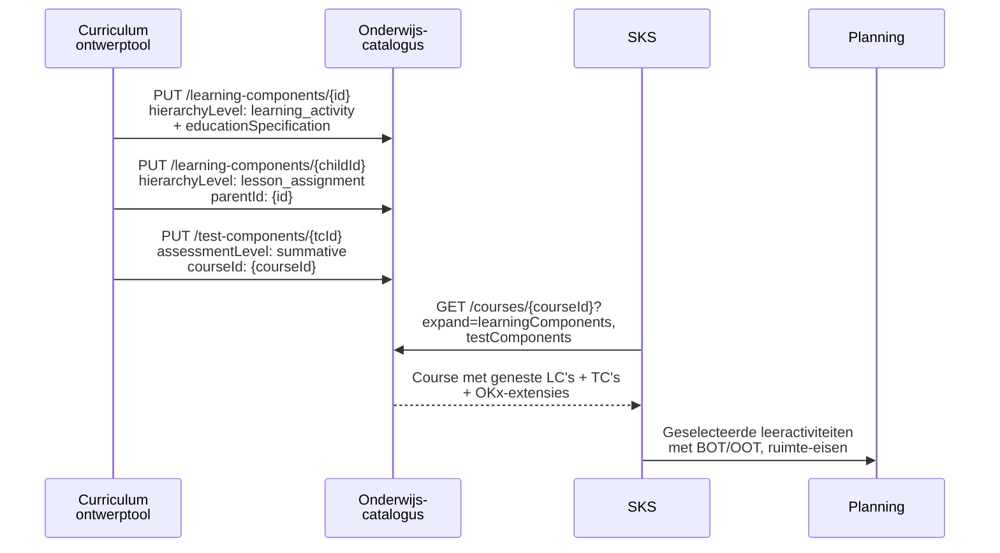
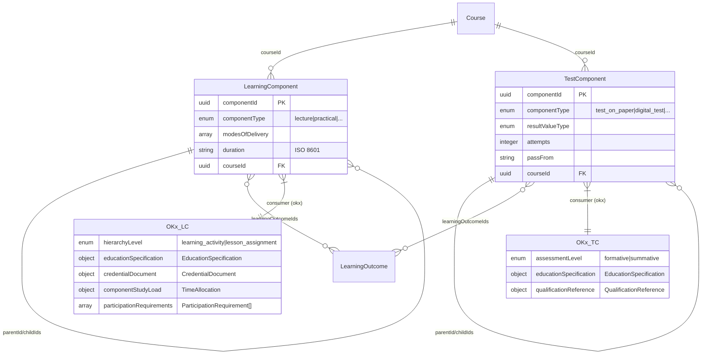

## NL → UK English mapping

| NL (oud) | EN (nieuw) | Type |
|----------|-----------|------|
| `hierarchieNiveau` | `hierarchyLevel` | attribuut |
| `onderwijsSpecificatie` | `educationSpecification` | attribuut |
| `waardeDocument` | `credentialDocument` | attribuut |
| `deelnameVereisten` | `participationRequirements` | attribuut |
| `toetsNiveau` | `assessmentLevel` | attribuut |
| `kwalificatieRef` | `qualificationReference` | attribuut |
| `leervorm` | `deliveryForm` | attribuut |
| `tijdsbesteding` | `timeAllocation` | attribuut |
| `bot` | `supervisedHours` | attribuut |
| `oot` | `unsupervisedHours` | attribuut |
| `eenheid` | `unit` | attribuut |
| `spreidingspatroon` | `distributionPattern` | attribuut |
| `ruimteType` | `roomType` | attribuut |
| `ruimteEisen` | `roomRequirements` | attribuut |
| `expertiseProfielen` | `expertiseProfiles` | attribuut |
| `profiel` | `profile` | attribuut |
| `leermiddelGroepen` | `learningResourceGroups` | attribuut |
| `groep` | `group` | attribuut |
| `specificatie` | `specification` | attribuut |
| `OnderwijsSpecificatie` | `EducationSpecification` | subschema |
| `WaardeDocument` | `CredentialDocument` | subschema |
| `Tijdsbesteding` | `TimeAllocation` | subschema |
| `DeelnameVereiste` | `ParticipationRequirement` | subschema |
| `KwalificatieRef` | `QualificationReference` | subschema |
| `leeractiviteit` | `learning_activity` | enum |
| `lesopdracht` | `lesson_assignment` | enum |
| `formatief` | `formative` | enum |
| `summatief` | `summative` | enum |
| `simulatie` | `simulation` | enum |
| `klassikaal` | `classroom` | enum |
| `praktijkruimte_simulatie` | `simulation_practice_room` | enum |
| `collegezaal` | `lecture_hall` | enum |
| `microcredential` | `micro_credential` | enum |

# Feature 4 — LearningComponent- en TestComponent-extensie

## 1. Probleem en doel

`LearningComponent` en `TestComponent` vormen het **fijnste niveau** van de onderwijshiërarchie: leeractiviteiten, lesopdrachten en toetsen. Hier is de `educationSpecification` het meest concreet — BOT/OOT per les, ruimte-eisen, expertiseprofiel, leermiddelen. De OEAPI-kern biedt `componentType`, `modesOfDelivery`, `duration` en recursieve `parentId`/`childIds`, maar mist een **hiërarchie-label** (leeractiviteit vs. lesopdracht), **BOT/OOT-uitsplitsing**, **deelnamevereisten** en het **toetsniveau** (formatief/summatief).

**Succescriterium:** Implementeurs kunnen `LearningComponent.yaml` en `TestComponent.yaml` schrijven met recursieve voorbeelden (leeractiviteit → lesopdrachten) en BOT/OOT-tijdsbesteding.

## 2. Scope

| Binnen scope | Buiten scope |
|-------------|-------------|
| OKx consumer-extensie op `LearningComponent` en `TestComponent` | Offering-extensies (feature 5) |
| LC: `hierarchyLevel`, `educationSpecification`, `credentialDocument`, `componentStudyLoad`, `participationRequirements` | LearningOutcome-extensie (feature 6) |
| TC: `assessmentLevel`, `educationSpecification` (subset), `qualificationReference` | Fase 2/3 attributen |

## 3. Referenties

| Bron | Pad |
|------|-----|
| Feature 1 ontwerp | `meta/architecture/agent-artifacts/design-docs/20260414_1900_feature-1-enumeraties-en-gedeelde-typen.md` |
| Projectaanvraag §4.3 | `meta/architecture/agent-artifacts/project-requests/20260414_1500_okx-oeapi-consumer-profiel.md` |
| ADR 0011 | Keuzeniveau = leeractiviteit; lesopdracht = LMS-domein |
| ADR 0004 | SBU/EC als logistieke maatstaf |
| OEAPI `LearningComponent.yaml` | `source/schemas/LearningComponent.yaml` |
| OEAPI `TestComponent.yaml` | `source/schemas/TestComponent.yaml` |

## 4. Data en validatie

### Bestaande OEAPI-kernvelden

| OEAPI-veld | OKx-gebruik |
|-----------|------------|
| `componentType` (LC: lecture, practical, project, ...) | Geeft het *type* activiteit; OKx voegt `hierarchyLevel` toe voor positie in hiërarchie |
| `modesOfDelivery` | OEAPI-kernwaarden; OKx voegt `deliveryForm` toe via `educationSpecification` |
| `duration` (ISO 8601) | Kalendermatige duur; OKx voegt BOT/OOT toe via `componentStudyLoad` |
| `parentId` / `childIds` | Recursie: leeractiviteit → lesopdrachten |
| `courseId` | Verwijst naar bovenliggende Course |
| `learningOutcomeIds` | Welke LO's deze component afdekt |
| TC `resultValueType`, `attempts`, `passFrom` | Toetsmetadata; OKx voegt `assessmentLevel` toe |

### Nieuwe OKx consumer-extensie: LearningComponent

| Attribuut | Type | Required | Beschrijving | ADR |
|-----------|------|----------|-------------|-----|
| `hierarchyLevel` | enum | ja | `learning_activity` (keuzeniveau) / `lesson_assignment` (LMS-domein) | 0011 |
| `educationSpecification` | object | nee | `$ref EducationSpecification.yaml` — hier het meest gedetailleerd | 0011 |
| `credentialDocument` | object | nee | `$ref CredentialDocument.yaml` — badge voor lesson_assignment, micro_credential voor learning_activity | — |
| `componentStudyLoad` | object | nee | `$ref TimeAllocation.yaml` — BOT/OOT per component | 0004 |
| `participationRequirements` | array | nee | `$ref ParticipationRequirement.yaml[]` — volgordelijkheid binnen een Course | — |

### Nieuwe OKx consumer-extensie: TestComponent

| Attribuut | Type | Required | Beschrijving |
|-----------|------|----------|-------------|
| `assessmentLevel` | enum | ja | `formative` / `summative` |
| `educationSpecification` | object | nee | Subset: ruimte, expertise, timeAllocation (examenduur) |
| `qualificationReference` | object | nee | `$ref QualificationReference.yaml` — welk workProcess wordt getoetst |

### Validatie-invarianten

1. `hierarchyLevel = learning_activity` → component mag children hebben (`childIds`).
2. `hierarchyLevel = lesson_assignment` → component **mag** children hebben (sub-opdrachten) maar is **geen** keuzeniveau voor SKS.
3. `SOM(children.componentStudyLoad[supervisedHours+unsupervisedHours]) ≈ parent.componentStudyLoad[supervisedHours+unsupervisedHours]` (aggregatie).
4. `assessmentLevel = summative` → `qualificationReference` zou niet-null moeten zijn (summatieve toets is wettelijk gebonden).
5. `componentStudyLoad.unit` moet consistent zijn met de bovenliggende Course `studyLoad` eenheid.

## 5. Happy-path narratief



## 6. Feature-specifieke diepte

### 6.1 Consumer YAML: LearningComponent

```yaml
# source/consumers/OKx/V1/LearningComponent.yaml
type: object
required:
  - hierarchyLevel
properties:
  hierarchyLevel:
    type: string
    description: |
      Positie in de onderwijshiërarchie.
      - learning_activity: collectie lesson_assignments, keuzeniveau student (ADR 0011)
      - lesson_assignment: individuele les/opdracht, LMS-domein
    enum:
      - learning_activity
      - lesson_assignment
  educationSpecification:
    oneOf:
      - $ref: "./shared/EducationSpecification.yaml"
      - type: "null"
  credentialDocument:
    oneOf:
      - $ref: "./shared/CredentialDocument.yaml"
      - type: "null"
  componentStudyLoad:
    oneOf:
      - $ref: "./shared/TimeAllocation.yaml"
      - type: "null"
  participationRequirements:
    type:
      - array
      - "null"
    items:
      $ref: "./shared/ParticipationRequirement.yaml"
```

### 6.2 Consumer YAML: TestComponent

```yaml
# source/consumers/OKx/V1/TestComponent.yaml
type: object
required:
  - assessmentLevel
properties:
  assessmentLevel:
    type: string
    description: |
      - formative: tussentijds, niet geldend voor diploma
      - summative: geldend voor diploma/certificaat
    enum:
      - formative
      - summative
  educationSpecification:
    oneOf:
      - $ref: "./shared/EducationSpecification.yaml"
      - type: "null"
  qualificationReference:
    oneOf:
      - $ref: "./shared/QualificationReference.yaml"
      - type: "null"
```

### 6.3 Entiteitsdiagram



### 6.4 Voorbeeld-YAML: LearningComponent

```yaml
# source/consumers/OKx/V1/examples/LearningComponent.yaml

# --- Leeractiviteit: Gespreksvoering simulatie ---
- consumerKey: okx
  hierarchyLevel: learning_activity
  educationSpecification:
    deliveryForm: simulation
    timeAllocation:
      supervisedHours: 80
      unsupervisedHours: 40
      unit: sbu
      distributionPattern: "2x per week, 8 weken"
    roomType: simulation_practice_room
    roomRequirements: "balie, wachtruimte, kassasysteem"
    expertiseProfiles:
      - profile: "rollenspel_training"
    learningResourceGroups:
      - group: "simulatie_materiaal"
        specification: "nep-medicijnen, bijsluiters"
  credentialDocument:
    type: micro_credential
    register: "instelling-intern"
  componentStudyLoad:
    supervisedHours: 80
    unsupervisedHours: 40
    unit: sbu
    distributionPattern: "2x per week, 8 weken"
  participationRequirements: null

# --- Lesopdracht: Gesprek bij emotionele cliënt ---
- consumerKey: okx
  hierarchyLevel: lesson_assignment
  educationSpecification:
    deliveryForm: simulation
    timeAllocation:
      supervisedHours: 20
      unsupervisedHours: 10
      unit: sbu
      distributionPattern: null
    roomType: simulation_practice_room
    roomRequirements: null
    expertiseProfiles:
      - profile: "rollenspel_training"
    learningResourceGroups: null
  credentialDocument:
    type: badge
    register: "edubadges.nl"
  componentStudyLoad:
    supervisedHours: 20
    unsupervisedHours: 10
    unit: sbu
    distributionPattern: null
  participationRequirements: null
```

### 6.5 Voorbeeld-YAML: TestComponent

```yaml
# source/consumers/OKx/V1/examples/TestComponent.yaml

# --- Summatief praktijkexamen ---
- consumerKey: okx
  assessmentLevel: summative
  educationSpecification:
    deliveryForm: simulation
    timeAllocation:
      supervisedHours: 4
      unsupervisedHours: 0
      unit: sbu
      distributionPattern: null
    roomType: simulation_practice_room
    roomRequirements: "balie, wachtruimte"
    expertiseProfiles:
      - profile: "examinator_farmaceutisch"
    learningResourceGroups: null
  qualificationReference:
    dossier: "25391"
    kwalificatie: null
    coreTask: "B1-K1"
    workProcess: "B1-K1-W1"
    crohoCode: null

# --- Formatieve tussentoets ---
- consumerKey: okx
  assessmentLevel: formative
  educationSpecification:
    deliveryForm: classroom
    timeAllocation:
      supervisedHours: 1
      unsupervisedHours: 0
      unit: sbu
      distributionPattern: null
    roomType: lecture_hall
    roomRequirements: null
    expertiseProfiles: null
    learningResourceGroups: null
  qualificationReference: null
```

### 6.6 `componentStudyLoad` vs. OEAPI `duration`

| Aspect | OEAPI `duration` | OKx `componentStudyLoad` |
|--------|------------------|--------------------------|
| Format | ISO 8601 (`P1DT10H30M`) | Object: `{ supervisedHours, unsupervisedHours, unit, distributionPattern }` |
| Wat | Kalendermatige duur van de component | Studielast uitgesplitst in contacttijd en zelfstudie |
| Aggregeert | Nee (duur overlapt potentieel) | Ja: `SOM(children) = parent` |

**Beslissing:** Beide bestaan naast elkaar. `duration` is de "klok-tijd" van de activiteit; `componentStudyLoad` is de "inspannings-tijd" voor de student (ADR 0004).

## 7. Faalpad

**Scenario:** Een LearningComponent met `hierarchyLevel: learning_activity` heeft geen children, maar de bovenliggende Course verwacht aggregatie.

**Impact:** De aggregatie-invariant `SOM(components.componentStudyLoad) = course.studyLoad` kan kloppen als de leeractiviteit zelf de volledige load draagt (geen sub-opdrachten). Dit is geldig — niet elke leeractiviteit hoeft lesopdrachten te hebben.

**Werkelijke faalpad:** De som van alle `componentStudyLoad` onder een Course wijkt af van `course.studyLoad`. Feature 7 signaleert dit als validatiefout.

## 8. Ontwerpkeuzes

| # | Keuze | Motivatie | Afgewogen alternatief |
|---|-------|-----------|----------------------|
| 1 | `hierarchyLevel` als expliciete enum i.p.v. afleiden uit nesting | Niet alle geneste componenten zijn lesopdrachten; een leeractiviteit kan ook onder een andere leeractiviteit vallen (thematische groepering). Expliciet label voorkomt ambiguïteit. | Automatisch afleiden: root = learning_activity, child = lesson_assignment — verworpen: te rigide bij 3+ niveaus. |
| 2 | `TestComponent` apart schema (niet hergebruik van LC) | OEAPI scheidt ze al; TC heeft unieke velden (`resultValueType`, `attempts`, `passFrom`). OKx volgt dit patroon. | Eén schema voor LC + TC — verworpen: breekt met OEAPI-structuur. |
| 3 | `componentStudyLoad` naast OEAPI `duration` | `duration` is ISO 8601 kalendermatig; `componentStudyLoad` is inspanningsmatig met BOT/OOT. Beide zijn nodig voor respectievelijk roostering en aggregatie. | Alleen `educationSpecification.timeAllocation` — verworpen: `componentStudyLoad` is direct op component-niveau nodig voor snelle aggregatie zonder nesting. |

## 9. Signaleringen

| # | Probleem | Workaround | Aanbeveling |
|---|---------|-----------|-------------|
| 1 | Geen `studyLoad` (StudyLoadDescriptor) op `LearningComponent`/`TestComponent` in OEAPI-kern | `componentStudyLoad` als consumer-extensie (TimeAllocation) | OEAPI change request: `studyLoad` op component-niveau (signalering 1 uit projectaanvraag) |
| 2 | Geen prerequisite-mechanisme op `LearningComponent` | `participationRequirements` als consumer-extensie | OEAPI change request (signalering 3) |

## 10. Verificatie

- [ ] `LearningComponent.yaml` en `TestComponent.yaml` valideren als JSON Schema
- [ ] `$ref`'s naar `./shared/` resolven
- [ ] Voorbeeld LC: learning_activity met 2 lesson_assignments, BOT/OOT consistent
- [ ] Voorbeeld TC: summative met qualificationReference, formative zonder
- [ ] `hierarchyLevel = learning_activity` ↔ `componentType` (practical, lecture, ...) zijn orthogonaal
- [ ] `componentStudyLoad` en OEAPI `duration` bestaan naast elkaar zonder conflict
- [ ] Aggregatie: SOM lesson_assignments = learning_activity = Course
