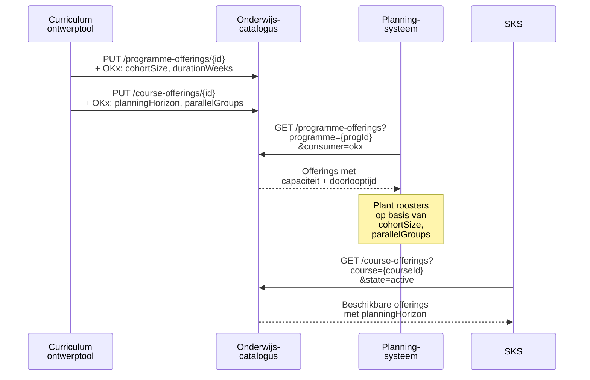

## NL → UK English mapping

| NL (oud) | EN (nieuw) |
|----------|-----------|
| `cohortGrootte` | `cohortSize` |
| `doorlooptijdWeken` | `durationWeeks` |
| `minimaalAantalDeelnemers` | `minimumParticipants` |
| `parallelGroepen` | `parallelGroups` |
| `onderwijsSpecificatie` | `educationSpecification` |
| `leervorm` | `deliveryForm` |
| `ruimteType` | `roomType` |
| `praktijkruimte_simulatie` | `simulation_practice_room` |
| `beschikbarePlaatsen` | `availablePlaces` |
| `instroomMomenten` | `admissionMoments` |
| `regioAanbod` | `regionOffering` |
| `beschikbaarheidsType` | `availabilityType` |
| `budgetIndicatie` | `budgetIndication` |

# Feature 5 — Offering-extensies (aanbod-/planningslaag)

## 1. Probleem en doel

Offerings verbinden de catalogusspecificatie met **concrete uitvoering in tijd en capaciteit**. De OEAPI-kern biedt `startDateTime`, `endDateTime`, `maxNumberStudents`, `minNumberStudents`, `state` en `modesOfDelivery`, maar het planningssysteem heeft aanvullende informatie nodig: **cohortgrootte**, **doorlooptijd**, en **planningshorizon**. Feature 5 levert de minimale fase-1 offering-extensies; fase 2/3 attributen (beschikbaarheid, budget, admissionMoments) volgen in features 8-10.

**Succescriterium:** Implementeurs kunnen `ProgrammeOffering.yaml`, `CourseOffering.yaml` en `LearningComponentOffering.yaml` schrijven als OKx consumer-extensies, refererend aan de entiteit-extensies uit feature 2-4.

## 2. Scope

| Binnen scope | Buiten scope |
|-------------|-------------|
| OKx consumer-extensies op `ProgrammeOffering`, `CourseOffering`, `LearningComponentOffering` | Fase 2: `availablePlaces`, `admissionMoments`, `regionOffering` (feature 8) |
| PO: `cohortSize`, `durationWeeks` | Fase 2: `availabilityType`, `budgetIndication` (feature 9) |
| CO: `planningHorizon`, `minimumParticipants`, `parallelGroups` | Fase 3: aanvullende planningsattributen (feature 10) |
| LCO: minimaal (voorbereid) | TestComponentOffering (volgt dezelfde structuur als LCO) |

## 3. Referenties

| Bron | Pad |
|------|-----|
| Features 2-4 ontwerp | `design-docs/20260414_1930_feature-{2,3,4}-*.md` |
| Projectaanvraag §6 | `project-requests/20260414_1500_okx-oeapi-consumer-profiel.md` |
| OEAPI `ProgrammeOffering.yaml` | `source/schemas/ProgrammeOffering.yaml` |
| OEAPI `CourseOffering.yaml` | `source/schemas/CourseOffering.yaml` |
| OEAPI `LearningComponentOffering.yaml` | `source/schemas/LearningComponentOffering.yaml` |
| OEAPI `OfferingProperties.yaml` | `source/schemas/OfferingProperties.yaml` |
| RIO `Offering.yaml` | `source/consumers/RIO/V1/Offering.yaml` |

## 4. Data en validatie

### Bestaande OEAPI-kernvelden

| OEAPI-veld | OKx-gebruik |
|-----------|------------|
| `startDateTime` / `endDateTime` | Wanneer het aanbod loopt. OKx voegt `durationWeeks` toe als afgeleide. |
| `maxNumberStudents` / `minNumberStudents` | Bestaande capaciteitsinfo. OKx voegt `cohortSize` toe voor planningsdoeleinden. |
| `state` (concept/active/inactive/cancelled) | Levenscyclus; OKx hergebruikt ongewijzigd. |
| `modesOfDelivery` | OEAPI-kernwaarden; `educationSpecification.deliveryForm` zit op de bovenliggende entiteit. |
| `academicSessionId` | Koppeling aan academisch jaar/periode. |
| `flexibleEntryPeriodStart/End` | Instroom-flexibiliteit; OKx hergebruikt. |
| `roomIds` / `rooms` (op LCO) | Ruimte-koppeling al in kern. |

### Nieuwe OKx consumer-extensies

#### ProgrammeOffering

| Attribuut | Type | Required | Beschrijving |
|-----------|------|----------|-------------|
| `cohortSize` | integer | nee | Geplande groepsgrootte voor dit cohort (niet hetzelfde als `maxNumberStudents` — dat is een capaciteitslimiet, dit is een planningsgetal) |
| `durationWeeks` | integer | nee | Geplande doorlooptijd in weken. Afgeleid uit `startDateTime`/`endDateTime` maar expliciet voor planners. |

#### CourseOffering

| Attribuut | Type | Required | Beschrijving |
|-----------|------|----------|-------------|
| `planningHorizon` | string | nee | Termijn waarbinnen dit aanbod gepland kan worden. Vrije string, bijv. "semester 1 2026-2027". |
| `minimumParticipants` | integer | nee | Minimum deelnemers om de offering door te laten gaan. Complementair aan kern `minNumberStudents` — OKx-equivalent voor planning. |
| `parallelGroups` | integer | nee | Aantal parallelle groepen dat gepland wordt voor dezelfde course. |

#### LearningComponentOffering

Initieel **leeg** — de `educationSpecification` zit op de bovenliggende `LearningComponent`. De offering voegt alleen tijdstip en locatie toe (al in OEAPI-kern). Voorbereid voor toekomstige extensies.

```yaml
# source/consumers/OKx/V1/LearningComponentOffering.yaml
type: object
description: |
  Prepared schema. The educationSpecification resides on the
  parent LearningComponent. Initially no OKx attributes.
properties: {}
```

### Validatie-invarianten

1. `cohortSize` ≤ `maxNumberStudents` (als beide gevuld zijn).
2. `minimumParticipants` ≤ kern `minNumberStudents` (of gelijk).
3. `durationWeeks` consistent met `endDateTime - startDateTime` (afgerond).

## 5. Happy-path narratief



## 6. Feature-specifieke diepte

### 6.1 Consumer YAML: ProgrammeOffering

```yaml
# source/consumers/OKx/V1/ProgrammeOffering.yaml
type: object
properties:
  cohortSize:
    type:
      - integer
      - "null"
    description: Planned cohort group size.
    minimum: 1
  durationWeeks:
    type:
      - integer
      - "null"
    description: Planned duration in weeks.
    minimum: 1
```

### 6.2 Consumer YAML: CourseOffering

```yaml
# source/consumers/OKx/V1/CourseOffering.yaml
type: object
properties:
  planningHorizon:
    type:
      - string
      - "null"
    description: |
      Planning horizon for this offering.
      Example: "semester 1 2026-2027", "continuous".
  minimumParticipants:
    type:
      - integer
      - "null"
    description: Minimum participants for the offering to proceed.
    minimum: 1
  parallelGroups:
    type:
      - integer
      - "null"
    description: Number of parallel groups planned for the same course.
    minimum: 1
```

### 6.3 Voorbeeld-YAML

```yaml
# source/consumers/OKx/V1/examples/ProgrammeOffering.yaml
- consumerKey: okx
  cohortSize: 30
  durationWeeks: 160

# source/consumers/OKx/V1/examples/CourseOffering.yaml
- consumerKey: okx
  planningHorizon: "semester 1 2026-2027"
  minimumParticipants: 12
  parallelGroups: 2
```

### 6.4 Relatie met RIO Offering-extensie

RIO heeft een eigen `Offering.yaml` met `registrationStatus`, `requiredPermissionRegistration`, `modeOfDelivery`. OKx-attributen conflicteren niet — ze zijn orthogonaal. Beide consumer-objecten leven naast elkaar in het `consumer`-array.

## 7. Faalpad

**Scenario:** CourseOffering heeft `parallelGroups: 3` maar de bovenliggende Course heeft `educationSpecification.roomType: simulation_practice_room`. Het planningssysteem moet 3 simulatieruimtes vinden.

**Impact:** Als de instelling maar 1 simulatieruimte heeft, kan het aanbod niet worden gerealiseerd.

**Mitigatie:** Dit is een **planningsconflict**, geen schemaconflict. Het planningssysteem combineert `parallelGroups` (offering) met `roomType` (component-extensie) om een haalbaarheidscheck te doen. Het OKx-profiel levert de data; de planningslogica zit bij het planningssysteem.

## 8. Ontwerpkeuzes

| # | Keuze | Motivatie | Afgewogen alternatief |
|---|-------|-----------|----------------------|
| 1 | `cohortSize` naast kern `maxNumberStudents` | `maxNumberStudents` is een harde capaciteitslimiet; `cohortSize` is een planningsgetal (hoeveel studenten worden verwacht). Ze zijn complementair. | Hergebruik van `maxNumberStudents` — verworpen: semantisch anders (limiet vs. verwachting). |
| 2 | `LearningComponentOffering` initieel leeg | De `educationSpecification` zit op het component-niveau (feature 4). De offering voegt alleen tijd/locatie toe (al in kern). Geen reden om nu OKx-attributen toe te voegen. | Altijd een schema met ten minste één veld — verworpen: zou lege semantiek forceren. |
| 3 | `planningHorizon` als vrije string | Te veel variatie in hoe instellingen planning uitdrukken ("semester 1", "doorlopend", "Q3 2026"). Structureren in fase 2 na pilotvalidatie. | Enum of ISO-periode — overweeg in fase 3. |

## 9. Signaleringen

| # | Probleem | Workaround | Aanbeveling |
|---|---------|-----------|-------------|
| 1 | Geen recurrence-model in OEAPI (bijv. "elke dinsdag 10:00-12:00 gedurende 8 weken") | Meerdere `LearningComponentOfferings` aanmaken, elk met eigen `startDateTime`/`endDateTime` | OEAPI change request: recurrence-patroon op offerings (signalering 6 uit projectaanvraag) |

## 10. Verificatie

- [ ] `ProgrammeOffering.yaml`, `CourseOffering.yaml`, `LearningComponentOffering.yaml` valideren als JSON Schema
- [ ] Geen conflicten met RIO `Offering.yaml` consumer-attributen
- [ ] Voorbeelden passen op schema
- [ ] `cohortSize` ≤ kern `maxNumberStudents` conceptueel consistent
- [ ] `LearningComponentOffering` is een leeg (maar geldig) schema
- [ ] Fase 2/3 attributen zijn **niet** opgenomen (scope-check)
