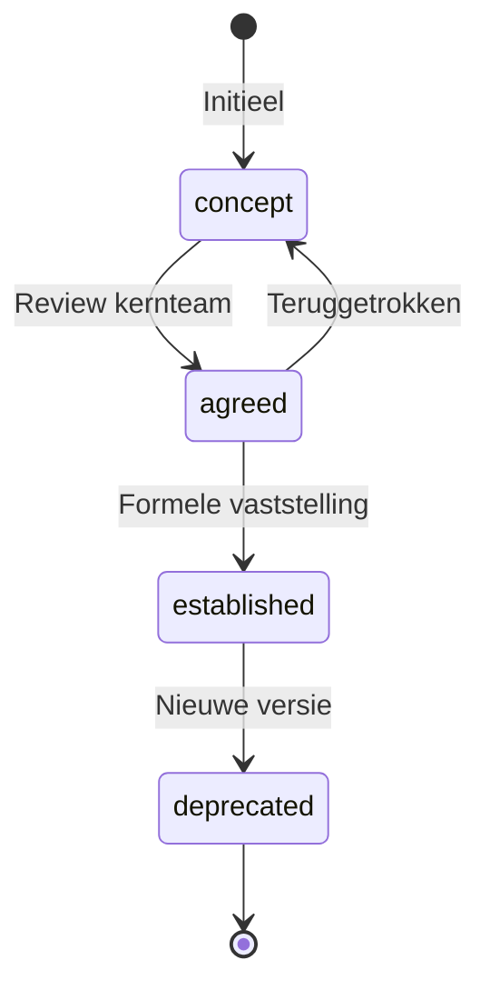
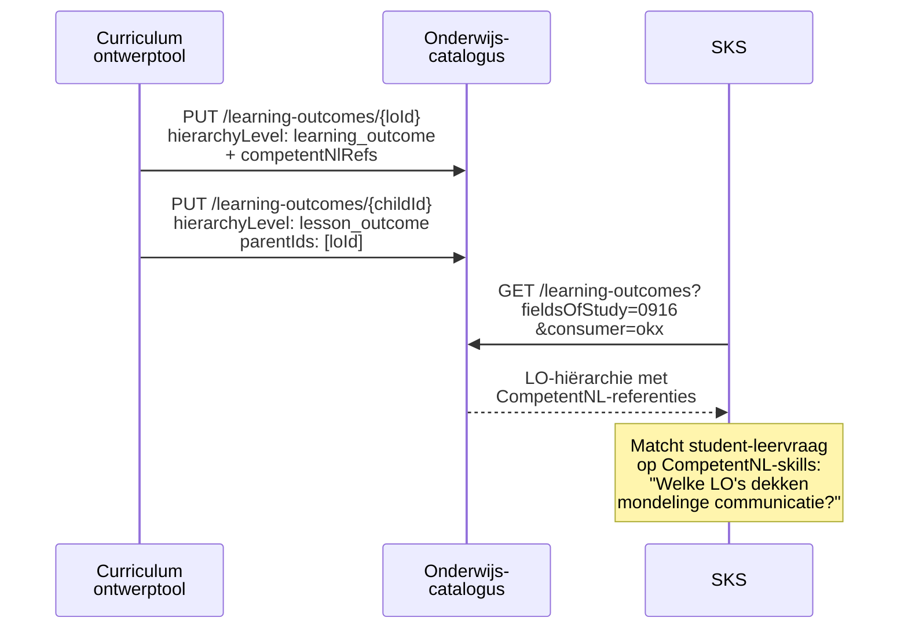
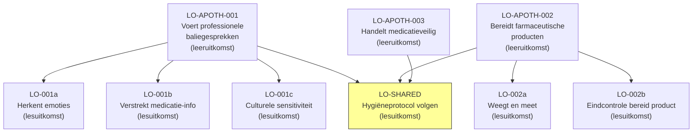

## NL → UK English mapping

| NL (oud) | EN (nieuw) | Type |
|----------|-----------|------|
| `hierarchieNiveau` | `hierarchyLevel` | attribuut |
| `standaardisatieStatus` | `standardisationStatus` | attribuut |
| `kwalificatieRef` | `qualificationReference` | attribuut |
| `sectorReferentie` | `sectorReference` | attribuut |
| `competentNlRelatieType` | `competentNlRelationType` | attribuut |
| `kerntaak` | `coreTask` | attribuut |
| `werkproces` | `workProcess` | attribuut |
| `KwalificatieRef` | `QualificationReference` | subschema |
| `CompetentNlRef` | `CompetentNlReference` | subschema |
| `leeruitkomst` | `learning_outcome` | enum |
| `lesuitkomst` | `lesson_outcome` | enum |
| `afgestemd` | `agreed` | enum |
| `vastgesteld` | `established` | enum |
| `verouderd` | `deprecated` | enum |
| `primair` | `primary` | enum |
| `ondersteunend` | `supporting` | enum |
| `vaardigheid_specifiek` | `skill_specific` | enum |
| `vaardigheid_generiek` | `skill_generic` | enum |
| `kennisgebied` | `knowledge_area` | enum |

# Feature 6 — LearningOutcome-extensie (leeruitkomsten + CompetentNL)

## 1. Probleem en doel

`LearningOutcome` is de **semantische sleutel** van het OKx-model: het verbindt pedagogiek (wat moet de student kunnen?) met logistiek (welke course/component dekt dit af?), kwalificatie (welke kerntaak uit het SBB-dossier?) en arbeidsmarkt (welke CompetentNL-skills?). De OEAPI-kern biedt `parentIds`/`childIds` (DAG), `fieldsOfStudy`, `complexityLevel` en `otherCodes`, maar mist een **hiërarchie-label** (leeruitkomst vs. lesuitkomst), **standaardisatiestatus**, **kwalificatiereferentie** en **CompetentNL-koppeling**.

**Succescriterium:** Een implementeur kan `LearningOutcome.yaml` schrijven met het Apothekersassistent-voorbeeld (3 root-LO's met geneste lesuitkomsten, DAG-structuur, CompetentNL-referenties per niveau).

## 2. Scope

| Binnen scope | Buiten scope |
|-------------|-------------|
| OKx consumer-extensie op `LearningOutcome` | Inhoudelijke definitie van leeruitkomsten (SBB/instelling-domein) |
| Attributen: `hierarchyLevel`, `standardisationStatus`, `qualificationReference`, `sectorReference`, `competentNlRefs`, `competentNlRelationType` | Validatie of CompetentNL-URI's actueel zijn (runtime-concern) |
| `CompetentNlReference.yaml` gedeeld subschema (feature 1) | Andere entiteit-extensies |
| DAG-voorbeelden met meerdere ouders | CompetentNL hbo-mapping (nog niet beschikbaar) |

## 3. Referenties

| Bron | Pad |
|------|-----|
| Feature 1 ontwerp | `meta/architecture/agent-artifacts/design-docs/20260414_1900_feature-1-enumeraties-en-gedeelde-typen.md` |
| Projectaanvraag §4.4 | `meta/architecture/agent-artifacts/project-requests/20260414_1500_okx-oeapi-consumer-profiel.md` |
| ADR 0003 | Leeruitkomsten als sleutel |
| ADR 0004 | SBU/EC als logistieke maatstaf |
| OEAPI `LearningOutcome.yaml` | `source/schemas/LearningOutcome.yaml` |
| OEAPI `learningOutcomeLevel.yaml` | `source/enumerations/learningOutcomeLevel.yaml` |
| CompetentNL | [competentnl.nl](https://competentnl.nl) |

## 4. Data en validatie

### Bestaande OEAPI-kernvelden

| OEAPI-veld | OKx-gebruik |
|-----------|------------|
| `parentIds` / `childIds` | DAG-structuur: leeruitkomst → lesuitkomsten. Meerdere ouders mogelijk (hergebruik). |
| `fieldsOfStudy` (ISCED-F, 2-6 digits) | Direct bruikbaar voor CompetentNL kennisgebiedentaxonomie (laag 1-3 = ISCED-F). |
| `complexityLevel` (extensible enum) | Bloom/SOLO-niveaus. Complementair aan CompetentNL-vaardigheidsniveaus. |
| `otherCodes` (array IdentifierEntry) | Secundaire codes; OKx gebruikt voor SBB-werkproces + CompetentNL-skill als fallback. |
| `validFrom` / `validTo` | Geldigheidsperiode van de LO-definitie. |

### Nieuwe OKx consumer-extensie attributen

| Attribuut | Type | Required | Beschrijving | ADR |
|-----------|------|----------|-------------|-----|
| `hierarchyLevel` | enum | ja | `learning_outcome` (summative, kerntaak-afgeleid) / `lesson_outcome` (formative, les-specifiek) | 0003 |
| `standardisationStatus` | enum | nee | `concept` → `agreed` → `established` → `deprecated` | — |
| `qualificationReference` | object | nee | `$ref QualificationReference.yaml` — koppeling aan SBB dossier/coreTask/workProcess | 0004 |
| `sectorReference` | string | nee | Vrije verwijzing naar sectorale standaard (bijv. "CanMEDS", "HBO-i"). | — |
| `competentNlRefs` | array | nee | `$ref CompetentNlReference.yaml[]` — CompetentNL vaardigheden en kennisgebieden | — |
| `competentNlRelationType` | enum | nee | `primary` / `supporting` | — |

### Validatie-invarianten

1. `hierarchyLevel = learning_outcome` → `parentIds` is null of leeg (root in de hiërarchie).
2. `hierarchyLevel = lesson_outcome` → `parentIds` bevat minstens één leeruitkomst-ID.
3. `standardisationStatus = established` → `qualificationReference` zou niet-null moeten zijn.
4. `competentNlRefs[].uri` moet `format: uri` zijn.
5. `competentNlRefs[].type` moet corresponderen met het CompetentNL-taxonomieniveau.

### Toestandsdiagram: standardisationStatus



## 5. Happy-path narratief



## 6. Feature-specifieke diepte

### 6.1 Consumer YAML-structuur

```yaml
# source/consumers/OKx/V1/LearningOutcome.yaml
type: object
required:
  - hierarchyLevel
properties:
  hierarchyLevel:
    type: string
    description: |
      - learning_outcome: summative, gekoppeld aan kwalificatiedossier
      - lesson_outcome: formative, gekoppeld aan individuele les/activiteit
    enum:
      - learning_outcome
      - lesson_outcome
  standardisationStatus:
    type:
      - string
      - "null"
    description: Levenscyclusstatus van deze leeruitkomst-definitie.
    enum:
      - concept
      - agreed
      - established
      - deprecated
  qualificationReference:
    oneOf:
      - $ref: "./shared/QualificationReference.yaml"
      - type: "null"
  sectorReference:
    type:
      - string
      - "null"
    description: |
      Vrije verwijzing naar een sectorale standaard.
      Voorbeelden: "CanMEDS", "HBO-i domeinprofiel", "SBB basisdeel".
  competentNlRefs:
    type:
      - array
      - "null"
    items:
      $ref: "./shared/CompetentNlReference.yaml"
  competentNlRelationType:
    type:
      - string
      - "null"
    description: |
      Geeft aan of deze LO primary of supporting is voor de
      gekoppelde CompetentNL-concepten.
      - primary: deze LO richt zich hoofdzakelijk op de skill/het kennisgebied
      - supporting: de skill/het kennisgebied is contextueel relevant
    enum:
      - primary
      - supporting
```

### 6.2 DAG-structuur en hergebruik



`LO-SHARED` demonstreert de DAG: één lesuitkomst heeft **drie ouders** (meerdere leeruitkomsten hergebruiken dezelfde lesuitkomst).

### 6.3 Voorbeeld-YAML

```yaml
# source/consumers/OKx/V1/examples/LearningOutcome.yaml

# --- Root leeruitkomst: Baliegesprekken ---
- consumerKey: okx
  hierarchyLevel: learning_outcome
  standardisationStatus: agreed
  qualificationReference:
    dossier: "25391"
    kwalificatie: null
    coreTask: "B1-K1"
    workProcess: "B1-K1-W1"
    crohoCode: null
  sectorReference: null
  competentNlRefs:
    - uri: "https://competentnl.nl/skill/specifiek/mondelinge-communicatie"
      type: skill_specific
      label: "Mondelinge communicatie"
    - uri: "https://competentnl.nl/skill/specifiek/klantgericht-handelen"
      type: skill_specific
      label: "Klantgericht handelen"
    - uri: "https://competentnl.nl/knowledge/0916"
      type: knowledge_area
      label: "Farmacie"
    - uri: "https://competentnl.nl/skill/generiek/communiceren"
      type: skill_generic
      label: "Communiceren"
  competentNlRelationType: primary

# --- Lesuitkomst: Herkent emoties ---
- consumerKey: okx
  hierarchyLevel: lesson_outcome
  standardisationStatus: concept
  qualificationReference:
    dossier: "25391"
    kwalificatie: null
    coreTask: "B1-K1"
    workProcess: "B1-K1-W1"
    crohoCode: null
  sectorReference: null
  competentNlRefs:
    - uri: "https://competentnl.nl/skill/specifiek/empathie-tonen"
      type: skill_specific
      label: "Empathie tonen"
    - uri: "https://competentnl.nl/skill/generiek/sociaal-communicatief"
      type: skill_generic
      label: "Sociaal-communicatief handelen"
  competentNlRelationType: primary

# --- Gedeelde lesuitkomst: Hygiëneprotocol ---
- consumerKey: okx
  hierarchyLevel: lesson_outcome
  standardisationStatus: established
  qualificationReference:
    dossier: "25391"
    kwalificatie: null
    coreTask: null
    workProcess: null
    crohoCode: null
  sectorReference: null
  competentNlRefs:
    - uri: "https://competentnl.nl/skill/specifiek/hygienisch-werken"
      type: skill_specific
      label: "Hygiënisch werken"
    - uri: "https://competentnl.nl/skill/generiek/kwaliteitsbewust-handelen"
      type: skill_generic
      label: "Kwaliteitsbewust handelen"
  competentNlRelationType: primary
```

### 6.4 Relatie OEAPI `otherCodes` ↔ OKx `competentNlRefs`

| Mechanisme | Wanneer |
|-----------|---------|
| `otherCodes` met `codeType: "competentnl-skill"` | Fallback voor systemen die geen OKx-consumer kennen maar wel `otherCodes` lezen |
| `competentNlRefs` (OKx-extensie) | Primair mechanisme: getypeerd, met taxonomieniveau en label |

**Beslissing:** Beide vullen. `otherCodes` is een OEAPI-kernveld dat altijd zichtbaar is; `competentNlRefs` geeft rijkere semantiek voor OKx-consumenten.

## 7. Faalpad

**Scenario:** Een `LearningOutcome` met `hierarchyLevel: learning_outcome` verwijst via `competentNlRefs` naar een CompetentNL-URI die niet meer bestaat (URI verwijderd of gewijzigd).

**Impact:** Systemen die CompetentNL-matching doen (SKS, arbeidsmarktportalen) kunnen de referentie niet resolven. De `label` is nog leesbaar, maar de link is gebroken.

**Mitigatie:** De `label` is altijd aanwezig voor menselijke leesbaarheid. De `otherCodes`-fallback biedt een tweede pad. Feature 7 (validatie) kan optioneel een check bevatten die CompetentNL-URI's resolvet, maar dit is een runtime-concern, geen build-time validatie.

## 8. Ontwerpkeuzes

| # | Keuze | Motivatie | Afgewogen alternatief |
|---|-------|-----------|----------------------|
| 1 | `competentNlRelationType` op LO-niveau, niet per referentie | Houdt het schema simpel. Eén LO is doorgaans volledig primary of volledig supporting voor zijn competenties. | Per-referentie relatieType (in `CompetentNlReference`) — overwogen maar de projectaanvraag §4.4 toont `relatieType` per referentie. **Heroverweging:** de projectaanvraag plaatst `relatieType` bij elke referentie. Voor consistentie met de aanvraag: `competentNlRelationType` wordt LO-breed, maar per-referentie override is mogelijk door `relatieType` op te nemen in `CompetentNlReference` als optioneel veld. Neem deze beslissing op in feature 1 `CompetentNlReference.yaml`. |
| 2 | `sectorReference` als vrije string | Te veel sectorale standaarden om nu te enumereren (CanMEDS, HBO-i, SBB basisdeel, ...). Pilotinstellingen valideren eerst. | Enum — verworpen: niet realistisch zonder volledige inventarisatie. |
| 3 | DAG met `parentIds` (meerdere ouders) actief gebruiken | OEAPI ondersteunt dit al. Hergebruik van lesuitkomsten over courses voorkomt duplicatie en maakt cross-instelling matching mogelijk. | Strikte boomstructuur — verworpen: verliest hergebruik en cross-course matching. |

## 9. Signaleringen

Geen nieuwe signaleringen. De OEAPI-kern biedt voldoende voor LearningOutcome-extensie:
- `parentIds`/`childIds` → DAG
- `fieldsOfStudy` → ISCED-F
- `complexityLevel` → Bloom/SOLO
- `otherCodes` → fallback voor CompetentNL

## 10. Verificatie

- [ ] `LearningOutcome.yaml` valideert als JSON Schema
- [ ] `$ref` naar `./shared/CompetentNlReference.yaml` en `./shared/QualificationReference.yaml` resolven
- [ ] Voorbeeld: 3 root-LO's + geneste lesuitkomsten + 1 gedeelde lesuitkomst (DAG)
- [ ] `competentNlRefs[].uri` is `format: uri`
- [ ] `competentNlRefs[].type` correspondeert met taxonomieniveau (3 vaardigheidsniveaus + knowledge_area)
- [ ] `standardisationStatus` toestandsdiagram is consistent met enum-waarden
- [ ] `otherCodes` en `competentNlRefs` bevatten dezelfde CompetentNL-referenties (dual encoding)
- [ ] Geen conflicten met bestaande LO consumer-attributen (geen bestaande profielen op LO)
