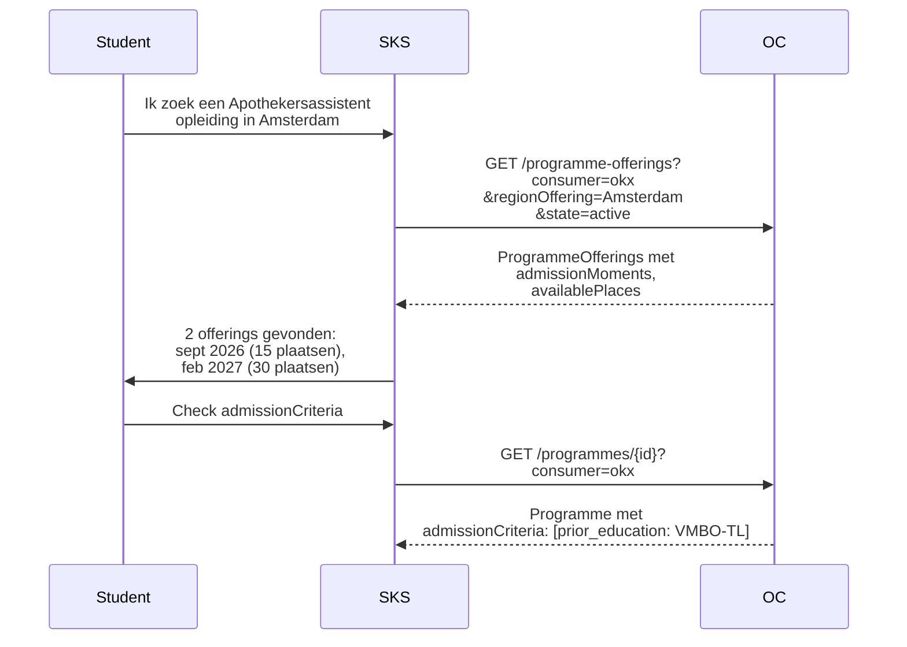

## NL → UK English mapping

| NL (oud) | EN (nieuw) |
|----------|-----------|
| `instroomEisen` | `admissionCriteria` |
| `uitstroomProfiel` | `graduateProfile` |
| `instroomMomenten` | `admissionMoments` |
| `beschikbarePlaatsen` | `availablePlaces` |
| `regioAanbod` | `regionOffering` |
| `vooropleiding` | `prior_education` |
| `werkervaring` | `work_experience` |
| `taaleis` | `language_requirement` |
| `leeftijd` | `age` |
| `referentie` | `reference` |
| `niveau` | `level` |

# Feature 8 — Fase 2 Programme-extensies (trechters en instroomeisen)

## 1. Probleem en doel

Het SKS moet studenten door een **trechterfunnel** leiden (ADR 0007): filteren op instroomeisen, uitstroomprofiel en regio. Fase 1 (feature 2) definieerde de curriculumstructuur; fase 2 voegt de **querybare attributen** toe die de trechter voeden.

**Succescriterium:** `Programme.yaml` (feature 2) wordt uitgebreid met `admissionCriteria`, `graduateProfile`; `ProgrammeOffering.yaml` (feature 5) met `admissionMoments`, `availablePlaces`, `regionOffering`.

## 2. Scope

| Binnen scope | Buiten scope |
|-------------|-------------|
| `admissionCriteria`, `graduateProfile` op Programme | CourseOffering-trechters (feature 9) |
| `admissionMoments`, `availablePlaces`, `regionOffering` op ProgrammeOffering | Daadwerkelijke SKS query-implementatie |

## 3. Referenties

Feature 2 en 5 ontwerpen, ADR 0007 (keuzecriteria), ADR 0012 (keuzegate).

## 4. Data en validatie

### Uitbreiding Programme (fase 2)

| Attribuut | Type | Beschrijving |
|-----------|------|-------------|
| `admissionCriteria` | array of object | `[{ type: enum, reference: string, level: string }]`. Type: `prior_education`, `work_experience`, `language_requirement`, `age`, `portfolio`. |
| `graduateProfile` | string (nullable) | Beschrijving van het beroepsprofiel na afronding. Vrije tekst; later mogelijk enum na pilotvalidatie. |

```yaml
# Toevoeging aan source/consumers/OKx/V1/Programme.yaml
  admissionCriteria:
    type:
      - array
      - "null"
    items:
      type: object
      required:
        - type
      properties:
        type:
          type: string
          enum:
            - prior_education
            - work_experience
            - language_requirement
            - age
            - portfolio
        reference:
          type:
            - string
            - "null"
          description: |
            Reference to the requirement. E.g. "VMBO-TL" (prior_education),
            "2 jaar apotheek" (work_experience), "B2 Nederlands" (language_requirement).
        level:
          type:
            - string
            - "null"
          description: Level indication where applicable.
  graduateProfile:
    type:
      - string
      - "null"
    description: Professional profile upon completion.
```

### Uitbreiding ProgrammeOffering (fase 2)

| Attribuut | Type | Beschrijving |
|-----------|------|-------------|
| `admissionMoments` | array of string | Datums of perioden waarop instroom mogelijk is. Bijv. `["2026-09-01", "2027-02-01"]`. |
| `availablePlaces` | integer (nullable) | Resterend aantal plaatsen in dit cohort. |
| `regionOffering` | string (nullable) | Regio-aanduiding. Bijv. "Amsterdam", "Zuid-Holland". Later mogelijk gestandaardiseerd via CBS-gemeentecodes. |

```yaml
# Toevoeging aan source/consumers/OKx/V1/ProgrammeOffering.yaml
  admissionMoments:
    type:
      - array
      - "null"
    items:
      type: string
    description: Dates or periods when admission is possible.
  availablePlaces:
    type:
      - integer
      - "null"
    description: Remaining number of available places.
    minimum: 0
  regionOffering:
    type:
      - string
      - "null"
    description: Region indication for this offering.
```

### Validatie

1. `availablePlaces` ≤ kern `maxNumberStudents` - kern `enrolledNumberStudents`.
2. `admissionCriteria[].type` is een gesloten enum (5 waarden).

## 5. Happy-path narratief



## 6. Feature-specifieke diepte

Geen nieuwe gedeelde subschema's — `admissionCriteria` is inline in `Programme.yaml`.

## 7. Faalpad

**Scenario:** `availablePlaces` is niet bijgewerkt na inschrijvingen. Student ziet "15 plaatsen" maar er zijn er nog 2.

**Mitigatie:** `availablePlaces` is een snapshot; de bron-systeemverantwoordelijkheid ligt bij de instelling. OKx definieert het veld, niet de update-frequentie.

## 8. Ontwerpkeuzes

| # | Keuze | Motivatie | Alternatief |
|---|-------|-----------|-------------|
| 1 | `admissionCriteria` als array met type-enum | Gestructureerd querybaar voor SKS; uitbreidbaar met nieuwe typen. | Vrije tekst (OEAPI `admissionRequirements`) — onvoldoende voor trechter. |
| 2 | `regionOffering` als vrije string | CBS-gemeentecodes vereisen extra mapping; nu te vroeg om te standaardiseren. | CBS-code — overweeg na pilotvalidatie. |

## 9. Signaleringen

Geen nieuwe. OEAPI `admissionRequirements` is vrije tekst; gestructureerde instroomeisen zijn een logische extensie.

## 10. Verificatie

- [ ] Uitbreiding `Programme.yaml` is backward compatible met fase 1 (alle nieuwe velden nullable)
- [ ] Uitbreiding `ProgrammeOffering.yaml` idem
- [ ] Voorbeelden bevatten minstens 2 `admissionCriteria`-types
- [ ] `regionOffering` is aanwezig in ProgrammeOffering-voorbeeld
