# OKx OEAPI Consumer Profiel — Implementatieverzoek (v3)

## 1. Profielbeschrijving

Een OEAPI **consumer profiel** (`consumerKey: "okx"`) waarmee de **Onderwijscatalogus (OC)** — als centrale referentiecomponent — haar informatiestromen verrijkt met een **complete onderwijsspecificatie**. Niet alleen *wat* er geleerd wordt, maar ook *hoe*, *waarmee*, *door wie*, *waar* en *hoe lang* — op elk niveau van de hiërarchie.

Dit profiel maakt maximaal gebruik van het **recursieve OEAPI-datamodel** en voegt een gestructureerd specificatie-object toe waar de kern onvoldoende is. Het resultaat is bruikbaar voor:
- **Studenten** die top-down (nominaal programma) of bottom-up (zelf samenstellen) kiezen
- **Planners** die moeten bepalen of de instelling een onderwijswens kan realiseren
- **Ontwerpers** die curriculum publiceren naar de catalogus
- **Andere instellingen** die aanbod willen ontvangen en verwerken (interoperabiliteit)

**OEAPI-broncode wordt niet aangepast.** Signaleringen leiden tot OEAPI change requests.

## 2. De Onderwijscatalogus als spil

Het ArchiMate-model positioneert de **OC** als centraal distributiepunt. Alle informatiestromen in scope lopen **door** of **naar** de OC:

```
                          ┌───────────────────┐
  Curriculum ontwerptool ─┤                   ├─▶ SKS (passend aanbod)
  ("Grofmazig ontwerp")   │                   │
                          │  Onderwijs-       ├─▶ SVS (fijnmazig aanbod)
  Planningssysteem ───────┤  catalogus (OC)   │
  ("Opleidingseenheid-    │                   ├─▶ Roostersysteem (aanbod)
   specifieke planning")  │                   │
                          │                   ├─▶ LMS (aanbod + leermiddelen)
  SKS ────────────────────┤                   │
  ("Leervraag in LO,      │                   ├─▶ Planningssysteem
   domein, leervorm")     │                   │
                          │                   ├─▶ Sector Edubroker
                          │                   │   ("Alle leergelegenheden
                          │                   │    i.r.t. leeruitkomsten")
                          │                   │
                          │                   ├──▶ Curriculum ontwerptool
                          └───────────────────┘   ("Herbruikbaar fijnmazig
                                                    aanbod")
```

**Het OKx-profiel is primair het profiel waarmee de OC via OEAPI communiceert.** Elke afnemer (SKS, planner, LMS, andere instelling) ontvangt dezelfde verrijkte structuur en haalt eruit wat relevant is.

## 3. De "Student Kiest"-keten

Het ArchiMate-model nummert de kernstroom expliciet:

| Stap | Stroom | Van → Naar | OEAPI-entiteiten |
|------|--------|-----------|------------------|
| 1 | Intake resultaat (studentidentiteit, leervraag in gewenste LO's, leercontext) | Intake → SVS | `Person`, `LearningOutcome` (referenties) |
| 2 | Keuzeproces starten (administratieve aanmelding) | SVS → SKS | `Association`-referentie |
| 3 | Aanbod passend op leervraag (uitgedrukt in LO's, domein, leervorm) | SKS → **OC** | Query op `LearningOutcome`, `modesOfDelivery`, leervorm |
| 4 | Passend aanbod: **programmes, courses, learning components <> test components** | **OC** → SKS | Volledige OEAPI-hiërarchie + OKx-extensies |
| 5 | Concept-leerroute als keuze → intekening | SKS → SVS | Genest `Programme` als track |

Stap 4 noemt de OEAPI-entiteiten letterlijk. Het OKx-profiel verrijkt die entiteiten met alles wat de keten nodig heeft.

## 4. OKx-hiërarchie op het OEAPI recursieve datamodel

### 4.1 OEAPI ondersteunt recursie

```
Programme ──parentId/childIds──▶ Programme (recursief, onbeperkte diepte)
  │
  └──programmeIds──▶ Course (N:M — course kan bij meerdere programmes horen)
                       │
                       ├──courseId──▶ LearningComponent ──parentId/childIds──▶ LearningComponent (recursief)
                       │
                       └──courseId──▶ TestComponent ──parentId/childIds──▶ TestComponent (recursief)

LearningOutcome ──parentIds/childIds──▶ LearningOutcome (DAG, meerdere ouders mogelijk)
  ▲ gerefereerd via learningOutcomeIds vanuit Programme, Course, LearningComponent, TestComponent
```

### 4.2 Mapping OKx → OEAPI

| OKx concept | OEAPI entiteit | Hoe | Credential bij afronding |
|-------------|----------------|-----|--------------------------|
| **Kwalificatie / opleiding** | `Programme` (root) | `programmeType: "programme"` | **Diploma** |
| **Leerroute** (globaal, vóór inschrijving) | `Programme` (kind) | `programmeType: "track"` of `"specialisation"` | (onderdeel van diploma) |
| **Keuzedeel** | `Programme` (kind) of `Course` | `programmeType: "minor"` of als losse `Course` | **MBO-certificaat** / Keuzedeel-bewijs |
| **Opleidingsonderdeel / leertaak** | `Course` | Eigen `studyLoad`, `learningOutcomeIds`. Kan bij meerdere programmes. | **Certificaat** / **Microcredential** |
| **Leeractiviteit** (keuzeniveau student) | `LearningComponent` (niveau 1) | Collectie lesopdrachten + lesuitkomsten | **Microcredential** / badge |
| **Lesopdracht / les** | `LearningComponent` (kind, recursief) | Genest via `parentId`/`childIds` | **Badge** |
| **Toets / examen** | `TestComponent` | Onder dezelfde `Course`. Gedeelde `learningOutcomeIds` | (beoordeelt bovenliggende LO's) |
| **Leeruitkomst** (summatief) | `LearningOutcome` (root) | Gerefereerd vanuit Programme, Course, LearningComponent | — |
| **Lesuitkomst** (formatief) | `LearningOutcome` (kind) | Genest via `parentIds`/`childIds`. DAG-structuur. | — |

### 4.3 Bottom-up aggregatie: de som klopt

Een **fundamenteel ontwerpprincipe**: de onderwijsspecificatie aggregeert bottom-up. De som van alle lessen onder een course moet kloppen met de course-specificatie, en de som van alle courses onder een programme moet kloppen met het programme — en idealiter uitlijnen met het top-down kwalificatiedossier van SBB.

```
Programme "Apothekersassistent" (level: mbo-4, studyLoad: 4800 SBU)
│  ▸ learningOutcomes: [alle kerntaak-afgeleide LO's]
│  ▸ OKx: waardeDocument: diploma
│  ▸ OKx: kwalificatieRef: { dossier: "25391", kwalificatie: "25396" }
│  ▸ SOM studyLoad children = 4800 SBU ✓
│
├── Programme "Track: Regulier voltijd" (programmeType: track)
│   │  ▸ OKx: leerrouteType: regulier
│   │  ▸ SOM studyLoad courses = 4800 SBU ✓
│   │
│   ├── Course "Baliegesprekken en cliëntcommunicatie" (studyLoad: 240 SBU)
│   │   │  ▸ learningOutcomes: ["Voert professionele baliegesprekken",
│   │   │  │                     "Cliëntgericht handelen"]
│   │   │  ▸ OKx: waardeDocument: microcredential
│   │   │  ▸ OKx: onderwijsSpecificatie:
│   │   │  │    leervorm: simulatie
│   │   │  │    tijdsbesteding: { bot: 160, oot: 80, eenheid: sbu }
│   │   │  │    ruimteType: praktijkruimte_simulatie
│   │   │  │    expertiseProfiel: ["rollenspel_training", "farmaceutisch"]
│   │   │  │    leermiddelGroepen: ["simulatie_materiaal", "digitaal_werkstation"]
│   │   │  ▸ SOM componentStudyLoad children = 240 SBU ✓
│   │   │
│   │   ├── LearningComponent "Leeractiviteit: Gespreksvoering simulatie"
│   │   │   │  ▸ learningComponentType: practical
│   │   │   │  ▸ OKx: hierarchieNiveau: leeractiviteit
│   │   │   │  ▸ OKx: onderwijsSpecificatie:
│   │   │   │  │    leervorm: simulatie
│   │   │   │  │    tijdsbesteding: { bot: 80, oot: 40, eenheid: sbu }
│   │   │   │  │    ruimteType: praktijkruimte_simulatie
│   │   │   │  │    ruimteEisen: "balie, wachtruimte, kassasysteem"
│   │   │   │  │    expertiseProfiel: ["rollenspel_training"]
│   │   │   │  │    leermiddelGroepen: ["simulatie_materiaal"]
│   │   │   │  │    spreidingspatroon: "2x per week, 8 weken"
│   │   │   │  ▸ OKx: waardeDocument: microcredential
│   │   │   │  ▸ OKx: deelnameVereisten: []
│   │   │   │  ▸ learningOutcomes: ["Voert professionele baliegesprekken"]
│   │   │   │
│   │   │   ├── LearningComponent "Les: Gesprek bij emotionele cliënt"
│   │   │   │     ▸ OKx: hierarchieNiveau: lesopdracht
│   │   │   │     ▸ OKx: onderwijsSpecificatie:
│   │   │   │     │    leervorm: simulatie
│   │   │   │     │    tijdsbesteding: { bot: 20, oot: 10, eenheid: sbu }
│   │   │   │     │    ruimteType: praktijkruimte_simulatie
│   │   │   │     │    expertiseProfiel: ["rollenspel_training"]
│   │   │   │     ▸ OKx: waardeDocument: badge
│   │   │   │     ▸ learningOutcomes: [lesuitkomst: "Herkent en hanteert
│   │   │   │     │                     emoties in baliegesprek"]
│   │   │   │
│   │   │   ├── LearningComponent "Les: Medicatie-informatie verstrekken"
│   │   │   │     ▸ (zelfde structuur, andere lesuitkomsten)
│   │   │   │
│   │   │   └── LearningComponent "Les: Culturele sensitiviteit"
│   │   │         ▸ (zelfde structuur)
│   │   │
│   │   ├── LearningComponent "Leeractiviteit: Farmaceutische theorie"
│   │   │   │  ▸ learningComponentType: lecture
│   │   │   │  ▸ OKx: onderwijsSpecificatie:
│   │   │   │  │    leervorm: klassikaal
│   │   │   │  │    tijdsbesteding: { bot: 40, oot: 40, eenheid: sbu }
│   │   │   │  │    ruimteType: collegezaal
│   │   │   │  │    expertiseProfiel: ["farmaceutisch"]
│   │   │   │  │    leermiddelGroepen: ["digitaal_werkstation", "vakliteratuur"]
│   │   │   │  ▸ OKx: deelnameVereisten: []
│   │   │   │  (... geneste lesopdrachten ...)
│   │   │
│   │   └── TestComponent "Praktijkexamen baliegesprekken"
│   │         ▸ testComponentType: life_skills_test
│   │         ▸ learningOutcomes: [zelfde LO's als bovenliggende course]
│   │         ▸ OKx: toetsNiveau: summatief
│   │         ▸ OKx: onderwijsSpecificatie:
│   │         │    ruimteType: praktijkruimte_simulatie
│   │         │    expertiseProfiel: ["examinator_farmaceutisch"]
│   │         │    tijdsbesteding: { bot: 4, eenheid: sbu }
│   │
│   ├── Course "Farmaceutische kennis en medicatieveiligheid" (studyLoad: 360 SBU)
│   │   └── (... zelfde structuur, andere leervormen/LO's ...)
│   │
│   ├── Course "Beroepspraktijkvorming" (studyLoad: 1200 SBU)
│   │   │  ▸ OKx: onderwijsSpecificatie:
│   │   │  │    leervorm: werkplekleren
│   │   │  │    ruimteType: externe_werkplek
│   │   │  │    expertiseProfiel: ["praktijkbegeleider"]
│   │   │  (gedeeld via programmeIds — hoort ook bij track "Versneld")
│   │   └── (... stage-activiteiten als LearningComponents ...)
│   │
│   └── (... overige courses tot SOM = 4800 SBU ...)
│
├── Programme "Track: Versneld" (programmeType: track)
│   │  ▸ OKx: leerrouteType: versneld
│   │  ▸ SOM studyLoad = 3600 SBU (minder SBU door EVC/vrijstellingen)
│   │  ▸ Deelt courses via programmeIds (N:M)
│   └── (... subset van courses, evt. gecomprimeerd ...)
│
└── Course "Keuzedeel: Digitale vaardigheden" (studyLoad: 240 SBU)
    ▸ programmeIds: [root + beide tracks] (beschikbaar in alle routes)
    ▸ OKx: waardeDocument: mbo_certificaat
```

**De aggregatie-invariant:** `SOM(children.studyLoad) = parent.studyLoad` op elk niveau. Dit maakt het mogelijk om vanuit een willekeurig niveau omhoog te aggregeren naar het kwalificatiedossier.

**Kwalificatiedossier-alignment:** De root `Programme` verwijst via `kwalificatieRef` naar het SBB-dossier. De `learningOutcomes` op programmaniveau dekken alle kerntaken/werkprocessen. Per `Course` en `LearningComponent` is traceerbaar welke LO's (en dus welke kerntaken) worden afgedekt.

### 4.4 Voorbeeld: LearningOutcome-hiërarchie met CompetentNL-taxonomieën

[CompetentNL](https://competentnl.nl/page/view/b1741ead-e4e8-4974-8aea-1399ae22284a/data-taxonomieen-van-competentnl) is de nationale standaard voor het beschrijven van skills, ontwikkeld door SBB, UWV, TNO en CBS. De taxonomie is beschikbaar als Linked Open Data (RDF/OWL/SKOS) via een SPARQL-endpoint en API. CompetentNL onderscheidt twee hiërarchieën:

| Taxonomie | Lagen | Omvang | Basis |
|-----------|-------|--------|-------|
| **Vaardighedentaxonomie** | 3 lagen: 6 algemene → 19 generieke → 112 specifieke vaardigheidsconcepten | Hard skills (leerbaar) + soft skills (ontwikkelbaar) | ESCO, O\*Net, wetenschappelijke literatuur |
| **Kennisgebiedentaxonomie** | 4 lagen, gebaseerd op ISCED-F 2013 | Vakspecifieke feiten, principes, theorieën en praktijken | ISCED-F 2013, CBS-rubrieken |

CompetentNL koppelt skills aan **alle mbo-kwalificaties** (kwalificaties, keuzedelen, certificaten) en is bezig met uitbreiding naar hbo en non-formeel onderwijs. De relatie `cnl:requires` verbindt beroepen met skills.

#### Waarom CompetentNL als referentie voor LearningOutcome?

1. **Gedeelde taal**: Leeruitkomsten in OEAPI beschrijven *wat* een student na afronding kan. CompetentNL beschrijft *welke vaardigheden en kennisgebieden* nodig zijn op de arbeidsmarkt. De koppeling maakt leeruitkomsten matchbaar met beroepen en vacatures.
2. **Cross-instelling vergelijkbaarheid**: Als instelling A en B dezelfde CompetentNL-referenties gebruiken voor hun leeruitkomsten, is automatisch zichtbaar welke overlap en complementariteit er is.
3. **Modulair studeren**: Bij bottom-up samenstellen van een leerroute (scenario E) kan het SKS leeruitkomsten matchen op CompetentNL-skills om te bepalen welke kwalificatie-eisen al zijn afgedekt.
4. **Arbeidsmarktaansluiting**: SBB koppelt CompetentNL aan de complete mbo-kwalificatiestructuur; OEAPI LearningOutcomes met CompetentNL-referenties sluiten dus direct aan op het kwalificatiedossier.

#### OEAPI-kernvelden die CompetentNL faciliteren

Het bestaande `LearningOutcome`-schema biedt al aanknopingspunten:

| OEAPI-veld | CompetentNL-mapping |
|------------|---------------------|
| `fieldsOfStudy` (ISCED-F, 2-6 digits) | Direct bruikbaar voor CompetentNL kennisgebiedentaxonomie (laag 1-3 = ISCED-F 2013) |
| `complexityLevel` (extensible enum: bloom\_1-6, solo\_0-4) | Aanvulbaar met CompetentNL vaardigheidsniveaus (als die beschikbaar komen) |
| `otherCodes` (array IdentifierEntry) | Ideaal voor CompetentNL skill-URI's als secundaire code |
| `parentIds` / `childIds` | DAG-structuur voor leeruitkomst → lesuitkomst hiërarchie |

#### OKx-extensie op LearningOutcome voor CompetentNL

Naast de bestaande OKx-attributen (`hierarchieNiveau`, `standaardisatieStatus`, `kwalificatieRef`, `sectorReferentie`) voegen we toe:

| Attribuut | Type | Beschrijving |
|-----------|------|-------------|
| `competentNlRefs` | array of object | Referenties naar CompetentNL-concepten. Per referentie: `{ uri: string, type: enum, label: string }`. `type`: `vaardigheid_algemeen`, `vaardigheid_generiek`, `vaardigheid_specifiek`, `kennisgebied`. `uri`: de CompetentNL Linked Data URI. `label`: leesbare naam (voor display). |
| `competentNlRelatieType` | enum: `primair`, `ondersteunend` | Geeft aan of deze LO primair of ondersteunend is voor het gekoppelde CompetentNL-concept. Volgt het CompetentNL-patroon van kernrelaties vs. contextuele relaties. |

#### Uitgewerkt voorbeeld: Apothekersassistent (mbo-4)

Hieronder de LearningOutcome-boom voor het voorbeeld uit §4.3. Leeruitkomsten zijn afgeleid van SBB kwalificatiedossier 25391 "Apothekersassistent" en gekoppeld aan CompetentNL vaardigheden en kennisgebieden.

```
LearningOutcome "LO-APOTH-001" (root — summatieve leeruitkomst)
│  name: "Voert professionele baliegesprekken"
│  description: "De beginnend beroepsbeoefenaar voert zelfstandig baliegesprekken
│  │              met cliënten over medicatiegebruik, bijwerkingen en
│  │              gezondheidsadvies, rekening houdend met de cliënt-context."
│  fieldsOfStudy: "0916"  (ISCED-F: Pharmacy)
│  complexityLevel: bloom_3  (Apply)
│  ▸ OKx: hierarchieNiveau: leeruitkomst
│  ▸ OKx: standaardisatieStatus: afgestemd
│  ▸ OKx: kwalificatieRef:
│  │    dossier: "25391"
│  │    kerntaak: "B1-K1"
│  │    werkproces: "B1-K1-W1"
│  ▸ OKx: competentNlRefs:
│  │    - uri: "cnl:skill/specifiek/mondelinge-communicatie"
│  │      type: vaardigheid_specifiek
│  │      label: "Mondelinge communicatie"
│  │      relatieType: primair
│  │    - uri: "cnl:skill/specifiek/klantgericht-handelen"
│  │      type: vaardigheid_specifiek
│  │      label: "Klantgericht handelen"
│  │      relatieType: primair
│  │    - uri: "cnl:knowledge/0916"
│  │      type: kennisgebied
│  │      label: "Farmacie"
│  │      relatieType: primair
│  │    - uri: "cnl:skill/generiek/communiceren"
│  │      type: vaardigheid_generiek
│  │      label: "Communiceren"
│  │      relatieType: primair
│  │    - uri: "cnl:skill/specifiek/empathie-tonen"
│  │      type: vaardigheid_specifiek
│  │      label: "Empathie tonen"
│  │      relatieType: ondersteunend
│  ▸ otherCodes:
│  │    - codeType: "competentnl-skill"
│  │      code: "cnl:skill/specifiek/mondelinge-communicatie"
│  │    - codeType: "competentnl-skill"
│  │      code: "cnl:skill/specifiek/klantgericht-handelen"
│  │    - codeType: "sbb-werkproces"
│  │      code: "B1-K1-W1"
│  │
│  ├── LearningOutcome "LO-APOTH-001a" (kind — formatieve lesuitkomst)
│  │     name: "Herkent en hanteert emoties in baliegesprek"
│  │     description: "De student herkent emotionele reacties bij cliënten
│  │     │              (angst, boosheid, verdriet) en past de gespreksvoering
│  │     │              aan met actief luisteren en empathische bevestiging."
│  │     fieldsOfStudy: "0916"
│  │     complexityLevel: bloom_4  (Analyse)
│  │     ▸ OKx: hierarchieNiveau: lesuitkomst
│  │     ▸ OKx: standaardisatieStatus: concept
│  │     ▸ OKx: kwalificatieRef:
│  │     │    dossier: "25391"
│  │     │    kerntaak: "B1-K1"
│  │     │    werkproces: "B1-K1-W1"
│  │     ▸ OKx: competentNlRefs:
│  │     │    - uri: "cnl:skill/specifiek/empathie-tonen"
│  │     │      type: vaardigheid_specifiek
│  │     │      label: "Empathie tonen"
│  │     │      relatieType: primair
│  │     │    - uri: "cnl:skill/specifiek/conflicthantering"
│  │     │      type: vaardigheid_specifiek
│  │     │      label: "Conflicthantering"
│  │     │      relatieType: ondersteunend
│  │     │    - uri: "cnl:skill/generiek/sociaal-communicatief"
│  │     │      type: vaardigheid_generiek
│  │     │      label: "Sociaal-communicatief handelen"
│  │     │      relatieType: primair
│  │
│  ├── LearningOutcome "LO-APOTH-001b" (kind — formatieve lesuitkomst)
│  │     name: "Verstrekt correcte medicatie-informatie aan cliënt"
│  │     description: "De student geeft gestructureerde en begrijpelijke
│  │     │              mondelinge uitleg over dosering, bijwerkingen,
│  │     │              interacties en bewaarcondities van gangbare medicijnen."
│  │     fieldsOfStudy: "0916"
│  │     complexityLevel: bloom_3  (Apply)
│  │     ▸ OKx: hierarchieNiveau: lesuitkomst
│  │     ▸ OKx: standaardisatieStatus: concept
│  │     ▸ OKx: kwalificatieRef:
│  │     │    dossier: "25391"
│  │     │    kerntaak: "B1-K1"
│  │     │    werkproces: "B1-K1-W2"
│  │     ▸ OKx: competentNlRefs:
│  │     │    - uri: "cnl:knowledge/0916"
│  │     │      type: kennisgebied
│  │     │      label: "Farmacie"
│  │     │      relatieType: primair
│  │     │    - uri: "cnl:skill/specifiek/mondelinge-communicatie"
│  │     │      type: vaardigheid_specifiek
│  │     │      label: "Mondelinge communicatie"
│  │     │      relatieType: primair
│  │     │    - uri: "cnl:skill/specifiek/informatieverstrekking"
│  │     │      type: vaardigheid_specifiek
│  │     │      label: "Informatieverstrekking"
│  │     │      relatieType: primair
│  │     │    - uri: "cnl:knowledge/091601"
│  │     │      type: kennisgebied
│  │     │      label: "Farmacologie"
│  │     │      relatieType: primair
│  │
│  └── LearningOutcome "LO-APOTH-001c" (kind — formatieve lesuitkomst)
│        name: "Past communicatie aan bij culturele achtergrond cliënt"
│        description: "De student herkent culturele invloeden op
│        │              gezondheidsbeleving en past taalgebruik, non-verbale
│        │              communicatie en adviesstijl hierop aan."
│        fieldsOfStudy: "0916"
│        complexityLevel: bloom_5  (Evaluate)
│        ▸ OKx: hierarchieNiveau: lesuitkomst
│        ▸ OKx: standaardisatieStatus: concept
│        ▸ OKx: competentNlRefs:
│        │    - uri: "cnl:skill/specifiek/interculturele-communicatie"
│        │      type: vaardigheid_specifiek
│        │      label: "Interculturele communicatie"
│        │      relatieType: primair
│        │    - uri: "cnl:skill/generiek/communiceren"
│        │      type: vaardigheid_generiek
│        │      label: "Communiceren"
│        │      relatieType: primair
│        │    - uri: "cnl:skill/specifiek/diversiteitsbewustzijn"
│        │      type: vaardigheid_specifiek
│        │      label: "Diversiteitsbewustzijn"
│        │      relatieType: ondersteunend

LearningOutcome "LO-APOTH-002" (root — summatieve leeruitkomst)
│  name: "Bereidt farmaceutische producten"
│  description: "De beginnend beroepsbeoefenaar bereidt zelfstandig magistrale
│  │              en generieke farmaceutische producten volgens GMP-richtlijnen,
│  │              voert kwaliteitscontroles uit en documenteert het bereidingsproces."
│  fieldsOfStudy: "0916"
│  complexityLevel: bloom_3  (Apply)
│  ▸ OKx: hierarchieNiveau: leeruitkomst
│  ▸ OKx: standaardisatieStatus: afgestemd
│  ▸ OKx: kwalificatieRef:
│  │    dossier: "25391"
│  │    kerntaak: "B1-K2"
│  │    werkproces: "B1-K2-W1"
│  ▸ OKx: competentNlRefs:
│  │    - uri: "cnl:skill/specifiek/prepareren"
│  │      type: vaardigheid_specifiek
│  │      label: "Prepareren en bereiden"
│  │      relatieType: primair
│  │    - uri: "cnl:skill/specifiek/kwaliteitscontrole"
│  │      type: vaardigheid_specifiek
│  │      label: "Kwaliteitscontrole uitvoeren"
│  │      relatieType: primair
│  │    - uri: "cnl:knowledge/0916"
│  │      type: kennisgebied
│  │      label: "Farmacie"
│  │      relatieType: primair
│  │    - uri: "cnl:skill/specifiek/nauwkeurig-werken"
│  │      type: vaardigheid_specifiek
│  │      label: "Nauwkeurig werken"
│  │      relatieType: primair
│  │    - uri: "cnl:skill/generiek/procedures-volgen"
│  │      type: vaardigheid_generiek
│  │      label: "Procedures en protocollen volgen"
│  │      relatieType: primair
│  │    - uri: "cnl:skill/specifiek/documenteren"
│  │      type: vaardigheid_specifiek
│  │      label: "Documenteren en registreren"
│  │      relatieType: ondersteunend
│  │
│  ├── LearningOutcome "LO-APOTH-002a" (kind — formatieve lesuitkomst)
│  │     name: "Weegt en meet grondstoffen conform voorschrift"
│  │     complexityLevel: bloom_3
│  │     ▸ OKx: hierarchieNiveau: lesuitkomst
│  │     ▸ OKx: competentNlRefs:
│  │     │    - uri: "cnl:skill/specifiek/nauwkeurig-werken"
│  │     │      type: vaardigheid_specifiek
│  │     │      label: "Nauwkeurig werken"
│  │     │      relatieType: primair
│  │     │    - uri: "cnl:skill/specifiek/meten-en-wegen"
│  │     │      type: vaardigheid_specifiek
│  │     │      label: "Meten en wegen"
│  │     │      relatieType: primair
│  │
│  ├── LearningOutcome "LO-APOTH-002b" (kind — formatieve lesuitkomst)
│  │     name: "Voert eindcontrole uit op bereid product"
│  │     complexityLevel: bloom_5  (Evaluate)
│  │     ▸ OKx: hierarchieNiveau: lesuitkomst
│  │     ▸ OKx: competentNlRefs:
│  │     │    - uri: "cnl:skill/specifiek/kwaliteitscontrole"
│  │     │      type: vaardigheid_specifiek
│  │     │      label: "Kwaliteitscontrole uitvoeren"
│  │     │      relatieType: primair
│  │     │    - uri: "cnl:skill/specifiek/kritisch-denken"
│  │     │      type: vaardigheid_specifiek
│  │     │      label: "Kritisch denken"
│  │     │      relatieType: ondersteunend
│  │
│  └── LearningOutcome "LO-APOTH-002c" (kind — formatieve lesuitkomst)
│        name: "Documenteert bereidingsproces in apotheekinformatiesysteem"
│        complexityLevel: bloom_3
│        ▸ OKx: hierarchieNiveau: lesuitkomst
│        ▸ OKx: competentNlRefs:
│        │    - uri: "cnl:skill/specifiek/documenteren"
│        │      type: vaardigheid_specifiek
│        │      label: "Documenteren en registreren"
│        │      relatieType: primair
│        │    - uri: "cnl:skill/specifiek/digitale-vaardigheden"
│        │      type: vaardigheid_specifiek
│        │      label: "Digitale vaardigheden"
│        │      relatieType: ondersteunend

LearningOutcome "LO-APOTH-003" (root — summatieve leeruitkomst)
│  name: "Handelt medicatieveilig"
│  description: "De beginnend beroepsbeoefenaar signaleert, voorkomt en
│  │              rapporteert medicatiefouten en -risico's conform de geldende
│  │              veiligheidsprotocollen en wet- en regelgeving."
│  fieldsOfStudy: "0913"  (ISCED-F: Nursing and caring)
│  complexityLevel: bloom_5  (Evaluate)
│  ▸ OKx: hierarchieNiveau: leeruitkomst
│  ▸ OKx: standaardisatieStatus: afgestemd
│  ▸ OKx: kwalificatieRef:
│  │    dossier: "25391"
│  │    kerntaak: "B1-K3"
│  │    werkproces: "B1-K3-W1"
│  ▸ OKx: competentNlRefs:
│       - uri: "cnl:skill/specifiek/veiligheidsprotocollen-toepassen"
│         type: vaardigheid_specifiek
│         label: "Veiligheidsprotocollen toepassen"
│         relatieType: primair
│       - uri: "cnl:skill/specifiek/risicosignalering"
│         type: vaardigheid_specifiek
│         label: "Risico's signaleren"
│         relatieType: primair
│       - uri: "cnl:skill/generiek/kwaliteitsbewust-handelen"
│         type: vaardigheid_generiek
│         label: "Kwaliteitsbewust handelen"
│         relatieType: primair
│       - uri: "cnl:knowledge/0916"
│         type: kennisgebied
│         label: "Farmacie"
│         relatieType: primair
│       - uri: "cnl:knowledge/0413"
│         type: kennisgebied
│         label: "Management en administratie"
│         relatieType: ondersteunend
```

#### DAG-structuur: meerdere ouders, hergebruik

Het OEAPI `LearningOutcome`-model ondersteunt meerdere ouders (`parentIds` is een array). Dit maakt hergebruik van lesuitkomsten over courses heen mogelijk:

```
LO-APOTH-001  "Voert professionele baliegesprekken"
  ├── LO-APOTH-001a  "Herkent en hanteert emoties"
  ├── LO-APOTH-001b  "Verstrekt correcte medicatie-informatie"
  └── LO-APOTH-001c  "Past communicatie aan bij culturele achtergrond"

LO-APOTH-003  "Handelt medicatieveilig"
  ├── LO-APOTH-001b  "Verstrekt correcte medicatie-informatie"  ← GEDEELD
  │     parentIds: [LO-APOTH-001, LO-APOTH-003]
  └── ...
```

Lesuitkomst `LO-APOTH-001b` hoort bij twee summatieve leeruitkomsten: "Baliegesprekken" en "Medicatieveiligheid". Bij het correct verstrekken van medicatie-informatie draag je aan beide bij. Dit is essentieel voor:
- **Modulair studeren**: een student die course "Baliegesprekken" afrond, heeft ook deels aan "Medicatieveiligheid" voldaan.
- **Cross-instelling erkenning**: instelling B ziet dat de student deze lesuitkomst al heeft behaald en hoeft dat deel niet opnieuw te toetsen.

#### CompetentNL-referenties als matchingsleutel

```
Student kiest in SKS: "Ik wil werken aan klantgericht handelen in de farmacie"

SKS query naar OC:
  → filter LearningOutcomes waar competentNlRefs bevat:
      uri LIKE "cnl:skill/specifiek/klantgericht-handelen"
      AND fieldsOfStudy = "0916"

OC retourneert:
  → LO-APOTH-001 "Voert professionele baliegesprekken"
    → gekoppeld aan Course "Baliegesprekken en cliëntcommunicatie" (240 SBU)
    → gekoppeld aan LearningComponent "Gespreksvoering simulatie"
  → Student ziet: leervorm = simulatie, 80 BOT, praktijkruimte, 8 weken

Planner berekent:
  → CompetentNL expertiseProfiel "rollenspel_training" + "farmaceutisch"
    → match met beschikbare docenten
```

---

## 5. Leerroute-scenario's

De Npuls-leerroutes (1-9) zijn allemaal expresseerbaar in het OEAPI-datamodel met OKx-extensies. Hieronder drie perspectieven per relevant scenario.

### Scenario A — Regulier (leerroute 1): Jochem wil apothekersassistent worden

> *Jochem schrijft zich in voor een voltijd mbo-4 opleiding van 3 jaar. Na 3 jaar behaalt hij zijn diploma.*

**Onderwijsontwerper (top-down)**
- Ontwerpt `Programme "Apothekersassistent"` met `curriculumType: nominaal`.
- Vertaalt kwalificatiedossier SBB 25391 naar `LearningOutcome`-hiërarchie.
- Maakt per kerntaak een of meer `Courses` met vaste `LearningComponents` (leeractiviteiten).
- Specificeert per component: leervorm (simulatie/klassikaal/werkplek), BOT/OOT, ruimtetype, expertiseprofiel, leermiddelen.
- Publiceert naar OC → alles staat klaar.

**Planner**
- Ontvangt volledige specificatie uit OC. Per `LearningComponentOffering`:
  - *"Gespreksvoering simulatie"*: 80 BOT, praktijkruimte met balie, docent met rollenspel-expertise, 2x/week, 8 weken.
  - *"Farmaceutische theorie"*: 40 BOT, collegezaal, farmaceutisch docent.
- Berekent: 120 studenten × deze specificaties = X lokalen, Y docenten, Z leermiddelen.
- Voedt `beschikbarePlaatsen` en `cohortGrootte` terug naar OC.

**Student (Jochem)**
- Ziet in SKS één programma met één track. Kiest niet, volgt nominale route.
- Elke afgeronde les → badge. Elke afgeronde leeractiviteit → microcredential. Course → certificaat. Alles → diploma.

---

### Scenario B — Versneld (leerroute 3): Linda heeft horeca-ervaring

> *Linda volgt Leidinggevende Bediening versneld. Ze heeft al horeca-ervaring en kan sneller door het programma.*

**Onderwijsontwerper**
- Dezelfde `Programme` root als regulier, maar voegt een `Programme "Track: Versneld"` toe (`leerrouteType: versneld`).
- Track "Versneld" deelt courses met Track "Regulier" via `programmeIds` (N:M), maar met minder totaal SBU (vrijstellingen o.b.v. EVC).
- Sommige `Courses` staan bij beide tracks; sommige alleen bij regulier.

**Planner**
- Ziet twee tracks onder hetzelfde programma. Kan berekenen:
  - Track Regulier: 30 studenten, Track Versneld: 5 studenten.
  - Gedeelde courses: 35 studenten in dezelfde `CourseOffering`.
  - Niet-gedeelde courses: aparte offerings met minder capaciteitsvraag.

**Student (Linda)**
- SKS toont track "Versneld" met minder courses. LO's die ze al beheerst (EVC) zijn afgevinkt.
- Kan alsnog meteen examen doen voor courses die ze overslaat → `TestComponent` is bereikbaar onafhankelijk van het volgen van de bijbehorende `LearningComponents`.

---

### Scenario C — Personaliseren binnen instelling (leerroute 4): Kyra combineert Pabo en ALO

> *Kyra wil het klaslokaal en de gymzaal combineren en gaat voor de dubbele bachelor Pabo-ALO.*

**Onderwijsontwerper**
- `Programme "Pabo"` en `Programme "ALO"` bestaan als losse root-programmes.
- Sommige `Courses` (bijv. "Pedagogiek", "Didactiek") horen bij **beide** programmes via `programmeIds`.
- Keuzedelen/minors zijn `Programme`-kinderen met `programmeType: "minor"`.

**Planner**
- Ziet dat `Course "Pedagogiek"` bij twee programmes hoort.
- Kan één `CourseOffering` plannen voor studenten uit beide opleidingen.
- Onderwijsspecificatie is identiek → zelfde ruimte, docent, leermiddelen.

**Student (Kyra)**
- SKS toont overlap: *"Deze 5 courses tellen voor beide diplomas."*
- Bottom-up: haar combinatie van gekozen courses aggregeert naar de LO's van **beide** kwalificaties.
- Na 4,5 jaar: twee diploma's, omdat de `learningOutcomes` van beide programmes zijn afgedekt.

---

### Scenario D — Personaliseren buiten instelling, binnen sector (leerroute 5): Macca doet Data Science bij universiteit B

> *Macca studeert voedingswetenschappen aan universiteit A. Ze vult haar programma aan met Data Science vakken van universiteit B.*

**Cross-instelling interoperabiliteit — waarom de standaard nodig is**

- Universiteit B publiceert `Course "Data Science Fundamentals"` in haar OC, met OKx-profiel:
  - `learningOutcomes`, `onderwijsSpecificatie` (leervorm, BOT/OOT, ruimtetype, etc.)
  - `studyLoad: 5 ECTS`
  - `waardeDocument: microcredential`
- Universiteit A ontvangt dit via **Sector Edubroker** of directe OEAPI-koppeling.
- **Omdat beide instellingen hetzelfde profiel gebruiken**, kan universiteit A:
  - De `learningOutcomes` matchen met haar eigen kwalificatie-eisen.
  - De `studyLoad` optellen in Macca's totaal.
  - De `onderwijsSpecificatie` tonen aan Macca (leervorm, locatie, etc.).

**Planner (universiteit B)**
- Plant de offering op basis van eigen onderwijsspecificatie.
- `beschikbarePlaatsen` wordt gedeeld via OC → Edubroker.

**Student (Macca)**
- SKS bij universiteit A toont aanbod van universiteit B als matchend op haar leervraag.
- `Course` van B wordt onderdeel van haar persoonlijke programme bij A (via `programmeIds`).
- Na afronding: microcredential van B + opname in diploma van A.

---

### Scenario E — Vrije keuze / modulair studeren (leerroute 7-9): Sinead en Chen

> *Sinead volgt losse modules voor bijscholing (vrije keuze). Chen bundelt modules uit mbo-opleidingen rond energietransitie (bundelen). Michelle stapelt modules richting diploma (stapelen).*

**Onderwijsontwerper**
- Publiceert `Courses` als **zelfstandige eenheden** met `keuzeMogelijk: true`.
- Elke course heeft eigen `learningOutcomes`, `onderwijsSpecificatie` en `waardeDocument: microcredential`.
- Courses kunnen los gevolgd worden — geen verplichte `Programme`-parent.

**Bottom-up aggregatie (de student bouwt zelf)**

```
Sinead kiest 3 losse courses:
  Course "Cloud Security" (5 ECTS, microcredential)
  Course "Threat Analysis" (5 ECTS, microcredential)
  Course "Incident Response" (5 ECTS, microcredential)
→ Geen diploma, wel 3 microcredentials + 15 ECTS in wallet

Chen bundelt 6 courses uit 2 opleidingen:
  Courses uit "Technicus Smart Energy" (mbo)
  Courses uit "Technicus Engineering" (mbo)
  Courses uit "Elektrotechniek" (hbo)
→ Thematische bundel, microcredentials, cross-instelling

Michelle stapelt modules:
  Begint met 4 courses → 4 microcredentials
  Instelling ziet: LO's dekken 60% van kwalificatie niveau-4
  → Aanbod: "volg nog 6 courses + examen → diploma"
  → Programme wordt retroactief samengesteld uit behaalde courses
```

**De aggregatie werkt bottom-up:** de `learningOutcomes` van de gekozen courses worden opgeteld en gematcht tegen het kwalificatiedossier. Als de som alle LO's dekt → diplomawaardig.

**Planner**
- Ziet per `CourseOffering`: aanmeldingen van zowel reguliere studenten als modulaire studenten.
- Onderwijsspecificatie is identiek ongeacht hoe de student er komt — dezelfde leervorm, ruimte, docent.
- Kan `minimaalAantalDeelnemers` hanteren voor go/no-go.

---

## 6. Het onderwijsSpecificatie-object (fase 1 — kern)

Het informatiemodel Onderwijsontwerp in ArchiMate toont dat op elk niveau niet alleen *wat* maar ook *hoe*, *waarmee*, *door wie*, *waar* en *hoe lang* wordt vastgelegd. Dit vertaalt zich naar een gestructureerd consumer-extensie-object.

### 6.1 Structuur `onderwijsSpecificatie`

Toepasbaar op `LearningComponent`, `Course` en `TestComponent`. Op hogere niveaus (Course, Programme) beschrijft het het overkoepelende kader; op lagere niveaus (LearningComponent) de concrete specificatie.

```yaml
onderwijsSpecificatie:
  leervorm:
    type: string enum         # simulatie, klassikaal, werkplekleren,
                              # projectonderwijs, zelfstudie_begeleid,
                              # stage, onderzoek, co_teaching, blended
    strategie: string         # optioneel: overkoepelende didactische
                              # strategie (bijv. "4CID", "probleemgestuurd")
  tijdsbesteding:
    bot: number               # begeleid onderwijs tijd (SBU of uren)
    oot: number               # onbegeleid onderwijs tijd
    eenheid: string enum      # sbu, ects, uur
    spreidingspatroon: string # "2x per week, 8 weken" / "doorlopend"
  ruimteType: string enum     # praktijkruimte_simulatie, collegezaal,
                              # werkplaats, lab, online, externe_werkplek,
                              # examenzaal, hybride
  ruimteEisen: string         # vrije specificatie: "balie, wachtruimte"
  expertiseProfielen:
    - profiel: string         # competentie-aanduiding
                              # bijv. "rollenspel_training", "farmaceutisch"
  leermiddelGroepen:
    - groep: string           # "digitaal_werkstation", "vakliteratuur",
                              # "simulatie_materiaal", "gereedschap"
      specificatie: string    # "Chromebook + MS Word licentie"
```

### 6.2 Aanvullende OKx-extensies per entiteit

**Programme** (`consumerKey: "okx"`)

| Attribuut | Type | Beschrijving |
|-----------|------|-------------|
| `curriculumType` | enum: `nominaal`, `flexibel`, `hybride` | Structuurtype. Bepaalt of tracks vast zijn of student vrij combineert. |
| `keuzegateType` | enum: `nominaal`, `maatwerk`, `continu` | Keuzemoment. `continu` = reversibele overgang (ADR 0012). |
| `leerrouteType` | enum: `regulier`, `versneld`, `temporiserend`, `personalisatie_intra`, `personalisatie_sector`, `personalisatie_cross_sector`, `vrije_keuze`, `bundelen`, `stapelen` | Npuls leerroute-classificatie (1-9). |
| `waardeDocument` | object: `{ type: enum, register: string }` | Credential bij afronding. `type`: `diploma`, `certificaat`, `mbo_certificaat`, `deelkwalificatie`, `microcredential`. `register`: bijv. "DUO", "edubadges.nl". |
| `kwalificatieRef` | object: `{ dossier: string, kwalificatie: string, kerntaak: string }` | Referentie naar SBB kwalificatiedossier. `dossier` = dossiernummer, `kwalificatie` = kwalificatienummer, `kerntaak` = optioneel specifieke kerntaak. |
| `leeruitkomstDekking` | enum: `volledig`, `gedeeltelijk`, `ontbreekt` | Mate waarin LO's gekoppeld zijn aan courses/components. |
| `onderwijsSpecificatie` | object (zie §6.1) | Overkoepelend specificatiekader op programmaniveau. |

**Course** (`consumerKey: "okx"`)

| Attribuut | Type | Beschrijving |
|-----------|------|-------------|
| `onderwijsSpecificatie` | object (zie §6.1) | Specificatie op cursusniveau: leervorm, tijdsbesteding, ruimte, expertise, leermiddelen. |
| `waardeDocument` | object: `{ type, register }` | Credential: `microcredential`, `certificaat`, `mbo_certificaat`, `badge`. |
| `keuzeMogelijk` | boolean | Kan onderdeel zijn van een maatwerk-leerroute. |
| `deelnameVereisten` | array of `{ courseId: UUID, type: "afgerond" \| "gelijktijdig" }` | Volgordelijkheid. Welke courses eerst afgerond moeten zijn. |
| `kwalificatieRef` | object | Optioneel: mapping naar specifieke kerntaak/werkproces in het dossier. |

**LearningComponent** (`consumerKey: "okx"`)

| Attribuut | Type | Beschrijving |
|-----------|------|-------------|
| `hierarchieNiveau` | enum: `leeractiviteit`, `lesopdracht` | Positie in OKx-hiërarchie. |
| `onderwijsSpecificatie` | object (zie §6.1) | Concrete specificatie: leervorm, BOT/OOT, ruimtetype + eisen, expertiseprofiel, leermiddelen, spreidingspatroon. |
| `waardeDocument` | object: `{ type, register }` | `microcredential`, `badge`, of `null`. |
| `componentStudyLoad` | object: `{ bot: number, oot: number, eenheid: enum }` | SBU/ECTS op componentniveau. Splitsing BOT/OOT. |
| `deelnameVereisten` | array of `{ learningComponentId: UUID, type: enum }` | Prerequisites tussen componenten. |

**TestComponent** (`consumerKey: "okx"`)

| Attribuut | Type | Beschrijving |
|-----------|------|-------------|
| `toetsNiveau` | enum: `formatief`, `summatief` | Summatief = geldend voor diploma, gekoppeld aan opleidingsonderdeel/kwalificatie. |
| `onderwijsSpecificatie` | object (subset: ruimteType, expertiseProfiel, tijdsbesteding) | Wat nodig is om de toets af te nemen. |
| `kwalificatieRef` | object | Mapping naar kerntaak/werkproces die geëxamineerd wordt. |

**LearningOutcome** (`consumerKey: "okx"`)

| Attribuut | Type | Beschrijving |
|-----------|------|-------------|
| `hierarchieNiveau` | enum: `leeruitkomst`, `lesuitkomst` | Positie in LO-hiërarchie. |
| `standaardisatieStatus` | enum: `concept`, `afgestemd`, `vastgesteld`, `verouderd` | Status sectorale standaardisatie. |
| `kwalificatieRef` | object: `{ dossier, kerntaak, werkproces }` | Traceerbaarheid naar SBB-kwalificatiedossier. |
| `sectorReferentie` | string | Referentie naar sectoraal register. |
| `competentNlRefs` | array of `{ uri: string, type: enum, label: string }` | Referenties naar [CompetentNL](https://competentnl.nl) vaardigheden en kennisgebieden. `type`: `vaardigheid_algemeen`, `vaardigheid_generiek`, `vaardigheid_specifiek`, `kennisgebied`. `uri`: Linked Data URI. Zie §4.4 voor voorbeelden. |
| `competentNlRelatieType` | enum: `primair`, `ondersteunend` | Geeft aan of deze LO primair of ondersteunend is voor het gekoppelde CompetentNL-concept. |

---

## 7. Cross-instelling interoperabiliteit

### Waarom de standaard nodig is

Als instelling A een `Course` publiceert met OKx-profiel, moet instelling B deze kunnen:

1. **Ontvangen** — via Sector Edubroker of directe OEAPI-koppeling
2. **Begrijpen** — dankzij gestandaardiseerde `onderwijsSpecificatie`, `learningOutcomes` en `kwalificatieRef`
3. **Matchen** — `learningOutcomes` van course B matchen met kwalificatie-eisen van programme A
4. **Inplannen** — `onderwijsSpecificatie` vertelt welke resources nodig zijn
5. **Erkennen** — `waardeDocument` en `learningOutcomes` maken erkenning/vrijstelling mogelijk

### Wat gestandaardiseerd moet zijn per entiteit

| Aspect | Waarom standaard | Voorbeeld |
|--------|-----------------|-----------|
| `learningOutcomes` met `kwalificatieRef` | Anders kan B niet matchen met eigen kwalificatie | LO "Voert professionele baliegesprekken" → SBB B1-K1-W1 |
| `onderwijsSpecificatie.leervorm` | Instelling B moet weten of het werkplekleren of klassikaal is | Relevant voor planning en studentverwachting |
| `onderwijsSpecificatie.tijdsbesteding` (BOT/OOT) | Instelling B moet weten hoeveel contacttijd nodig is | Relevant voor inpassing in eigen rooster |
| `studyLoad` in gedeelde eenheid | Optelbaarheid cross-instelling | ECTS (hbo) of SBU (mbo) |
| `waardeDocument` | Erkenning van wat de student elders heeft behaald | Microcredential van B telt mee bij A |
| `deelnameVereisten` | Instelling B moet weten of student kwalificeert | "Eerst course X afgerond" |

### Wat instelling-specifiek mag blijven

| Aspect | Waarom niet standaard |
|--------|----------------------|
| Fysiek lokaal (OEAPI `Room`) | Instelling-eigen faciliteiten |
| Specifieke docent (OEAPI `Person`) | Instelling-eigen personeel |
| Roostering / tijdslots | Instelling-eigen planning |
| Prijs / bekostigingsmodel | Instelling-eigen beleid |

---

## 8. Fasering (herzien)

### Fase 1 — Curriculum ontwerp → OC (onderwijsspecificatie publiceren)

**Doel:** Instelling publiceert compleet curriculum als OEAPI-structuur met onderwijsspecificatie. Bruikbaar voor zowel klassiek nominaal onderwijs als flexibel modulair aanbod.

**Scope:** `Programme`, `Course`, `LearningComponent`, `TestComponent`, `LearningOutcome` met alle OKx-extensies uit §6. Bottom-up aggregatie-invariant (SOM klopt per niveau). Kwalificatiedossier-referenties.

### Fase 2 — OC → SKS (keuze, trechters en leerroutes)

**Doel:** OC levert gefilterd aanbod aan SKS. Student kan kiezen op leervorm, LO's, beschikbaarheid, budget, regio. Alle 9 leerroute-typen worden ondersteund.

**Aanvullende extensies:** `instroomEisen` (gestructureerd), `uitstroomProfiel`, `leerrouteType`, `beschikbaarheidsType`, `budgetIndicatie`, `instroomMomenten`, `beschikbarePlaatsen`, `regioAanbod`.

### Fase 3 — OC ↔ Planningssysteem (realisatie)

**Doel:** Planningssysteem gebruikt onderwijsspecificatie om haalbaarheid te berekenen. Terugkoppeling naar OC.

**Aanvullende extensies:** `planningHorizon`, `minimaalAantalDeelnemers`, `parallelGroepen`, `cohortGrootte`, `doorlooptijdWeken`. De `onderwijsSpecificatie` (leervorm, BOT/OOT, ruimtetype, expertiseprofiel, leermiddelen) uit fase 1 is hier direct bruikbaar — geen aparte planning-extensies nodig voor de kernvraag "kan de instelling dit realiseren?".

---

## 9. Signaleringen (buiten extensiemogelijkheden OEAPI)

| # | Probleem | Impact | Workaround | Aanbeveling |
|---|---------|--------|-----------|-------------|
| 1 | `studyLoad` ontbreekt op `LearningComponent`/`TestComponent` | BOT/OOT per component alleen via extensie; niet interoperabel | `componentStudyLoad` als OKx-extensie | OEAPI change request: `studyLoad` op alle entiteiten |
| 2 | `modesOfDelivery` te grof voor OKx-leervormen | Simulatie, werkplekleren, projectonderwijs niet expresseerbaar | `onderwijsSpecificatie.leervorm` als extensie | Uitbreiden `x-ooapi-extensible-enum` met OKx-waarden |
| 3 | Geen prerequisite-mechanisme | Volgordelijkheid niet uitdrukbaar in kern | `deelnameVereisten` als extensie | OEAPI change request: `prerequisiteIds` op `Course`/`LearningComponent` |
| 4 | Geen credential/waardedocument-veld | Niet duidelijk welk bewijs bij afronding hoort | `waardeDocument` als extensie | Evalueer OEAPI-uitbreiding |
| 5 | Keuze/plaatsingsobject ontbreekt | SKS ↔ SVS interactie buiten OEAPI | Separaat koppelvlak | OKx-koppelvlakspecificatie voor SKS ↔ SVS |
| 6 | Fijnmazige roostering (recurrence) ontbreekt | Geen "elke dinsdag 10-12" | Basiskenmerken via extensie | Aansluiting iCal/RFC 5545 onderzoeken |

---

## 10. Ontwerpkeuzes

| # | Keuze | Toelichting | Alternatief |
|---|-------|-------------|-------------|
| 1 | **`onderwijsSpecificatie` als gestructureerd object** | Eén consistent object op elk niveau. Planner, student en LMS halen er elk uit wat ze nodig hebben. | Losse attributen per concern (ruimte apart, docent apart, leermiddel apart) — verliest samenhang. |
| 2 | **Bottom-up aggregatie als invariant** | `SOM(children) = parent` op elk niveau. Maakt cross-instelling erkenning en modulair studeren mogelijk. | Geen aggregatie-eis — verliest controleerbaarheid. |
| 3 | **`waardeDocument` per niveau** | Maakt de credentialing-cascade (badge → microcredential → certificaat → diploma) expliciet en gestandaardiseerd. | Alleen op programmaniveau — mist de bottom-up motivatie. |
| 4 | **`kwalificatieRef` op elk niveau** | Traceert van lesopdracht tot kwalificatiedossier. Essentieel voor summatieve toetsing en cross-instelling erkenning. | Alleen op programmaniveau — verliest granulaire alignment. |
| 5 | **Alle 9 Npuls-leerroutes via `leerrouteType`** | Expliciet classificeren maakt het mogelijk om in SKS op leerroute-type te filteren. | Afleiden uit structuur — niet eenduidig. |
| 6 | **BOT/OOT-splitsing in `tijdsbesteding`** | Cruciaal voor planning: BOT = docent + ruimte nodig, OOT = zelfstandig. | Alleen totaal SBU — planner kan niet berekenen wat nodig is. |
| 7 | **Cross-instelling door gedeeld profiel** | Eén `consumerKey: "okx"` met gestandaardiseerde semantiek. Instelling B kan aanbod van A begrijpen, matchen en inplannen. | Bilaterale afspraken — niet schaalbaar. |

---

## 11. Overige aantekeningen

- **Architectuurkader incompleet:** ADRs staan op "Voorstel". Het profiel evolueert mee.
- **Afstemming RIO/EduXchange:** Vermijd overlap. RIO heeft `sector`, `studyChoiceCheck`; EduXchange heeft `alliances`. OKx vult aan.
- **64 OKx business processes** in ArchiMate vormen de functionele validatie.
- **Twee catalogi:** OC (fijnmazig) en Onderwijsprogrammacatalogus (grofmazig). OEAPI: expand = fijnmazig, geen expand = grofmazig.
- **Voorbeelden:** Bij YAML-implementatie: `source/consumers/OKx/V1/` met examples conform RIO-patroon.

---

## 12. Informatie- en data-objecten in OKx-keten (negenvlaks-perspectief)

Vanuit de procesanalyse en het ArchiMate-model (`meta/architecture/model/model.archimate`) onderscheiden we **drie levenscyclus-stadia** van het onderwijsproduct, conform een negenvlaks-uitwerking. Elk stadium kent een eigen object-vorm, eigen processen en eigen koppelvlakken:

| Stadium | Bedrijfslaag (BusinessObject — ontwerptaal) | Applicatielaag (DataObject — uitwisseling) | Realisatielaag (OEAPI-entiteit) |
|---------|---------------------------------------------|--------------------------------------------|----------------------------------|
| **1. Specificatie** (sjabloon) | `ProgrammaSpecificatie`, `Opleidingsonderdeelspecificatie` (Onderwijseenheid), `Leeronderdeelspecificatie` / `Leeractiviteitspecificatie`, `Lesplan`, `Toetsvormspecificatie`, `Examenspecificatie`, `LeeruitkomstSpecificatie`, `LesmateriaalSpecificaties`, `Leervormspecificatie` | `ProgrammaSamenstelling`, `ProgrammaOntwerpkader`, `LeertaakSpecificatie`, `LeeruitkomstSpecificatie`, `Toetscatalogus` | `Programme`, `Course`, `LearningComponent` (recursief), `TestComponent`, `LearningOutcome` (DAG) |
| **2. Aanbod** (concrete instantie) | `Programma Aanbod`, `Onderwijseenheid Aanbod` (impliciet), `Leeronderdeel Aanbod`, `Periode Onderwijsaanbod Rooster`, `Toets-/Examenaanbod` | `ProgrammeOffering`, `CourseOffering`, `LearningComponentOffering`, `TestComponentOffering`, `Offerings` (verzameling), `RequestForOffering` | `ProgrammeOffering`, `CourseOffering`, `LearningComponentOffering`, `TestComponentOffering` |
| **3. Inschrijving** (deelname-relatie student ↔ aanbod) | `Aanmelding`, `Inschrijving`, `aanmelding voor examenmoment`, `Inschrijving examenafname / zitting` | `Association`, `ProgrammeOfferingAssociation`, `CourseOfferingAssociation`, `LearningComponentOfferingAssociation`, `TestComponentOfferingAssociation`, `Aanmelding voor toets-/examenpoging gegevens` | `Association` per Offering-type (rol, state, periodes) |

**Het centrale OKx-inzicht**: het OKx-profiel verrijkt **stadium 1 (Specificatie)** zwaar met een `educationSpecification`-object dat de planner vertelt *wat nodig is* om dit aanbod te kunnen realiseren. **Stadium 2 (Aanbod)** wordt grotendeels door OEAPI-kernvelden gedragen en wordt aangevuld met capaciteits-/cohortinformatie (`cohortSize`, `parallelGroups`). **Stadium 3 (Inschrijving)** zit volledig in OEAPI-kern en hoeft geen OKx-uitbreiding.

### 12.1 Bedrijfslaag — onderwijskundige ontwerptaal

De ArchiMate-businessobjecten weerspiegelen de **onderwijskundige werkelijkheid** zoals docenten, ontwerpers en kwaliteitszorg die hanteren. Ze zijn in MORA-stijl genoemd en sluiten aan bij SBB-kwalificatiedossiers (mbo) en CROHO/HBO-formuleringen.

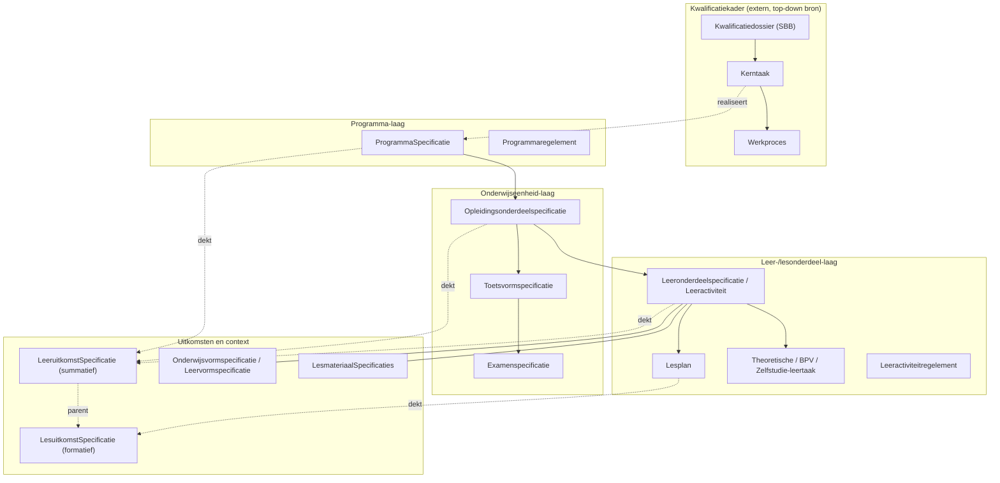
```mermaid
flowchart TB
    subgraph Kwalificatie["Kwalificatiekader (extern, top-down bron)"]
        KD["Kwalificatiedossier (SBB)"]
        KT["Kerntaak"]
        WP["Werkproces"]
    end
    subgraph Programma["Programma-laag"]
        PS["ProgrammaSpecificatie"]
        PR["Programmaregelement"]
    end
    subgraph Eenheid["Onderwijseenheid-laag"]
        OOS["Opleidingsonderdeelspecificatie"]
        TVS["Toetsvormspecificatie"]
        ES["Examenspecificatie"]
    end
    subgraph Leer["Leer-/lesonderdeel-laag"]
        LOS["Leeronderdeelspecificatie / Leeractiviteit"]
        LP["Lesplan"]
        LT["Theoretische / BPV / Zelfstudie-leertaak"]
        LAR["Leeractiviteitregelement"]
    end
    subgraph Uitkomsten["Uitkomsten en context"]
        LU["LeeruitkomstSpecificatie (summatief)"]
        LesU["LesuitkomstSpecificatie (formatief)"]
        OVS["Onderwijsvormspecificatie / Leervormspecificatie"]
        LMS_spec["LesmateriaalSpecificaties"]
    end
    KD --> KT --> WP
    KT -.realiseert.-> PS
    PS --> OOS
    OOS --> LOS
    LOS --> LP
    LOS --> LT
    OOS --> TVS --> ES
    PS -.dekt.-> LU
    OOS -.dekt.-> LU
    LOS -.dekt.-> LU
    LP -.dekt.-> LesU
    LU -.parent.-> LesU
    LOS --- OVS
    LOS --- LMS_spec
```

**Naamgevingsdiscipline (negenvlaks):** de term *specificatie* duidt op een **sjabloon/ontwerp** vóór realisatie. Pas wanneer een specificatie wordt geïnstantieerd in **tijd** en met **capaciteit** ontstaat een *aanbod*. Pas wanneer een student zich daaraan koppelt ontstaat een *associatie* (inschrijving). Het OKx-profiel hanteert deze drie lagen consequent.

### 12.2 Applicatielaag — uitwisselbare dataobjecten

Op applicatielaag (MOKA-koppelvlakspecificatie-view) worden bedrijfsobjecten gerealiseerd door dataobjecten die in koppelvlakken worden uitgewisseld. De ArchiMate-DataObjects volgen waar mogelijk de OEAPI-naamgeving (`ProgrammeOffering`, `CourseOffering`, `Association`) wat de mapping vereenvoudigt.

| ArchiMate DataObject | OEAPI-realisatie | Functie in keten |
|---------------------|------------------|------------------|
| `ProgrammaOntwerpkader` | `Programme` (zonder offering) | Top-down ontwerp, kwalificatieRef, leerroutestructuur |
| `ProgrammaSamenstelling` | `Programme` met child `Programme`s (`programmeType: "track"`) | Globale leerroute (cross-instelling) en gedetailleerd leertraject (intra-instelling) — ADR 0012 |
| `LeertaakSpecificatie` | `Course` (met `learningOutcomeIds`) | Opleidingsonderdeel of zelfstandige leertaak; N:M via `programmeIds` |
| `Leeractiviteit gegevens` | `LearningComponent` (`hierarchyLevel: "learning_activity"`) | Keuzeniveau van de student — ADR 0011 |
| (impliciet: lesopdracht) | `LearningComponent` (kind, `hierarchyLevel: "lesson_assignment"`) | LMS-domein, fijnmazig |
| `LeeruitkomstSpecificatie` | `LearningOutcome` (DAG) | Summatieve LO + formatieve LesU; CompetentNL-koppeling (§4.4) |
| `Leervormspecificatie / kader gegevens` | OKx `educationSpecification.deliveryForm` + bijbehorende velden | Aanbodkenmerk — ADR 0011 |
| `LesmateriaalSpecificaties` | OKx `educationSpecification.learningResourceGroups` | Welke leermiddelen zijn nodig |
| `ProgrammeOffering` (OOAPI v6 in model) | `ProgrammeOffering` | Concrete uitvoering van een Programme in tijd |
| `CourseOffering` | `CourseOffering` | Concrete uitvoering van een Course in tijd |
| `LearningComponentOffering` | `LearningComponentOffering` | Concrete uitvoering van een LearningComponent (les of leeractiviteit) |
| `TestComponentOffering` | `TestComponentOffering` | Concrete toets-/examenmoment |
| `Offerings` (verzameling) | Resultset van een GET op `/offerings` | Wat de SKS-/Roostersysteem-/Edubroker-query terugkrijgt |
| `RequestForOffering?` | **GAT** in OEAPI — workflow-object | Een student vraagt om aanbod dat nog niet ingepland is — signalering 7 |
| `Association` | `Association` (per offering-type) | Inschrijving / actieve deelname / afgerond — OEAPI-kern volstaat |

### 12.3 Specificatie → Aanbod → Inschrijving — de drie transformaties

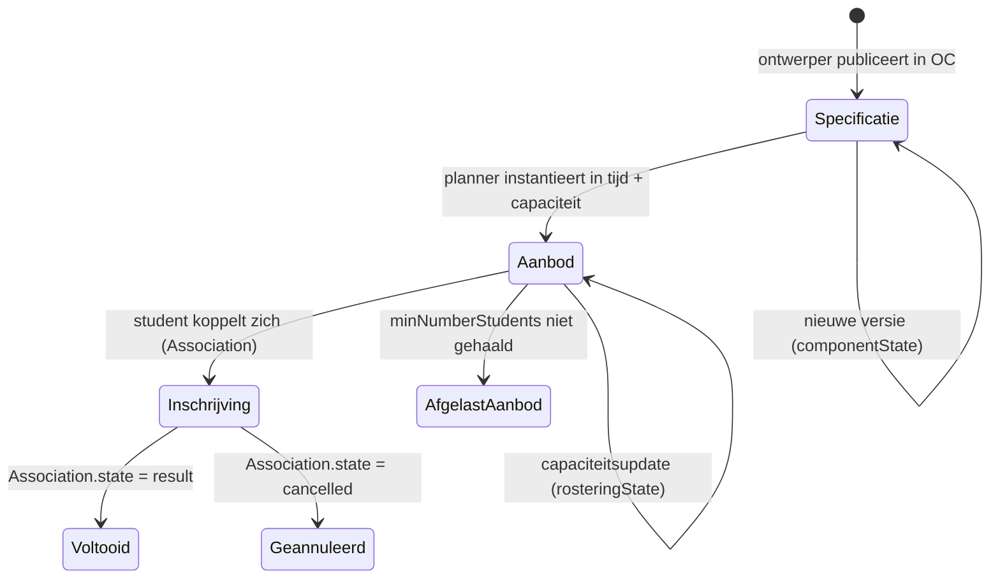
```mermaid
stateDiagram-v2
    [*] --> Specificatie : ontwerper publiceert in OC
    Specificatie --> Aanbod : planner instantieert in tijd + capaciteit
    Aanbod --> Inschrijving : student koppelt zich (Association)
    Inschrijving --> Voltooid : Association.state = result
    Inschrijving --> Geannuleerd : Association.state = cancelled
    Aanbod --> AfgelastAanbod : minNumberStudents niet gehaald
    Specificatie --> Specificatie : nieuwe versie (componentState)
    Aanbod --> Aanbod : capaciteitsupdate (rosteringState)
```

| Transformatie | Trigger | Verantwoordelijke component | OKx/OEAPI-mechanisme |
|---------------|---------|------------------------------|----------------------|
| Specificatie → Aanbod | Strategisch besluit "gaan we deze opleiding dit jaar geven?" + planningsalgoritme | Planningssysteem | Planning POST'et `*Offering`-objecten naar OC, gekoppeld aan bestaande `Programme`/`Course`/`LearningComponent`/`TestComponent` |
| Aanbod → Inschrijving | Studentaanmelding via SKS/SVS | SKS / SVS / Aanmeldsysteem | POST `Association` voor de juiste offering met `state: "pending"`/`"enrolled"` |
| Aanbod afgelast | Capaciteitsondergrens niet gehaald (`enrolledNumberStudents < minNumberStudents`) | Planningssysteem | PATCH `state: "cancelled"` op offering; OC propageert |
| Re-specificatie | Onderwijskundige wijziging | Curriculum-ontwerptool | Specificatie-update in OC met versionering — bestaande Offerings blijven actief tot eindperiode |

### 12.4 RequestForOffering — vraag-gestuurd aanbod

Het ArchiMate-model toont een dataobject `RequestForOffering?` (vraagteken in naam: nog niet uitgewerkt). Dit reflecteert dat de keten **bidirectioneel** moet werken:

- **Top-down (gedekt)**: instelling specificeert → planner maakt aanbod → student tekent in.
- **Bottom-up (vraagstuk)**: student of cohort vraagt aanbod aan dat (nog) niet bestaat → SKS/SVS dient `RequestForOffering` in → Planning evalueert haalbaarheid → terugkoppeling.

OEAPI-kern kent geen `RequestForOffering`; dit is een **signalering** (zie §9 nr. 7) en mogelijk een eigen OKx-koppelvlak. Voor MVP is top-down voldoende.

---

## 13. Resourcemapping — van leervorm naar reële middelen

De planner moet voor elke `LearningComponentOffering` (en daaronder `TestComponentOffering`) bepalen of de instelling het **kan realiseren**. Dat is een Constraint Satisfaction Problem (CSP) dat alleen oplosbaar is wanneer het OKx-profiel de relatie tussen *leervorm* en *reële middelen* expliciet maakt.

### 13.1 Decision matrix: leervorm × ruimte × expertise × leermiddelen

Onderstaande tabel is een **referentie-mapping** (instellingen mogen aanvullen). Ze laat zien hoe één veld `educationSpecification.deliveryForm` consequenties heeft voor drie middelen-categorieën.

| `deliveryForm` | Verwachte `roomType` | Indicatieve `expertiseProfiles` | Indicatieve `learningResourceGroups` | Voorbeelden |
|----------------|---------------------|----------------------------------|--------------------------------------|-------------|
| `simulation` | `simulation_practice_room`, `workshop` | `roleplay_training`, vakspecifiek (bijv. `pharmaceutical`) | `simulation_material`, `digital_workstation` | Baliegesprek apothekersassistent; verpleegkundige skillslab |
| `classroom` | `lecture_hall`, `general_classroom` | Vakdocent (vakspecifiek profiel) | `professional_literature`, `digital_workstation` | Theorievak farmacie; rekenles; Engels |
| `work_based_learning` | `external_workplace` | `practice_supervisor` (BPV-begeleider intern) | (extern bedrijf levert middelen) | Stage; BPV; werkplekleren |
| `project_based_education` | `workshop`, `general_classroom`, `online` | Procesbegeleider, inhoudelijke expert | `digital_workstation`, vak-leermiddelen | 4CID-projectonderwijs; minor "Energietransitie" |
| `guided_self_study` | `online`, `study_room` | Mentorschap (lichte begeleiding) | `e_learning_platform`, `professional_literature` | LLO-modules; zelfstudietraject onder begeleiding |
| `internship` | `external_workplace` | `practice_supervisor` | (extern) | Hbo-stage; mbo-stage |
| `research` | `laboratory`, `external_workplace` | `research_supervisor`, vakspecifiek | `lab_equipment`, vak-leermiddelen | Praktijkonderzoek hbo-bachelor; mbo-onderzoeksopdracht |
| `co_teaching` | meerdere ruimtes simultaan | meerdere docenten (instelling A + B) | conform `classroom` of `project_based` | Cross-instelling minor; Edu Exchange |
| `blended` | `hybrid` + `online` | Vakdocent + e-learning ondersteuning | `e_learning_platform` + fysieke middelen | Modern blended onderwijs |

### 13.2 Hoe de planner deze mapping gebruikt

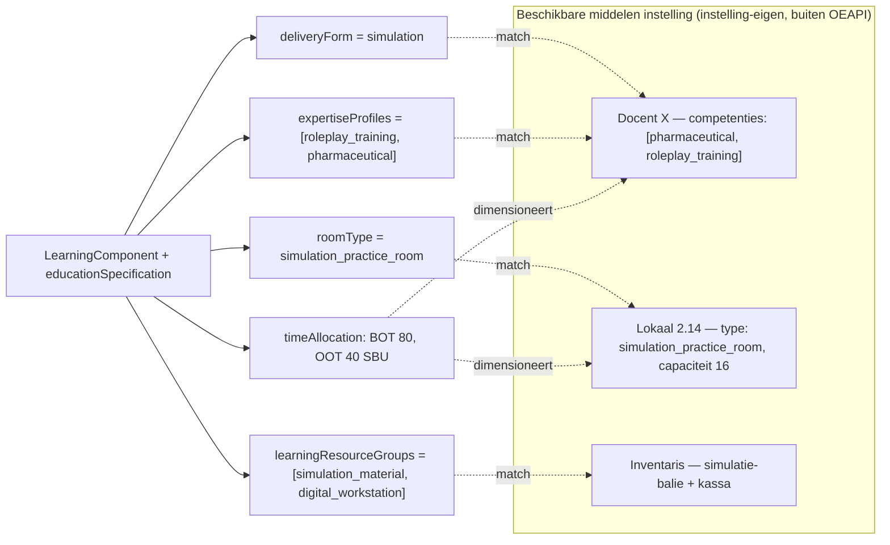
```mermaid
flowchart LR
    Spec["LearningComponent + educationSpecification"]
    Spec --> DF["deliveryForm = simulation"]
    Spec --> RT["roomType = simulation_practice_room"]
    Spec --> EP["expertiseProfiles = [roleplay_training, pharmaceutical]"]
    Spec --> LR["learningResourceGroups = [simulation_material, digital_workstation]"]
    Spec --> TA["timeAllocation: BOT 80, OOT 40 SBU"]

    subgraph Resources["Beschikbare middelen instelling (instelling-eigen, buiten OEAPI)"]
        Docent["Docent X — competenties: [pharmaceutical, roleplay_training]"]
        Lokaal["Lokaal 2.14 — type: simulation_practice_room, capaciteit 16"]
        Mat["Inventaris — simulatie-balie + kassa"]
    end

    DF -.match.-> Docent
    EP -.match.-> Docent
    RT -.match.-> Lokaal
    LR -.match.-> Mat
    TA -.dimensioneert.-> Lokaal
    TA -.dimensioneert.-> Docent
```

**De clou**: het OKx-profiel maakt geen uitspraak over welke specifieke docent of welk specifiek lokaal nodig is — dat is instelling-eigen. Het profiel maakt **expliciet welke kenmerken een docent/lokaal/middel moet hebben**, zodat de instelling die met haar HRM-systeem (`Plan van inzet systeem`) en facilitair systeem kan matchen.

### 13.3 ArchiMate-onderbouwing

Het ArchiMate-model toont expliciete flows tussen het Planningssysteem en het Plan van inzet systeem (HRM):

| Flow (ArchiMate) | Richting | Rol in CSP |
|------------------|----------|------------|
| `Inzetplanning mensen en middelen` | Plan van inzet → Planning | Beschikbaarheidskalender van docenten/ruimtes |
| `Jaarplanning` | Planning → Plan van inzet | Geboekte inzet (na CSP-oplossing) |
| `Doorstroom aantallen / Stamgroepen` | KRS → Planning | Demand-side: hoeveel studenten verwacht |
| `Prognose op potentiële aanmeldingen` | Aanmeldsysteem → Planning | Demand-side: indicatieve aanmeldingen |
| `Concept Meerjarenplanning` | Planning → Curriculum-ontwerptool | Terugkoppeling: welk grofmazig ontwerp wel/niet haalbaar |
| `Opleidingseenheid specifieke planning` | Planning → OC | Capaciteits- en periode-update terug naar catalog |

Deze flows komen terug in §17 als sequentiediagrammen.

---

## 14. CSP-input — datachecklist voor planning

Wat heeft het Planningssysteem **minimaal** nodig om een eerste jaarplanning te genereren? Hieronder een geconsolideerde checklist, opgesplitst naar de drie zijden van het Constraint Satisfaction Problem.

### 14.1 Demand-side (vraag) — uit KRS, Aanmeldsysteem, beleidskader

| Gegeven | Bron | OEAPI-/OKx-veld |
|---------|------|------------------|
| Verwachte instroom per programme per cohort | KRS (Doorstroom aantallen / Stamgroepen) | `ProgrammeOffering.maxNumberStudents`, OKx `cohortSize` |
| Indicatieve aanmeldingen (lopend) | Aanmeldsysteem (Prognose op potentiële aanmeldingen) | `ProgrammeOffering.pendingNumberStudents` |
| Strategisch besluit "aanbieden ja/nee" | Beleidskader (`Strategisch kader start/stop opleidingsaanbod`) | Bestaan van een `*Offering` voor het komende jaar |
| Doorstroom uit lager jaar | KRS | (afgeleid uit Associations met state = `participating`) |
| LLO-vraag (vrije keuze, leerroute 7-9) | SKS RequestForOffering | (signalering 7) |

### 14.2 Specification-side (waaromheen plannen) — uit OC

Per `Programme`/`Course`/`LearningComponent`/`TestComponent` heeft de planner uit het OKx-profiel:

| Categorie | OEAPI-kern | OKx-extensie | Functie in CSP |
|-----------|-----------|--------------|-----------------|
| **Identiteit en hiërarchie** | `programmeId`, `courseId`, `learningComponentId`, `parentId`, `childIds`, `programmeIds` | `hierarchyLevel` (LC) | Aggregatieniveau, ouder-kind-bomen |
| **Inhoudelijk wat** | `learningOutcomeIds` | `qualificationReference`, `competentNlRefs` | Welke LO's gedekt; matching met SBB-dossier |
| **Studielast** | `studyLoad` (Programme/Course) | `componentStudyLoad` (LC, sig. 1) | Som per niveau ⇒ totaal SBU/EC |
| **Hoe wordt het onderwezen** | `modesOfDelivery` (grof) | `educationSpecification.deliveryForm` | Selecteert ruimtetype, expertise, materiaal |
| **Tijdsbeslag** | — | `educationSpecification.timeAllocation` (BOT/OOT/eenheid/spreidingspatroon) | BOT bepaalt docent- en lokaalbezetting |
| **Ruimte** | (Room is OEAPI-kern, gerelateerd via offering) | `educationSpecification.roomType`, `roomRequirements` | Filter beschikbare lokalen |
| **Expertise** | — | `educationSpecification.expertiseProfiles` | Filter beschikbare docenten |
| **Leermiddelen** | — | `educationSpecification.learningResourceGroups` | Filter beschikbare inventaris/licenties |
| **Volgordelijkheid** | — | `participationRequirements` (sig. 3) | Prerequisite-graaf — eerst module X dan Y |
| **Credential** | `formalDocument` | `credentialDocument` | Welke registers (DUO, Edubadges) raken bij afronding |
| **Capaciteit per offering** | `maxNumberStudents`, `minNumberStudents` | `parallelGroups`, `cohortSize` | Hoeveel parallelle groepen; afgelast bij ondergrens |
| **Periode** | `startDateTime`, `endDateTime`, `academicSession` | `durationWeeks`, `admissionMoments` (fase 2) | Calendaire afbakening |

### 14.3 Resource-side (instelling-eigen, buiten OEAPI-kern)

Deze gegevens zitten **niet in OC** maar in HRM-/Facilitair-systeem en worden via koppelvlakken beschikbaar gemaakt aan Planning:

| Resourcecategorie | Bron-systeem | Sleutel-attributen voor CSP |
|-------------------|--------------|------------------------------|
| Docenten | Plan van inzet systeem (HRM) | competenties (matchen met `expertiseProfiles`), beschikbaarheid (FTE × kalender), maximum aantal contacturen |
| Lokalen | Facilitair systeem | type (matchen met `roomType`), capaciteit, faciliteiten (matchen met `roomRequirements`), bezetting per slot |
| Leermiddelen | Inventaris/Licentiebeheer | groep (matchen met `learningResourceGroups`), aantal beschikbaar |
| Praktijkplekken (BPV) | BPV-administratie | aantal beschikbare plekken per leerbedrijf, periode |

### 14.4 Constraints

| Constraint | Bron | OEAPI/OKx-mechanisme |
|------------|------|----------------------|
| Aggregatie-invariant: `SOM(children.studyLoad) = parent.studyLoad` | OKx — feature 7 | Validatie tijdens publicatie OC |
| Volgordelijkheid (X eerst, dan Y) | OKx | `participationRequirements` |
| Toelating (vooropleiding/credentials) | OKx fase 2 | `admissionCriteria`; check bij intake (ADR 0013) |
| Examen-wettelijk: summatieve toetsing onafhankelijk volgbaar | OKx | `TestComponent.assessmentLevel = "summative"` zonder verplichte voorgaande LearningComponents (ADR 0003) |
| Kwalificatiedekking | OKx | `learningOutcomeIds` × `qualificationReference` (kerntaak/werkproces dekking) |
| Cross-instelling N:M | OEAPI-kern | `programmeIds` op `Course` |
| Geen tijdsconflict per docent/lokaal/student | Roostersysteem (downstream van Planning) | (buiten OC; signalering 6: recurrence-model ontbreekt) |

---

## 15. Interactiepatronen

De OKx-keten koppelt 8+ systemen aan elkaar. Per koppelvlak hanteren we een expliciet **interactiepatroon**: dit voorkomt dat leveranciers verschillende patronen door elkaar implementeren en maakt foutafhandeling voorspelbaar (consistent met ADR 0003 over enterprise messaging).

### 15.1 Patroonoverzicht per koppelvlak

| Koppelvlak | Patroon | Synchronisatie | OEAPI-mechanisme |
|------------|---------|----------------|------------------|
| Curriculum-ontwerptool → OC (publiceren specificatie) | **Publish-update** (idempotent PUT) | Asynchroon, eventually consistent | OEAPI POST/PUT op `/programmes`, `/courses`, `/learningComponents`, `/learningOutcomes` |
| OC → Curriculum-ontwerptool (herbruikbaar fijnmazig aanbod) | **Pull-on-demand** (request-response) | Synchroon | OEAPI GET met `expand` |
| Planningssysteem ↔ Curriculum-ontwerptool ("Concept Meerjarenplanning") | **Handshake** (request → review → vaststelling) | Conversatie, meerdere rondes | Buiten OEAPI; eigen koppelvlak |
| Planningssysteem → OC (offerings publiceren) | **Publish-update** (PUT/PATCH) | Asynchroon | OEAPI POST/PUT op `/programmeOfferings`, `/courseOfferings`, `/learningComponentOfferings` |
| Planningssysteem ↔ Plan van inzet systeem (HRM) | **CSP-roundtrip** (snapshot → solve → reservation) | Asynchroon batch, soms iteratief | Buiten OEAPI; eigen koppelvlak |
| OC → SKS (passend aanbod) | **Request-response met queryparameters** (trechter) | Synchroon | OEAPI GET met filter-/expand-parameters (ADR 0007) |
| SKS → SVS (associatie) | **Event** (student kiest aanbod) | Asynchroon | OEAPI POST `Association` |
| OC → Sector Edubroker (cross-instelling) | **Publish-aggregate** | Asynchroon, eventually consistent | OEAPI federatieve structuur |
| OC → LMS (onderwijsspecificatie structuur) | **Push-template** | Asynchroon | OEAPI; LMS leest specificatie |
| LMS → OC (lesmethode-referentie) | **Push-update** | Asynchroon | OKx-extensie of buiten OEAPI |
| OC → Toets-/examenbeheersysteem | **Push-template** | Asynchroon | OEAPI |
| KRS → Planning | **Periodieke push** (snapshot doorstroom) | Batch | Buiten OEAPI |
| Aanmeldsysteem → Planning | **Push prognose** | Asynchroon | Buiten OEAPI |

### 15.2 Patroon-eigenschappen

| Patroon | Idempotentie | Foutafhandeling | Consistentie |
|---------|--------------|------------------|---------------|
| **Publish-update** (PUT) | Verplicht (zelfde PUT levert zelfde state) | Idempotent retry; dead-letter na N pogingen | Eventually consistent; consumer fetch latere versie |
| **Pull-on-demand** (GET) | N.v.t. (read-only) | Synchrone foutcode; client retry-policy | Strong (lees actuele OC-state) |
| **Handshake** | Per ronde behouden | Conversatie kan paused/cancelled | Door beide partijen geaccepteerd voor commit |
| **CSP-roundtrip** | Snapshot bevriest input; oplossing als atomair commit | Solver-failure → terug naar Planning-input | Strong na commit; tussenstaten zijn werkkopieën |
| **Request-response queryparameters** | N.v.t. | HTTP-foutcodes; pagineren bij grote resultsets | Strong |
| **Event** (associatie) | Eventid + at-least-once | Saga met compensatie (annulering) | Eventually consistent; idempotente consumer |
| **Publish-aggregate** | Per source idempotent; aggregator deduplicate op id | Heartbeats; sources kunnen offline zijn | Eventually consistent; staleness-acceptable |

### 15.3 Berichtenpatronen (ADR 0003)

ADR 0003 noemt expliciet: **guaranteed delivery, dead letter, idempotentie, berichtvolgorde**. OKx-koppelvlakken adopteren deze patronen:

- **Guaranteed delivery**: voor publish-update (CO→OC, Planning→OC) en events (SKS→SVS Association). Implementatie via doorstuurqueue of polling-fallback.
- **Dead letter**: na N retries gaat een bericht naar een dead-letter-queue voor handmatige inspectie.
- **Idempotentie**: alle write-acties moeten idempotent zijn op basis van `id`-veld (PUT-semantiek). Een tweede PUT met zelfde body levert geen tweede neveneffect.
- **Berichtvolgorde**: per `programmeId`/`courseId`/`learningComponentId` moet de volgorde behouden blijven (zelfde key → zelfde partition).

---

## 16. Sequentiediagrammen — Curriculum-ontwerp → Onderwijscatalogus

Vanuit het ArchiMate-model komen de volgende benoemde flows tussen Curriculum-ontwerptool en OC:

| ArchiMate-flow | Richting | Inhoud |
|----------------|----------|--------|
| `Grofmazig Onderwijsontwerp` | CO → OC | Programme + Course-skelet, op zijn minst kwalificatieRef en LO's |
| `Herbruikbaar (fijnmazig) aanbod` | OC → CO | Bestaande LearningComponents/Courses van eigen of andere instelling |
| `Concept Onderwijsprogramma en opleidingsonderdelen` | CO → Planning | Voorlopig ontwerp ter beoordeling planbaarheid |
| `Concept Meerjarenplanning` | Planning → CO | Terugkoppeling: realiseerbaar/niet, suggesties |
| `Examenplan t.b.h.v. opstellen summatieve resultaat structuur` | CO → SVS | TestComponent-structuur + LO-koppeling voor SVS-resultaatstructuren |

### 16.1 Happy flow — top-down nieuwe opleiding ontwerpen en publiceren

> **Scenario**: Onderwijsontwerper Aida ontwerpt een nieuwe opleiding "Apothekersassistent" (mbo-4, kwalificatiedossier 25391) en publiceert deze naar de OC.

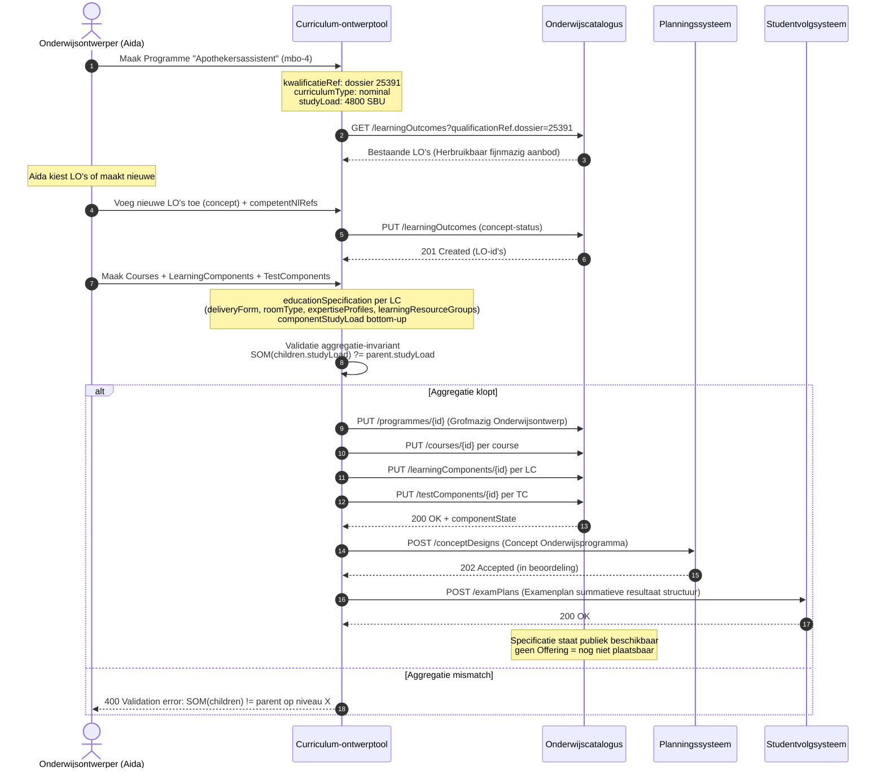
```mermaid
sequenceDiagram
    autonumber
    actor Ontwerper as Onderwijsontwerper (Aida)
    participant CO as Curriculum-ontwerptool
    participant OC as Onderwijscatalogus
    participant Planning as Planningssysteem
    participant SVS as Studentvolgsysteem

    Ontwerper->>CO: Maak Programme "Apothekersassistent" (mbo-4)
    Note over CO: kwalificatieRef: dossier 25391<br/>curriculumType: nominal<br/>studyLoad: 4800 SBU
    CO->>OC: GET /learningOutcomes?qualificationRef.dossier=25391
    OC-->>CO: Bestaande LO's (Herbruikbaar fijnmazig aanbod)
    Note over Ontwerper: Aida kiest LO's of maakt nieuwe
    Ontwerper->>CO: Voeg nieuwe LO's toe (concept) + competentNlRefs
    CO->>OC: PUT /learningOutcomes (concept-status)
    OC-->>CO: 201 Created (LO-id's)
    Ontwerper->>CO: Maak Courses + LearningComponents + TestComponents
    Note over CO: educationSpecification per LC<br/>(deliveryForm, roomType, expertiseProfiles, learningResourceGroups)<br/>componentStudyLoad bottom-up

    CO->>CO: Validatie aggregatie-invariant<br/>SOM(children.studyLoad) ?= parent.studyLoad
    alt Aggregatie klopt
        CO->>OC: PUT /programmes/{id} (Grofmazig Onderwijsontwerp)
        CO->>OC: PUT /courses/{id} per course
        CO->>OC: PUT /learningComponents/{id} per LC
        CO->>OC: PUT /testComponents/{id} per TC
        OC-->>CO: 200 OK + componentState
        CO->>Planning: POST /conceptDesigns (Concept Onderwijsprogramma)
        Planning-->>CO: 202 Accepted (in beoordeling)
        CO->>SVS: POST /examPlans (Examenplan summatieve resultaat structuur)
        SVS-->>CO: 200 OK
        Note over OC: Specificatie staat publiek beschikbaar<br/>geen Offering = nog niet plaatsbaar
    else Aggregatie mismatch
        CO-->>Ontwerper: 400 Validation error: SOM(children) != parent op niveau X
    end
```

### 16.2 Bottom-up — bestaande LearningComponents hergebruiken

> **Scenario**: Aida wil een bestaande course "Farmaceutische theorie" (van zusterinstelling) hergebruiken in haar nieuwe Programme.

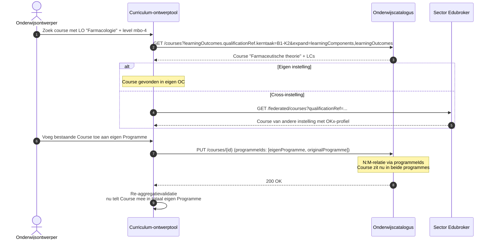
```mermaid
sequenceDiagram
    autonumber
    actor Ontwerper as Onderwijsontwerper
    participant CO as Curriculum-ontwerptool
    participant OC as Onderwijscatalogus
    participant Edubroker as Sector Edubroker

    Ontwerper->>CO: Zoek course met LO "Farmacologie" + level mbo-4
    CO->>OC: GET /courses?learningOutcomes.qualificationRef.kerntaak=B1-K2&expand=learningComponents,learningOutcomes
    OC-->>CO: Course "Farmaceutische theorie" + LCs
    alt Eigen instelling
        Note over CO: Course gevonden in eigen OC
    else Cross-instelling
        CO->>Edubroker: GET /federated/courses?qualificationRef=...
        Edubroker-->>CO: Course van andere instelling met OKx-profiel
    end
    Ontwerper->>CO: Voeg bestaande Course toe aan eigen Programme
    CO->>OC: PUT /courses/{id} (programmeIds: [eigenProgramme, originalProgramme])
    Note over OC: N:M-relatie via programmeIds<br/>Course zit nu in beide programmes
    OC-->>CO: 200 OK
    CO->>CO: Re-aggregatievalidatie<br/>nu telt Course mee in totaal eigen Programme
```

### 16.3 Faalpad — aggregatiemismatch tijdens publicatie

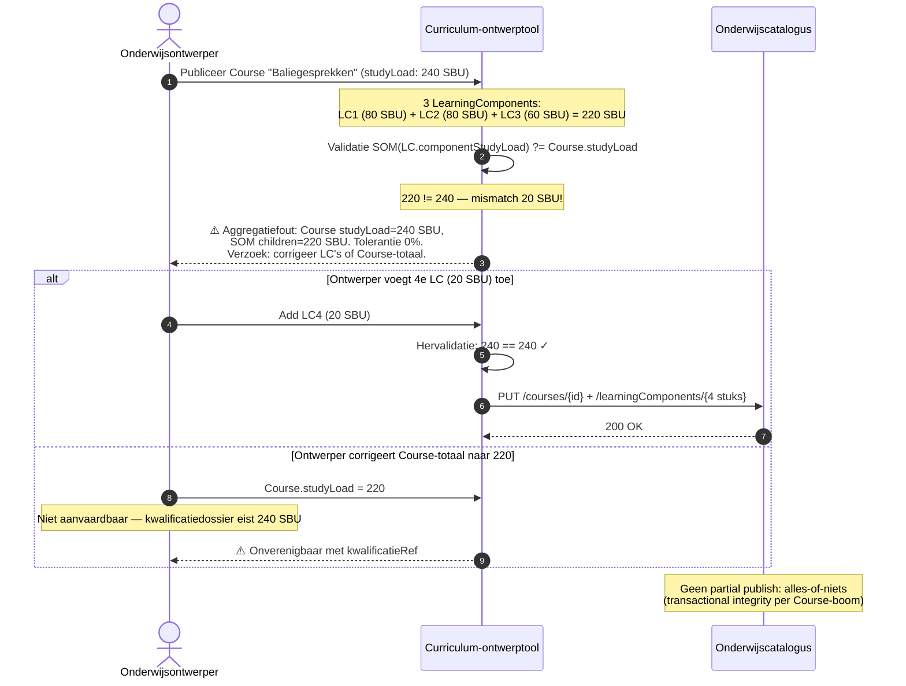
```mermaid
sequenceDiagram
    autonumber
    actor Ontwerper as Onderwijsontwerper
    participant CO as Curriculum-ontwerptool
    participant OC as Onderwijscatalogus

    Ontwerper->>CO: Publiceer Course "Baliegesprekken" (studyLoad: 240 SBU)
    Note over CO: 3 LearningComponents:<br/>LC1 (80 SBU) + LC2 (80 SBU) + LC3 (60 SBU) = 220 SBU
    CO->>CO: Validatie SOM(LC.componentStudyLoad) ?= Course.studyLoad
    Note over CO: 220 != 240 — mismatch 20 SBU!
    CO-->>Ontwerper: ⚠️ Aggregatiefout: Course studyLoad=240 SBU,<br/>SOM children=220 SBU. Tolerantie 0%.<br/>Verzoek: corrigeer LC's of Course-totaal.
    alt Ontwerper voegt 4e LC (20 SBU) toe
        Ontwerper->>CO: Add LC4 (20 SBU)
        CO->>CO: Hervalidatie: 240 == 240 ✓
        CO->>OC: PUT /courses/{id} + /learningComponents/{4 stuks}
        OC-->>CO: 200 OK
    else Ontwerper corrigeert Course-totaal naar 220
        Ontwerper->>CO: Course.studyLoad = 220
        Note over Ontwerper: Niet aanvaardbaar — kwalificatiedossier eist 240 SBU
        CO-->>Ontwerper: ⚠️ Onverenigbaar met kwalificatieRef
    end
    Note over OC: Geen partial publish: alles-of-niets<br/>(transactional integrity per Course-boom)
```

### 16.4 Faalpad — ontbrekende kwalificatieRef bij summatieve LO

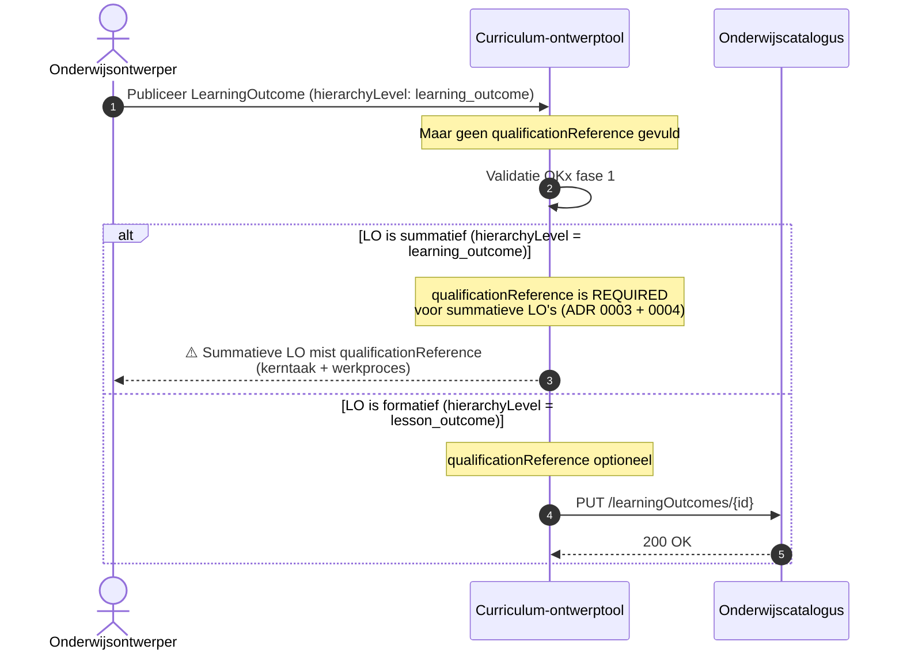
```mermaid
sequenceDiagram
    autonumber
    actor Ontwerper as Onderwijsontwerper
    participant CO as Curriculum-ontwerptool
    participant OC as Onderwijscatalogus

    Ontwerper->>CO: Publiceer LearningOutcome (hierarchyLevel: learning_outcome)
    Note over CO: Maar geen qualificationReference gevuld
    CO->>CO: Validatie OKx fase 1
    alt LO is summatief (hierarchyLevel = learning_outcome)
        Note over CO: qualificationReference is REQUIRED<br/>voor summatieve LO's (ADR 0003 + 0004)
        CO-->>Ontwerper: ⚠️ Summatieve LO mist qualificationReference<br/>(kerntaak + werkproces)
    else LO is formatief (hierarchyLevel = lesson_outcome)
        Note over CO: qualificationReference optioneel
        CO->>OC: PUT /learningOutcomes/{id}
        OC-->>CO: 200 OK
    end
```

### 16.5 Re-publicatie en versionering

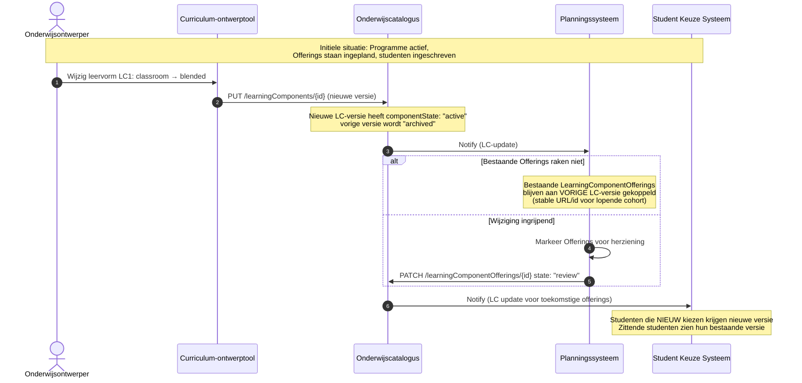
```mermaid
sequenceDiagram
    autonumber
    actor Ontwerper as Onderwijsontwerper
    participant CO as Curriculum-ontwerptool
    participant OC as Onderwijscatalogus
    participant Planning as Planningssysteem
    participant SKS as Student Keuze Systeem

    Note over Ontwerper,SKS: Initiele situatie: Programme actief,<br/>Offerings staan ingepland, studenten ingeschreven
    Ontwerper->>CO: Wijzig leervorm LC1: classroom → blended
    CO->>OC: PUT /learningComponents/{id} (nieuwe versie)
    Note over OC: Nieuwe LC-versie heeft componentState: "active"<br/>vorige versie wordt "archived"
    OC->>Planning: Notify (LC-update)
    alt Bestaande Offerings raken niet
        Note over Planning: Bestaande LearningComponentOfferings<br/>blijven aan VORIGE LC-versie gekoppeld<br/>(stable URL/id voor lopende cohort)
    else Wijziging ingrijpend
        Planning->>Planning: Markeer Offerings voor herziening
        Planning->>OC: PATCH /learningComponentOfferings/{id} state: "review"
    end
    OC->>SKS: Notify (LC update voor toekomstige offerings)
    Note over SKS: Studenten die NIEUW kiezen krijgen nieuwe versie<br/>Zittende studenten zien hun bestaande versie
```

---

## 17. Sequentiediagrammen — Onderwijscatalogus → Planningssysteem

### 17.1 Happy flow — jaarplanning generen via CSP

> **Scenario**: ROC publiceert "Apothekersassistent" voor cohort 2026-2027. Planning leest specificatie, lost CSP op, schrijft Offerings terug naar OC.

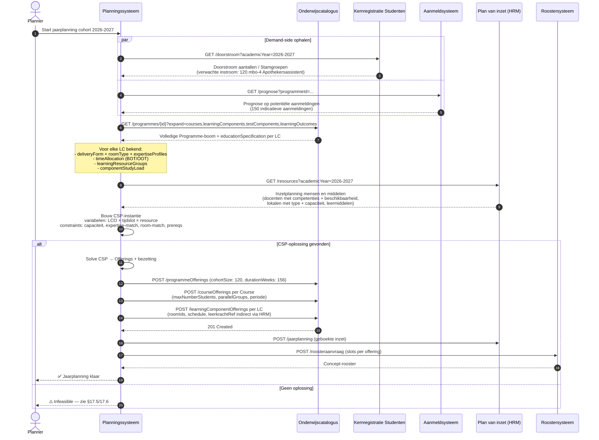
```mermaid
sequenceDiagram
    autonumber
    actor Planner as Planner
    participant Planning as Planningssysteem
    participant OC as Onderwijscatalogus
    participant KRS as Kernregistratie Studenten
    participant Aanmeld as Aanmeldsysteem
    participant HRM as Plan van inzet (HRM)
    participant Roost as Roostersysteem

    Planner->>Planning: Start jaarplanning cohort 2026-2027
    par Demand-side ophalen
        Planning->>KRS: GET /doorstroom?academicYear=2026-2027
        KRS-->>Planning: Doorstroom aantallen / Stamgroepen<br/>(verwachte instroom: 120 mbo-4 Apothekersassistent)
    and
        Planning->>Aanmeld: GET /prognose?programmeId=...
        Aanmeld-->>Planning: Prognose op potentiële aanmeldingen<br/>(150 indicatieve aanmeldingen)
    end

    Planning->>OC: GET /programmes/{id}?expand=courses,learningComponents,testComponents,learningOutcomes
    OC-->>Planning: Volledige Programme-boom + educationSpecification per LC
    Note over Planning: Voor elke LC bekend:<br/>- deliveryForm + roomType + expertiseProfiles<br/>- timeAllocation (BOT/OOT)<br/>- learningResourceGroups<br/>- componentStudyLoad

    Planning->>HRM: GET /resources?academicYear=2026-2027
    HRM-->>Planning: Inzetplanning mensen en middelen<br/>(docenten met competenties + beschikbaarheid,<br/>lokalen met type + capaciteit, leermiddelen)

    Planning->>Planning: Bouw CSP-instantie<br/>variabelen: LCO × tijdslot × resource<br/>constraints: capaciteit, expertise-match, room-match, prereqs

    alt CSP-oplossing gevonden
        Planning->>Planning: Solve CSP → Offerings + bezetting
        Planning->>OC: POST /programmeOfferings (cohortSize: 120, durationWeeks: 156)
        Planning->>OC: POST /courseOfferings per Course<br/>(maxNumberStudents, parallelGroups, periode)
        Planning->>OC: POST /learningComponentOfferings per LC<br/>(roomIds, schedule, leerkrachtRef indirect via HRM)
        OC-->>Planning: 201 Created
        Planning->>HRM: POST /jaarplanning (geboekte inzet)
        Planning->>Roost: POST /roosteraanvraag (slots per offering)
        Roost-->>Planning: Concept-rooster
        Planning-->>Planner: ✅ Jaarplanning klaar
    else Geen oplossing
        Planning-->>Planner: ⚠️ Infeasible — zie §17.5/17.6
    end
```

### 17.2 Capaciteitsterugkoppeling — Planning → OC

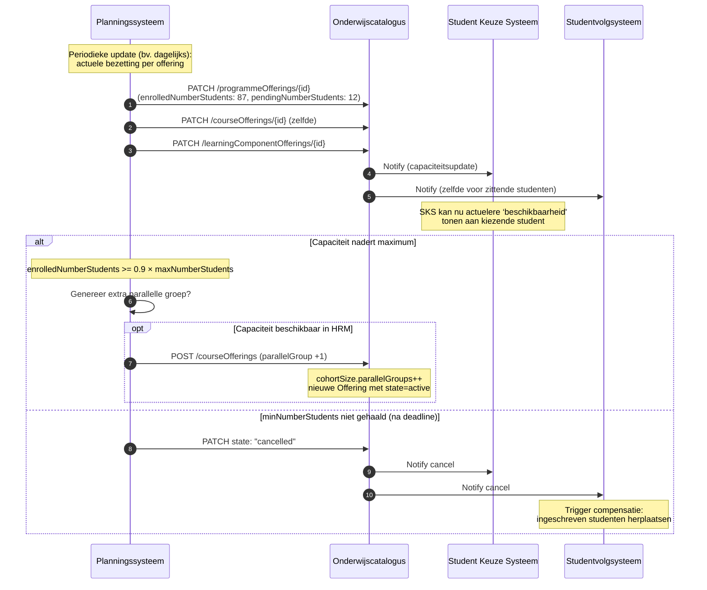
```mermaid
sequenceDiagram
    autonumber
    participant Planning as Planningssysteem
    participant OC as Onderwijscatalogus
    participant SKS as Student Keuze Systeem
    participant SVS as Studentvolgsysteem

    Note over Planning: Periodieke update (bv. dagelijks):<br/>actuele bezetting per offering
    Planning->>OC: PATCH /programmeOfferings/{id}<br/>(enrolledNumberStudents: 87, pendingNumberStudents: 12)
    Planning->>OC: PATCH /courseOfferings/{id} (zelfde)
    Planning->>OC: PATCH /learningComponentOfferings/{id}
    OC->>SKS: Notify (capaciteitsupdate)
    OC->>SVS: Notify (zelfde voor zittende studenten)
    Note over SKS: SKS kan nu actuelere ‘beschikbaarheid'<br/>tonen aan kiezende student

    alt Capaciteit nadert maximum
        Note over Planning: enrolledNumberStudents >= 0.9 × maxNumberStudents
        Planning->>Planning: Genereer extra parallelle groep?
        opt Capaciteit beschikbaar in HRM
            Planning->>OC: POST /courseOfferings (parallelGroup +1)
            Note over OC: cohortSize.parallelGroups++<br/>nieuwe Offering met state=active
        end
    else minNumberStudents niet gehaald (na deadline)
        Planning->>OC: PATCH state: "cancelled"
        OC->>SKS: Notify cancel
        OC->>SVS: Notify cancel
        Note over SVS: Trigger compensatie:<br/>ingeschreven studenten herplaatsen
    end
```

### 17.3 Keuzedeel als zelfstandig Programme + N:M-koppeling

> **Scenario**: SBB-keuzedeel "Digitale vaardigheden" (K0023) is volgens SBB een **zelfstandig programma**, maar wordt door studenten van meerdere mbo-opleidingen gekozen. OEAPI-N:M-relatie via `programmeIds` op Course is hier essentieel.

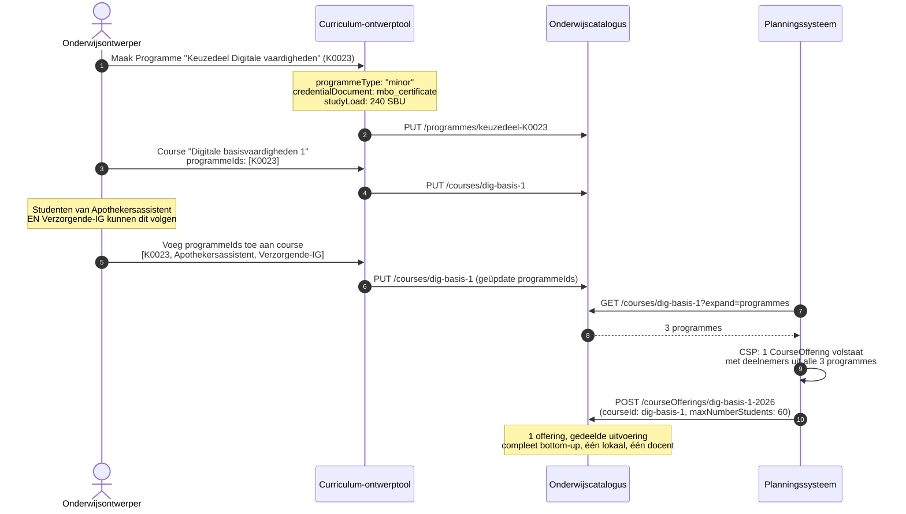
```mermaid
sequenceDiagram
    autonumber
    actor Ontwerper as Onderwijsontwerper
    participant CO as Curriculum-ontwerptool
    participant OC as Onderwijscatalogus
    participant Planning as Planningssysteem

    Ontwerper->>CO: Maak Programme "Keuzedeel Digitale vaardigheden" (K0023)
    Note over CO: programmeType: "minor"<br/>credentialDocument: mbo_certificate<br/>studyLoad: 240 SBU
    CO->>OC: PUT /programmes/keuzedeel-K0023
    Ontwerper->>CO: Course "Digitale basisvaardigheden 1"<br/>programmeIds: [K0023]
    CO->>OC: PUT /courses/dig-basis-1

    Note over Ontwerper: Studenten van Apothekersassistent<br/>EN Verzorgende-IG kunnen dit volgen
    Ontwerper->>CO: Voeg programmeIds toe aan course<br/>[K0023, Apothekersassistent, Verzorgende-IG]
    CO->>OC: PUT /courses/dig-basis-1 (geüpdate programmeIds)

    Planning->>OC: GET /courses/dig-basis-1?expand=programmes
    OC-->>Planning: 3 programmes
    Planning->>Planning: CSP: 1 CourseOffering volstaat<br/>met deelnemers uit alle 3 programmes
    Planning->>OC: POST /courseOfferings/dig-basis-1-2026<br/>(courseId: dig-basis-1, maxNumberStudents: 60)
    Note over OC: 1 offering, gedeelde uitvoering<br/>compleet bottom-up, één lokaal, één docent
```

### 17.4 Iteratieve handshake — Concept → Meerjarenplanning → Vastgesteld

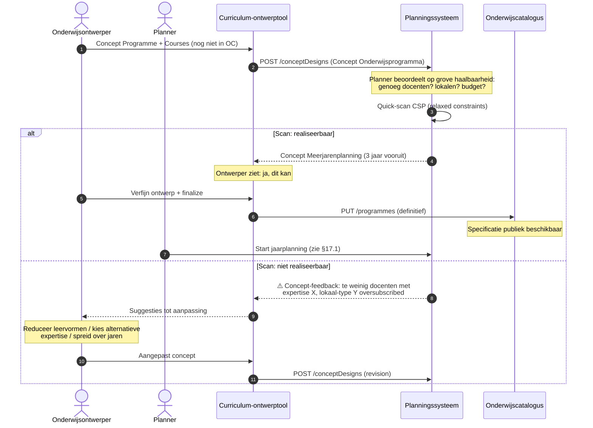
```mermaid
sequenceDiagram
    autonumber
    actor Ontwerper as Onderwijsontwerper
    actor Planner as Planner
    participant CO as Curriculum-ontwerptool
    participant Planning as Planningssysteem
    participant OC as Onderwijscatalogus

    Ontwerper->>CO: Concept Programme + Courses (nog niet in OC)
    CO->>Planning: POST /conceptDesigns (Concept Onderwijsprogramma)
    Note over Planning: Planner beoordeelt op grove haalbaarheid:<br/>genoeg docenten? lokalen? budget?
    Planning->>Planning: Quick-scan CSP (relaxed constraints)
    alt Scan: realiseerbaar
        Planning-->>CO: Concept Meerjarenplanning (3 jaar vooruit)
        Note over CO: Ontwerper ziet: ja, dit kan
        Ontwerper->>CO: Verfijn ontwerp + finalize
        CO->>OC: PUT /programmes (definitief)
        Note over OC: Specificatie publiek beschikbaar
        Planner->>Planning: Start jaarplanning (zie §17.1)
    else Scan: niet realiseerbaar
        Planning-->>CO: ⚠️ Concept-feedback: te weinig docenten met<br/>expertise X, lokaal-type Y oversubscribed
        CO-->>Ontwerper: Suggesties tot aanpassing
        Note over Ontwerper: Reduceer leervormen / kies alternatieve<br/>expertise / spreid over jaren
        Ontwerper->>CO: Aangepast concept
        CO->>Planning: POST /conceptDesigns (revision)
    end
```

### 17.5 Faalpad — infeasible CSP wegens expertisetekort

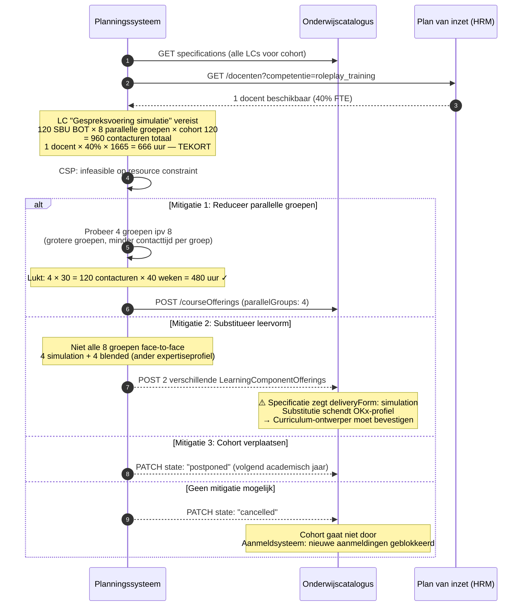
```mermaid
sequenceDiagram
    autonumber
    participant Planning as Planningssysteem
    participant OC as Onderwijscatalogus
    participant HRM as Plan van inzet (HRM)

    Planning->>OC: GET specifications (alle LCs voor cohort)
    Planning->>HRM: GET /docenten?competentie=roleplay_training
    HRM-->>Planning: 1 docent beschikbaar (40% FTE)
    Note over Planning: LC "Gespreksvoering simulatie" vereist<br/>120 SBU BOT × 8 parallelle groepen × cohort 120<br/>= 960 contacturen totaal<br/>1 docent × 40% × 1665 = 666 uur — TEKORT
    Planning->>Planning: CSP: infeasible op resource constraint

    alt Mitigatie 1: Reduceer parallelle groepen
        Planning->>Planning: Probeer 4 groepen ipv 8<br/>(grotere groepen, minder contacttijd per groep)
        Note over Planning: Lukt: 4 × 30 = 120 contacturen × 40 weken = 480 uur ✓
        Planning->>OC: POST /courseOfferings (parallelGroups: 4)
    else Mitigatie 2: Substitueer leervorm
        Note over Planning: Niet alle 8 groepen face-to-face<br/>4 simulation + 4 blended (ander expertiseprofiel)
        Planning-->>OC: POST 2 verschillende LearningComponentOfferings
        Note over OC: ⚠️ Specificatie zegt deliveryForm: simulation<br/>Substitutie schendt OKx-profiel<br/>→ Curriculum-ontwerper moet bevestigen
    else Mitigatie 3: Cohort verplaatsen
        Planning-->>OC: PATCH state: "postponed" (volgend academisch jaar)
    else Geen mitigatie mogelijk
        Planning-->>OC: PATCH state: "cancelled"
        Note over OC: Cohort gaat niet door<br/>Aanmeldsysteem: nieuwe aanmeldingen geblokkeerd
    end
```

### 17.6 Faalpad — ruimtetekort / roosterconflict

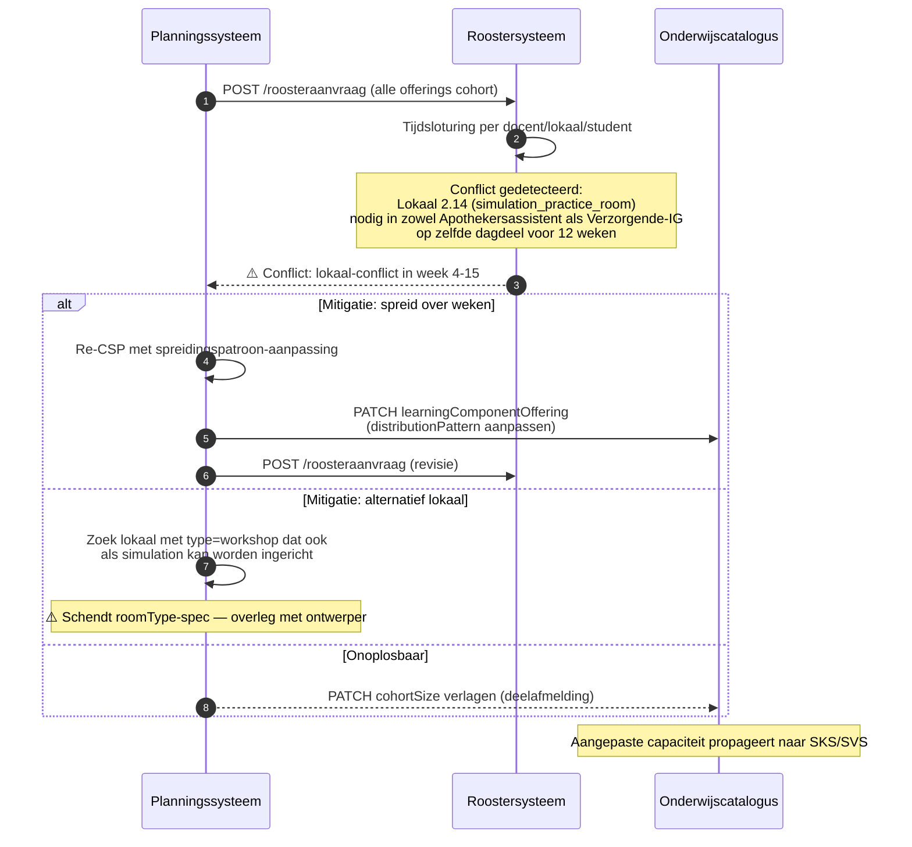
```mermaid
sequenceDiagram
    autonumber
    participant Planning as Planningssysteem
    participant Roost as Roostersysteem
    participant OC as Onderwijscatalogus

    Planning->>Roost: POST /roosteraanvraag (alle offerings cohort)
    Roost->>Roost: Tijdsloturing per docent/lokaal/student
    Note over Roost: Conflict gedetecteerd:<br/>Lokaal 2.14 (simulation_practice_room)<br/>nodig in zowel Apothekersassistent als Verzorgende-IG<br/>op zelfde dagdeel voor 12 weken
    Roost-->>Planning: ⚠️ Conflict: lokaal-conflict in week 4-15
    alt Mitigatie: spreid over weken
        Planning->>Planning: Re-CSP met spreidingspatroon-aanpassing
        Planning->>OC: PATCH learningComponentOffering<br/>(distributionPattern aanpassen)
        Planning->>Roost: POST /roosteraanvraag (revisie)
    else Mitigatie: alternatief lokaal
        Planning->>Planning: Zoek lokaal met type=workshop dat ook<br/>als simulation kan worden ingericht
        Note over Planning: ⚠️ Schendt roomType-spec — overleg met ontwerper
    else Onoplosbaar
        Planning-->>OC: PATCH cohortSize verlagen (deelafmelding)
    end
    Note over OC: Aangepaste capaciteit propageert naar SKS/SVS
```

### 17.7 Faalpad — prognose-spike / late aanmeldgolf

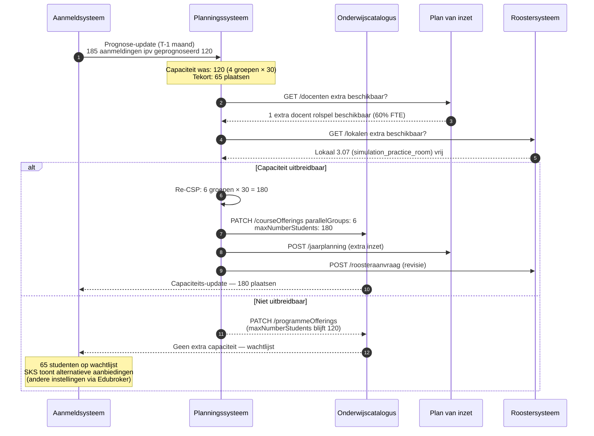
```mermaid
sequenceDiagram
    autonumber
    participant Aanmeld as Aanmeldsysteem
    participant Planning as Planningssysteem
    participant OC as Onderwijscatalogus
    participant HRM as Plan van inzet
    participant Roost as Roostersysteem

    Aanmeld->>Planning: Prognose-update (T-1 maand)<br/>185 aanmeldingen ipv geprognoseerd 120
    Note over Planning: Capaciteit was: 120 (4 groepen × 30)<br/>Tekort: 65 plaatsen
    Planning->>HRM: GET /docenten extra beschikbaar?
    HRM-->>Planning: 1 extra docent rolspel beschikbaar (60% FTE)
    Planning->>Roost: GET /lokalen extra beschikbaar?
    Roost-->>Planning: Lokaal 3.07 (simulation_practice_room) vrij
    alt Capaciteit uitbreidbaar
        Planning->>Planning: Re-CSP: 6 groepen × 30 = 180
        Planning->>OC: PATCH /courseOfferings parallelGroups: 6<br/>maxNumberStudents: 180
        Planning->>HRM: POST /jaarplanning (extra inzet)
        Planning->>Roost: POST /roosteraanvraag (revisie)
        OC-->>Aanmeld: Capaciteits-update — 180 plaatsen
    else Niet uitbreidbaar
        Planning-->>OC: PATCH /programmeOfferings<br/>(maxNumberStudents blijft 120)
        OC-->>Aanmeld: Geen extra capaciteit — wachtlijst
        Note over Aanmeld: 65 studenten op wachtlijst<br/>SKS toont alternatieve aanbiedingen<br/>(andere instellingen via Edubroker)
    end
```

---

## 18. Sequentiediagrammen — overige referentie-flows (kort)

Deze flows zijn **buiten primaire scope (CO→OC, OC→Planning)** maar volgen voor compleetheid en als input voor design docs. Volgende sessies werken deze verder uit.

### 18.1 OC → SKS — passend aanbod op trechterquery

> **ArchiMate-flow 3**: SKS → OC `Aanbod passend op leervraag (uitgedrukt in o.a. leeruitkomsten, domein, leervorm etc.)`<br/>
> **ArchiMate-flow 4**: OC → SKS `Passend aanbod op leervraag (programmes, courses, learning components <> test components)`

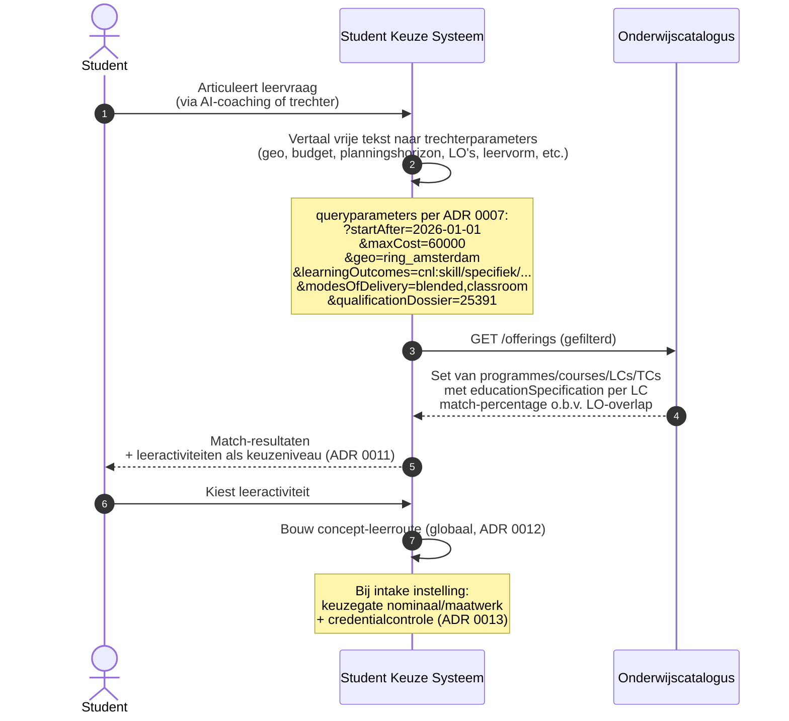
```mermaid
sequenceDiagram
    autonumber
    actor Student
    participant SKS as Student Keuze Systeem
    participant OC as Onderwijscatalogus

    Student->>SKS: Articuleert leervraag<br/>(via AI-coaching of trechter)
    SKS->>SKS: Vertaal vrije tekst naar trechterparameters<br/>(geo, budget, planningshorizon, LO's, leervorm, etc.)
    Note over SKS: queryparameters per ADR 0007:<br/>?startAfter=2026-01-01<br/>&maxCost=60000<br/>&geo=ring_amsterdam<br/>&learningOutcomes=cnl:skill/specifiek/...<br/>&modesOfDelivery=blended,classroom<br/>&qualificationDossier=25391
    SKS->>OC: GET /offerings (gefilterd)
    OC-->>SKS: Set van programmes/courses/LCs/TCs<br/>met educationSpecification per LC<br/>match-percentage o.b.v. LO-overlap
    SKS-->>Student: Match-resultaten<br/>+ leeractiviteiten als keuzeniveau (ADR 0011)
    Student->>SKS: Kiest leeractiviteit
    SKS->>SKS: Bouw concept-leerroute (globaal, ADR 0012)
    Note over SKS: Bij intake instelling:<br/>keuzegate nominaal/maatwerk<br/>+ credentialcontrole (ADR 0013)
```

### 18.2 OC → Sector Edubroker — cross-instelling aggregatie

> **ArchiMate-flow**: OC → Edubroker `Alle beschikbare leergelegenheden i.r.t. leeruitkomsten`<br/>
> **Edubroker-docstring**: `rocn.oc.nl/aanbod/getq?={01-01-26, 01-01-2030}, {maxcost = 60k}, {ring_amsterdam}, {set leeruitkomsten}, {OOT/BOT}, {BPV ja/nee}, {beoordeling < 5/7}, {toetsvorm = grotendeels selfpaced theorie}`

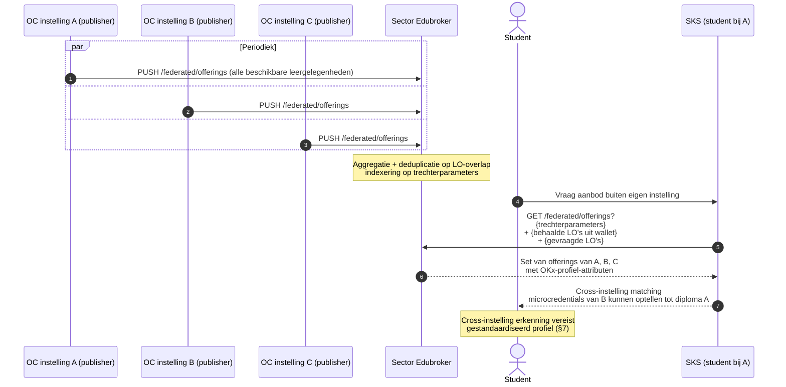
```mermaid
sequenceDiagram
    autonumber
    participant OC_A as OC instelling A (publisher)
    participant OC_B as OC instelling B (publisher)
    participant OC_C as OC instelling C (publisher)
    participant Edubroker as Sector Edubroker
    actor Student
    participant SKS as SKS (student bij A)

    par Periodiek
        OC_A->>Edubroker: PUSH /federated/offerings (alle beschikbare leergelegenheden)
    and
        OC_B->>Edubroker: PUSH /federated/offerings
    and
        OC_C->>Edubroker: PUSH /federated/offerings
    end
    Note over Edubroker: Aggregatie + deduplicatie op LO-overlap<br/>indexering op trechterparameters

    Student->>SKS: Vraag aanbod buiten eigen instelling
    SKS->>Edubroker: GET /federated/offerings?<br/>{trechterparameters}<br/>+ {behaalde LO's uit wallet}<br/>+ {gevraagde LO's}
    Edubroker-->>SKS: Set van offerings van A, B, C<br/>met OKx-profiel-attributen
    SKS-->>Student: Cross-instelling matching<br/>microcredentials van B kunnen optellen tot diploma A
    Note over Student: Cross-instelling erkenning vereist<br/>gestandaardiseerd profiel (§7)
```

### 18.3 OC → LMS — onderwijsspecificatie als template

> **ArchiMate-flow**: OC → LMS `Onderwijsspecificatie structuur (request for LMS structuur)`<br/>
> **Reverse**: LMS → OC `verwijzing naar lesmethode structuur o.b.v. onderwijsspecificaties`

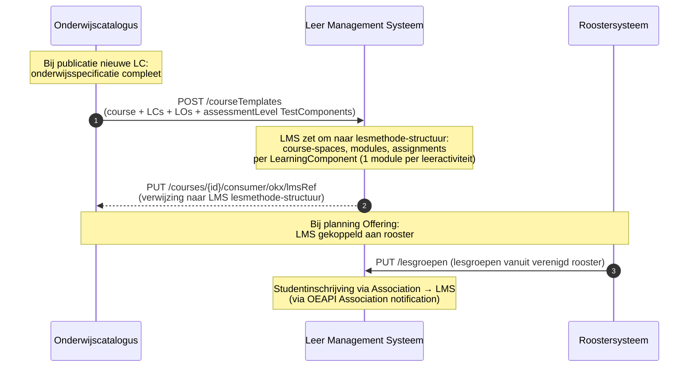
```mermaid
sequenceDiagram
    autonumber
    participant OC as Onderwijscatalogus
    participant LMS as Leer Management Systeem
    participant Roost as Roostersysteem

    Note over OC: Bij publicatie nieuwe LC:<br/>onderwijsspecificatie compleet
    OC->>LMS: POST /courseTemplates<br/>(course + LCs + LOs + assessmentLevel TestComponents)
    Note over LMS: LMS zet om naar lesmethode-structuur:<br/>course-spaces, modules, assignments<br/>per LearningComponent (1 module per leeractiviteit)
    LMS-->>OC: PUT /courses/{id}/consumer/okx/lmsRef<br/>(verwijzing naar LMS lesmethode-structuur)

    Note over OC,Roost: Bij planning Offering:<br/>LMS gekoppeld aan rooster
    Roost->>LMS: PUT /lesgroepen (lesgroepen vanuit verenigd rooster)
    Note over LMS: Studentinschrijving via Association → LMS<br/>(via OEAPI Association notification)
```

### 18.4 OC → Toets-/examenbeheersysteem

> **ArchiMate-flow**: OC → Toetsbeheer `Onderwijsspecificaties i.c.m. examens en toetsen`<br/>
> **Reverse**: Toetsbeheer → SKS `Onderwijsspecificaties i.c.m. examens en toetsen i.c.m. keuze mogelijkheden in toets- en exameninstrumenten`

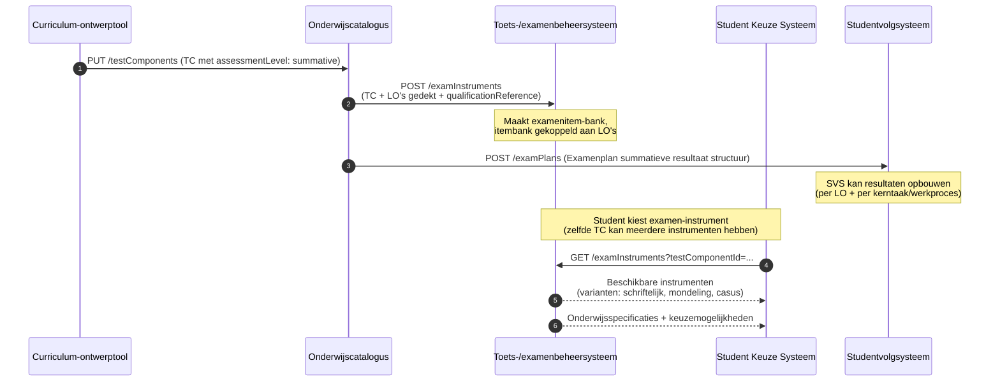
```mermaid
sequenceDiagram
    autonumber
    participant CO as Curriculum-ontwerptool
    participant OC as Onderwijscatalogus
    participant Toets as Toets-/examenbeheersysteem
    participant SKS as Student Keuze Systeem
    participant SVS as Studentvolgsysteem

    CO->>OC: PUT /testComponents (TC met assessmentLevel: summative)
    OC->>Toets: POST /examInstruments<br/>(TC + LO's gedekt + qualificationReference)
    Note over Toets: Maakt examenitem-bank,<br/>itembank gekoppeld aan LO's
    OC->>SVS: POST /examPlans (Examenplan summatieve resultaat structuur)
    Note over SVS: SVS kan resultaten opbouwen<br/>(per LO + per kerntaak/werkproces)

    Note over SKS,Toets: Student kiest examen-instrument<br/>(zelfde TC kan meerdere instrumenten hebben)
    SKS->>Toets: GET /examInstruments?testComponentId=...
    Toets-->>SKS: Beschikbare instrumenten<br/>(varianten: schriftelijk, mondeling, casus)
    Toets-->>SKS: Onderwijsspecificaties + keuzemogelijkheden
```

---

## 19. Faalmatrix — overzicht ketenfaalmodi

| # | Faalmodus | Detectiemoment | Actor primair | Mitigatie | Diagram |
|---|-----------|----------------|----------------|-----------|---------|
| F1 | Aggregatiemismatch tijdens publicatie | CO-validatie | Curriculum-ontwerptool | Correctie LC's of Course-totaal; transactional rollback | §16.3 |
| F2 | Ontbrekende qualificationReference voor summatieve LO | CO-validatie | Curriculum-ontwerptool | Verplicht-veld melding | §16.4 |
| F3 | Concept Onderwijsprogramma niet realiseerbaar | Planning quick-scan | Planningssysteem | Conceptfeedback → ontwerper past aan | §17.4 |
| F4 | CSP infeasible op expertise | Planning solve | Planningssysteem | Reduceer groepen / substitueer leervorm / verplaats cohort / annuleer | §17.5 |
| F5 | Roosterconflict (lokaal/docent dubbel) | Roostersysteem | Roostersysteem | Spreid distributiepatroon / alternatief lokaal / capaciteit bijstellen | §17.6 |
| F6 | Prognose-spike / late aanmeldgolf | Aanmeld-update | Aanmeldsysteem → Planning | Extra parallelle groep of wachtlijst | §17.7 |
| F7 | minNumberStudents niet gehaald | Aanmelddeadline | Planning | PATCH state: cancelled, herplaats studenten | §17.2 |
| F8 | Cross-instelling: ontbrekend OKx-profiel | Edubroker-aggregator | Edubroker | Herken OKx-extensie afwezig; degradeer naar OEAPI-kern; signaleer instelling | §18.2 |
| F9 | LMS kan onderwijsspecificatie niet vertalen | LMS-import | LMS | Ondersteunt subset; signaleer ontbrekende velden | §18.3 |
| F10 | Specificatie-update raakt lopende Offerings | OC-versionering | OC | Vorige versie blijft actief tot eindperiode; nieuwe versie voor nieuwe Offerings | §16.5 |
| F11 | Ontbrekende prerequisite-relatie | Planning of SKS | Planning | Signalering 3 (OEAPI-gat); OKx `participationRequirements` als workaround | (sig. 3) |
| F12 | Discrepantie tussen `studyLoad` (Course/Programme) en aggregatie LC's | Aggregatievalidatie | OC | Zie F1; mogelijk OEAPI-uitbreiding nodig (sig. 1) | (sig. 1) |

---

## 20. Bevestigde principes uit ArchiMate-model

Onderstaande **benoemde flows** in het ArchiMate-model bevestigen dat de OKx-keten exact deze interactiepatronen verlangt:

| ArchiMate-flow (naam in model) | Bron → Doel | OKx-interpretatie | Sectie |
|--------------------------------|-------------|--------------------|--------|
| `Grofmazig Onderwijsontwerp` | Curriculum-ontwerptool → OC | Top-down ontwerp publiceren | §16.1 |
| `Herbruikbaar (fijnmazig) aanbod` | OC → Curriculum-ontwerptool | Bestaande LC/course oppikken | §16.2 |
| `Concept Onderwijsprogramma en opleidingsonderdelen` | Curriculum-ontwerptool → Planning | Handshake voor haalbaarheid | §17.4 |
| `Concept Meerjarenplanning` | Planning → Curriculum-ontwerptool | Terugkoppeling realiseerbaarheid | §17.4 |
| `Examenplan t.b.h.v. opstellen summatieve resultaat structuur` | Curriculum-ontwerptool → SVS | TC + LO's voor SVS | §16.1 |
| `Opleidingseenheid specifieke planning` | Planning → OC | Capaciteits-update | §17.2 |
| `Opleidingsaanbod` | OC → Roostersysteem | Aanbod doorzetten naar rooster | §17.1 |
| `Fijmazig Opleidingsaanbod` | OC → SVS | SVS resultaatstructuren | §17.1 |
| `Onderwijsspecificatie structuur (request for LMS structuur)` | OC → LMS | Template voor LMS | §18.3 |
| `verwijzing naar lesmethode structuur o.b.v. onderwijsspecificaties` | LMS → OC | LMS-ref op course | §18.3 |
| `3. Aanbod passend op leervraag (uitgedrukt in o.a. leeruitkomsten, domein, leervorm etc.)` | SKS → OC | Trechterquery | §18.1 |
| `4. Passend aanbod op leervraag (programmes, courses, learning components <> test components)` | OC → SKS | Resultset met OKx-profiel | §18.1 |
| `Alle beschikbare leergelegenheden i.r.t. leeruitkomsten` | OC → Edubroker | Federatie-publicatie | §18.2 |
| `Doorstroom aantallen / Stamgroepen` | KRS → Planning | Demand-side CSP | §14.1, §17.1 |
| `Prognose op potentiële aanmeldingen` | Aanmeldsysteem → Planning | Demand-side CSP | §14.1, §17.1, §17.7 |
| `Inzetplanning mensen en middelen` | Plan van inzet → Planning | Resource-side CSP | §14.3, §17.1 |
| `Jaarplanning` | Planning → Plan van inzet | Resource-commitment | §17.1 |
| `Lesgroepen vanuit verenigd rooster` | Planning → LMS | Roostercommit naar LMS | §17.1, §18.3 |
| `Onderwijsspecificaties i.c.m. examens en toetsen` | OC → Toetsbeheer | Examenitem-bank input | §18.4 |
| `Vraag articulatie student (OC Query)` | (vraagsysteem) → Edubroker | Student vrije tekst → trechter | (latere uitwerking) |
| `Behaalde leeruitkomsten en gevraagde leeruitkomsten` | Wallet-context → Edubroker | Cross-instelling LO-matching | (latere uitwerking) |

Deze 21 flows vormen tezamen het **referentie-interactiemodel** van de OKx-keten. Sequentiediagrammen in §16-§18 dekken minimaal alle flows in scope (CO↔OC↔Planning, en kort de andere ketenpartijen).

---

## Sessiestatus

**Gedaan (v3):**
- Onderwijsspecificatie als gestructureerd object met leervorm, BOT/OOT, ruimtetype, expertiseprofiel, leermiddelen, spreidingspatroon
- Bottom-up aggregatie met SOM-invariant en kwalificatiedossier-alignment
- 5 uitgewerkte scenario's over Npuls-leerroutes (regulier, versneld, personalisatie intra/inter-instelling, modulair)
- 3 perspectieven per scenario (ontwerper, planner, student)
- Cross-instelling interoperabiliteit: wat moet standaard zijn, wat mag instelling-specifiek blijven
- Credentialing-cascade (badge → microcredential → certificaat → diploma) met `waardeDocument`

**Gedaan (v4):**
- LearningOutcome-voorbeelduitwerkingen met CompetentNL-taxonomieën (§4.4)
- CompetentNL vaardighedentaxonomie (6 → 19 → 112) en kennisgebiedentaxonomie (ISCED-F) als referentiekader
- Twee nieuwe OKx-extensieattributen: `competentNlRefs` en `competentNlRelatieType`
- Drie uitgewerkte root-leeruitkomsten (B1-K1, B1-K2, B1-K3) met geneste lesuitkomsten
- DAG-structuur voorbeeld: gedeelde lesuitkomst met meerdere ouders
- Matchingscenario: student zoekt op CompetentNL-skills → OC retourneert passend aanbod

**Gedaan (v5):**
- §12 Negenvlaks-mapping van Specificatie → Aanbod → Inschrijving incl. ArchiMate ↔ OEAPI-tabel
- §13 Resourcemapping leervorm × ruimte × expertise × leermiddelen (decision matrix + flowchart)
- §14 CSP-input checklist (demand-side / specification-side / resource-side / constraints)
- §15 Interactiepatronen per koppelvlak (publish-update, pull-on-demand, handshake, CSP-roundtrip, trechter-query, saga, idempotentie + dead-letter conform ADR 0003)
- §16 Sequentiediagrammen Curriculum-ontwerp → OC: top-down publish, bottom-up reuse, aggregatiemismatch, ontbrekende qualificationReference, re-publicatie/versionering
- §17 Sequentiediagrammen OC → Planning: jaarplanning via CSP, capaciteitsterugkoppeling, keuzedeel als zelfstandig Programme + N:M, iteratieve handshake, infeasible-CSP, roosterconflict, prognose-spike
- §18 Aanvullende referentie-sequenties: SKS-trechterquery, Edubroker cross-instelling, LMS-template, Toetsbeheer
- §19 Faalmatrix: 12 ketenfaalmodi met detectiemoment + mitigatie + diagram-referentie
- §20 ArchiMate-cross-reference: 21 benoemde flows uit `model.archimate` gemapt op secties

**Volgende stappen:**
- [ ] Review kernteam: kloppen scenario's met praktijk pilotinstellingen?
- [ ] Validatie sequentiediagrammen tegen feitelijke leveranciersimplementaties
- [ ] Concretiseren `RequestForOffering` als signalering 7 (vraag-gestuurd aanbod ontbreekt in OEAPI)
- [ ] Validatie CompetentNL-URI's: zijn de gebruikte URI's reëel in de publieksversie van CompetentNL?
- [ ] Validatie: kan voorbeeld (§4.3 + §4.4) door bestaande OEAPI-implementaties worden geserveerd?
- [ ] Detaillering enum-waarden (leervorm, ruimtetype, expertiseprofiel) met instellingen
- [ ] Uitwerking modulair studeren: hoe werkt retroactieve programme-samenstelling?
- [ ] OEAPI change requests voor signaleringen (incl. nieuwe sig. 7 RequestForOffering)
- [ ] Verwerking sequentiediagrammen in design-docs (per feature toepasselijke sequenties markeren)
- [ ] Featureplan via `/maak-plan` voor YAML-profielbestanden (opgeleverd: `feature-plans/20260414_1800_okx-oeapi-consumer-profiel.md`)
