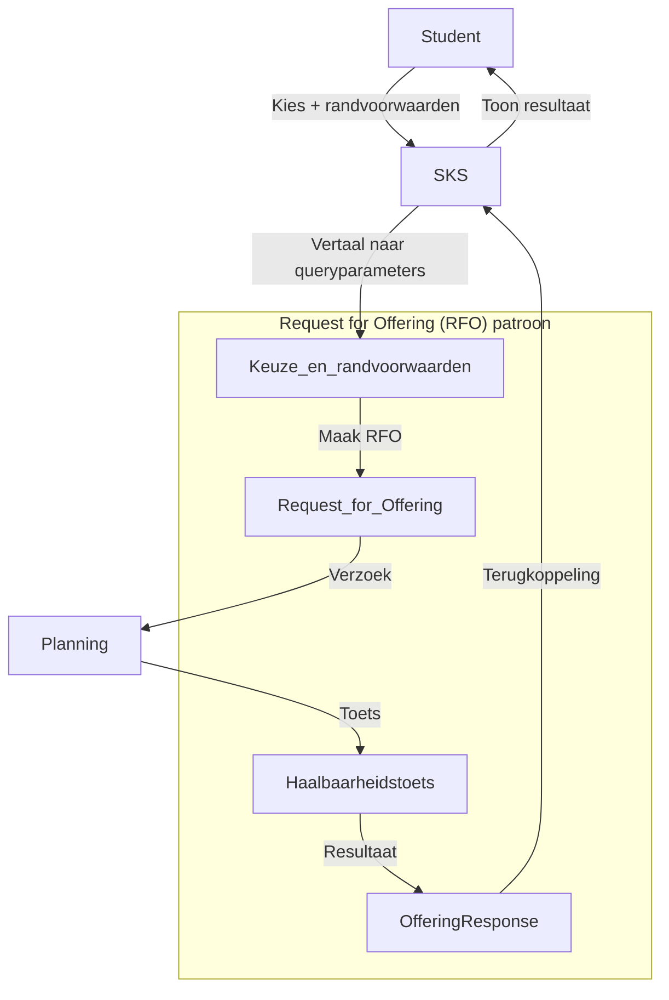

## Request for Offering (RFO): haalbaarheidstoets tussen studentkeuze (SKS) en planning/roostering

Status: Voorstel

Datum: 2026-04-20

### Context

In het overleg over **studentkeuze, roostering, planning en POC’s** is een conceptuele processtap benoemd: **Request for Offering**. De kern daarvan is dat een student (of het Student Keuze Systeem) een **verzoek** indient op basis van leerroute/leervraag, waarna de planner (en/of planningscomponent) de **haalbaarheid** toetst op **schaarse middelen** (bijv. ruimte, docenten, tijdsloten) vóórdat er sprake is van plaatsing/commitment.

Deze stap is relevant omdat studentkeuze (zeker bij maatwerk en iteratieve keuze) niet automatisch betekent dat er ook **realiseerbare capaciteit** is binnen de instelling. Zonder expliciete haalbaarheidstoets ontstaat een ontwerp waarin:

- keuzes automatisch als “plaatsbaar” worden verondersteld, of
- planning impliciet alle keuze-logica moet absorberen, of
- de student pas laat (na onrealistische combinaties) feedback krijgt.

Bron: `architecture/meetings/okx_kernteam_inhoud_uitwerken_studentkeuze_roostering_planning_pocs_20260417/summary.md`.

### Beslissing

We leggen vast dat het OKx-proces een expliciete stap **Request for Offering (RFO)** bevat als **brug** tussen studentkeuze en planning/roostering:

1. **Initiatie (SKS):** het SKS initieert een RFO op basis van leerroute/leervraag en de gekozen leeractiviteiten (keuzeniveau: leeractiviteit; zie [0011](0011-keuzeniveau-leeractiviteit-leervormen-als-aanbodkenmerk.md)).
2. **Haalbaarheidstoets (Planning):** de planningsfunctie toetst haalbaarheid op schaarse middelen en planningsconstraints (o.a. beschikbaarheid, doorlooptijd/horizon, belastbaarheid in SBU/EC waar relevant; zie [0004](0004-leeruitkomsten-sbu-ec-logistieke-containergrootte.md)).
3. **Antwoord (Planning -> SKS):** de uitkomst wordt teruggekoppeld als (minimaal) **acceptatie**, **afwijzing**, of **alternatief voorstel** (bijv. andere periode/locatie/variant), zodat de student zijn route/keuzes kan bijstellen.

Deze beslissing definieert het **proces- en informatiemodelpatroon**; de precieze technische vorm (API, events, synchronie) volgt in koppelvlakspecificaties.

### Alternatieven

| Optie | Voordeel | Nadeel / risico |
|-------|----------|------------------|
| **A. Directe plaatsing op basis van keuze** | Eenvoudig conceptueel; minder stappen | Negeert schaarste en roosterconstraints; hoge kans op teleurstelling/rework; planning wordt achteraf “brandjes blussen” |
| **B. Planning beslist impliciet zonder expliciet verzoek-object** | Minder expliciete modellering | Ondoorzichtig; lastig te specificeren en te testen; moeilijk te hergebruiken tussen instellingen/leveranciers |
| **C. Volledig automatische plaatsing (optimizer) zonder menselijke/planner-interactie** | Potentieel efficiënt op termijn | Vereist hoge datakwaliteit en volwassen constraints; niet realistisch als MVP; risico op onverklaarbare beslissingen |
| **D. (Gekozen richting)** **Request for Offering als expliciete processtap** | Heldere ketenstap en verantwoordelijkheid; ondersteunt iteratieve keuze; sluit aan bij intra-instelling planning-fasering ([0008](0008-scope-planning-eerst-intra-instelling.md)) | Vereist expliciete koppelvlakken en datadefinities voor verzoek/antwoord |

### Consequenties

- **Procesmodellering:** er komt een herkenbare stap tussen “keuze” en “plaatsing/roostering” die zowel bij nominale routes (beperkte variatie) als bij maatwerk (veel combinaties) kan worden toegepast.
- **Datadefinities:** een RFO heeft minimaal nodig: student-/routecontext (pseudoniem of identificerend afhankelijk van fase), set van gewenste leeractiviteiten, randvoorwaarden (criteria/trechterparameters), en gewenste tijdshorizon. Antwoord bevat status + motivatie (constraint), en optioneel alternatieven.
- **Scope en fasering:** ondersteunt ADR [0008](0008-scope-planning-eerst-intra-instelling.md) (eerst intra-instelling) doordat de haalbaarheidstoets primair binnen één instelling kan worden ingericht.

### Relaties en links

- **Gerelateerde ADR’s:**
  - [0005](0005-student-keuze-systeem-zelfstandige-referentiecomponent.md) — SKS als zelfstandige referentiecomponent
  - [0008](0008-scope-planning-eerst-intra-instelling.md) — fasering: planning intra-instelling eerst
  - [0011](0011-keuzeniveau-leeractiviteit-leervormen-als-aanbodkenmerk.md) — leeractiviteit als keuzeniveau
  - [0012](0012-leerroute-onafhankelijk-keuzegate-nominaal-maatwerk.md) — leerroute/leertraject en keuzegate
- Issues: #(te koppelen)
- PR: #(te vullen)
- Meetings: `architecture/meetings/okx_kernteam_inhoud_uitwerken_studentkeuze_roostering_planning_pocs_20260417/summary.md`
- ArchiMate model: `architecture/model/model.archimate` (voeg processtap “Request for Offering” toe en informatie-objecten “OfferingRequest”/“OfferingResponse”; modelleer expliciete relatie SKS -> Planning en terugkoppeling)

